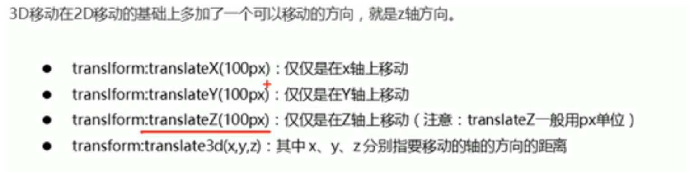
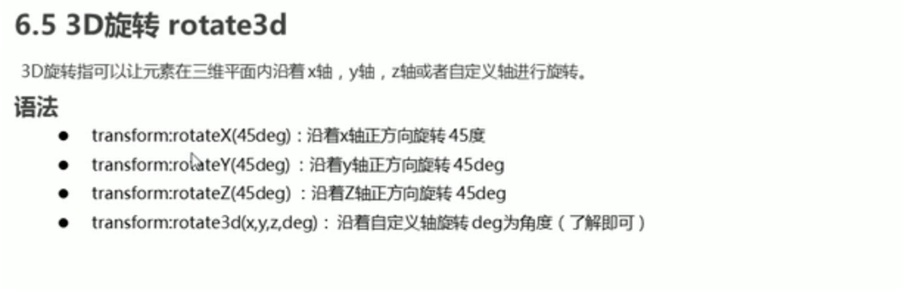
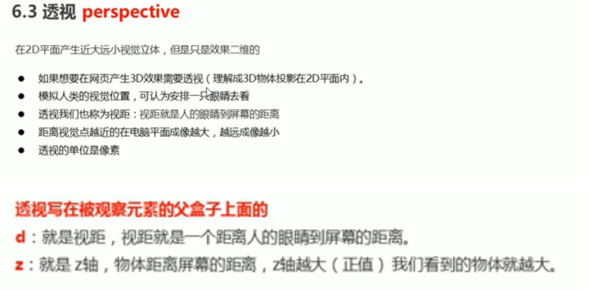
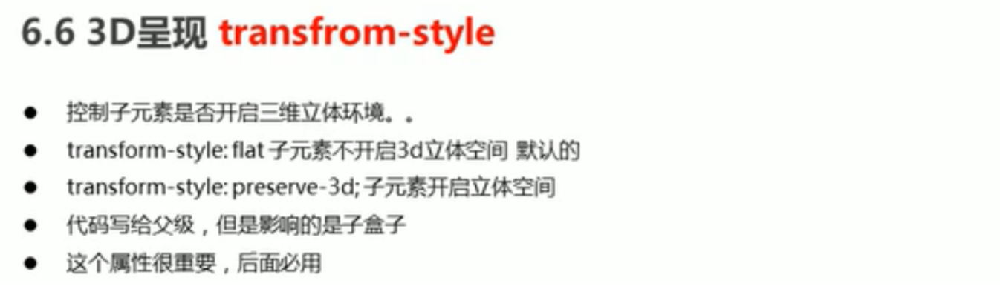

css简洁

- ##### css主要使用场景就是优化网页布局
- css 语法规范

#### style 标签

- style 标签位于head中

    ```css
    <!DOCTYPE html>
    <html lang="en">
    <head>
        <meta charset="UTF-8">
        <title>css语法练习</title>
        <style>
            /*选择器 {样式}*/
            p {
                /*修改 p 段落标签内字体的颜色*/
                color: red;
                /*调整 p 标签内字体大小*/
                /*属性和属性值之间冒号分割 加封号表示结束*/
                font-size: 13px;
            }
    
        </style>
    </head>
    <body>
        <p>测试段落</p>
    </body>
    </html>
    ```


#### CSS基础选择器

- 基础选择器是由单个选择器组成的
- 基础选择器有包括 标签选择器  类选择器  id选择器 和 通配符选择器

##### 标签选择器

```css
<!DOCTYPE html>
<html lang="en">
<head>
    <meta charset="UTF-8">
    <title>css语法练习</title>
    <style>
        /*选择器 {样式}*/
        p {
            /*修改 p 段落标签内字体的颜色*/
            color: red;
            /*调整 p 标签内字体大小*/
            /*属性和属性值之间冒号分割 加封号表示结束*/
            font-size: 13px;
        }
		div{
            color: pink;
        }

    </style>
</head>
<body>
    <p>测试段落</p>
	<div>哈哈哈</div>
</body>
</html>
```


##### 类选择器

```css
<!DOCTYPE html>
<html lang="en">
<head>
    <meta charset="UTF-8">
    <title>css语法练习</title>
    <style>
        /*定义一个类  里边的颜色属性为红色 类名为red*/
        .red {
            color: red;
        }
    </style>
</head>
<body>
    <ul>
<!--        只把小红的字体颜色改成红色 使用类来定义 不使用标签选择器-->
        <li class="red">小红</li> 
        <li>小名</li>
        <li>小白</li>
    </ul>
</body>
</html>
```

###### 类选择器案例

```css
<!DOCTYPE html>
<html lang="en">
<head>
    <meta charset="UTF-8">
    <title>css语法练习</title>
    <style>
        /*定义一个类  里边的颜色属性为红色 类名为red*/
        .red {
            width: 100px;
            height: 100px;
            background-color: red;
        }
        .green {
            width: 100px;
            height: 100px;
            background-color: green;
        }
    </style>
</head>
<body>
    <div class="red"></div>
    <div class="green"></div>
    <div class="red"></div>
</body>
</html>
```

###### 多类名

```css
<!DOCTYPE html>
<html lang="en">
<head>
    <meta charset="UTF-8">
    <title>css语法练习</title>
    <style>
        /*定义一个类  里边的颜色属性为红色 类名为red*/
        .red {

            background-color: red;
        }
        .font {
            font-size: 35px;
        }
    </style>
</head>
<body>
	<!-- 同时使用两个类 多类之间空格隔开 -->
    <div class="red font">刘德华</div>
</body>
</html>
```


##### id选择器

```css
<!DOCTYPE html>
<html lang="en">
<head>
    <meta charset="UTF-8">
    <title>css语法练习</title>
    <style>
	<!--定义以#开头-->
        #pink{
            color: pink;
        }
    </style>
</head>
<body>
    <div id="pink">刘德华</div>
</body>
</html>
```

- 定义的时候只能#开头 调用的时候只能以id调用 并且只能一次调用 调用后别的再调用就不可以了 而类可以多次调用

##### 通配符选择器

```css
<!DOCTYPE html>
<html lang="en">
<head>
    <meta charset="UTF-8">
    <title>css语法练习</title>
    <style>
        *{
            color: red;
        }
    </style>
</head>
<body>
    <div id="pink">刘德华</div>
</body>
</html>
```

- 在css中 通配符选择器使用 * 定义 他表示选取页面中所有的元素

#### CSS字体属性

##### 字体系列

```css
<!DOCTYPE html>
<html lang="en">
<head>
    <meta charset="UTF-8">
    <title>css语法练习</title>
    <style>
        h2 {
            font-family: 微软雅黑;
        }
    </style>
</head>
<body>
    <h2>字体测试</h2>
</body>
</html>
```

- css使用font-family来定义字体系列

##### 字体大小

```css
p{
    font-size: 20px;
}
```

##### 字体粗细

```css
p{
    font-weight: bold; <!--字体加粗-->
    font-weight: normal; <!--字体不加粗-->
}

h2 {
    font-family: 微软雅黑;
    /*700 的后边不可加单位 实际开发中更多的使用数字来 加粗活或者减细*/
    font-weight: 700;
}
```

##### 文字样式

```css
h2 {
    /*字体倾斜  斜体*/
    font-style: italic;
    /*倾斜的字体不倾斜*/
    font-style: normal;
}
```

##### 复合属性

```css
div{
    /*font-style: italic; */
    /*font-weight: 700;*/
    /*font-size: 16px;*/
    /*font-family: 微软雅黑;*/
    /*font: font-style font-weight font-size/line-height font-family*/
    font: italic 700 16px 微润雅黑;
}
```

- 必须按照里边注释的顺序来写 不可随意更换

#### CSS文本属性

##### 文本颜色

```css
<!DOCTYPE html>
<html lang="en">
<head>
    <meta charset="UTF-8">
    <title>css语法练习</title>
    <style>
        div{
            color: red;
        }
    </style>
</head>
<body>
    <div>测试div</div>
</body>
</html>
```

##### 对齐文本

```css
div{
    /*居中对齐*/
    text-align: center;
    /*向右对齐*/
    text-align: right;
    /*向左对齐*/
    text-align: left;
}
```

- text-align 只能设置水平对齐 center right left

##### 装饰文本

```css
div{
    /*下划线*/
    text-decoration: underline;
    /*上划线*/
    text-decoration: overline;
    /*删除线*/
    text-decoration: line-through;
    /*去除下划线*/
    text-decoration: none
}
```

##### 文本缩进

```css
p {

    text-indent: 20px;
    text-indent: 2em;
    /*em相对于文字的大小来缩进 1em就是当前文字一个文字的大小2em就是缩进两个文字大小的距离*/
}
```

- text-indent 用来指定文本第一行的缩进

##### 行间距

```css
p{
    line-height: 16px;
}
```

#### CSS引入方式

##### 内部样式表

```css
<style>
    p{
        line-height: 16px;
    }

</style>
```

- 此种样式可以方便控制当前整个页面中的元素样式设置
- 代码结构清晰 但是并没有实现结构样式完全分离

##### 行内样式表

```css
<!DOCTYPE html>
<html lang="en">
<head>
    <meta charset="UTF-8">
    <title>css语法练习</title>
 
</head>
<body>
    <p style="color: red">缩进测试</p>
</body>
</html>
```

##### 外部样式表

- 新建单独的css文件

    ```css
    /*文件名 css-1.css*/
    /*css文件里只要样式 没有标签*/
    
    p{
        color: red;
    }
    ```

- html文件中引入样式文件

    ```html
    <!DOCTYPE html>
    <html lang="en">
    <head>
        <meta charset="UTF-8">
        <title>css语法练习</title>
        <link rel="stylesheet" href="css-1.css">
    </head>
    <body>
        <p>缩进测试</p>
    </body>
    </html>
    ```

    

- 适合样式比较多的情况 将样式单独写入到单独的css文件中 将css文件引入到html文件中即可使用

#### 复合选择器

##### 后代选择器

```css
<!DOCTYPE html>
<html lang="en">
<head>
    <meta charset="UTF-8">
    <title>css语法练习</title>
    <style>
        ol li { /*只把ol下的li的字体颜色改变 使用后代选择器*/
            color: red;
        }
        /*还可以在多级查找*/
        ol li a {
    		color: green;
		}
        /*可以通过查找标签中定义的类名来区分同样的标签产生多个的问题 并对含有lei的标签添加样式*/
        .nav li a {
            color: pink;
        }
    </style>
</head>
<body>
    <ol>
        <li>sdfdsf</li>
    </ol>
    <ul>
        <li><a href="#">我是第三级</a></li>
    </ul>
    <ul class="nav">
        <li>sdfsdf</li>
    </ul>
</body>
</html>
```

- 后代选择器又称为包含选择器 可以选择父元素里边的子元素 写法就是将外层标签写在前面 内层标签写在后边 中间用空格分开 当标签 发生嵌套时 内层标签就成为外层标签的后代

##### 子选择器

```css
<!DOCTYPE html>
<html lang="en">
<head>
    <meta charset="UTF-8">
    <title>css语法练习</title>
    <style>
        .nav>a {
            color: red;
        }
    </style>
</head>
<body>
    <div class="nav">
        <a href="#">我是儿子级</a>
        <p><a href="#">我是孙子级</a></p>
    </div>
</body>
</html>
```

- 只能选择作为某元素的最近一级的子元素

##### 并集选择器

```css
<!DOCTYPE html>
<html lang="en">
<head>
    <meta charset="UTF-8">
    <title>css语法练习</title>
    <style>
        div,p { /*定义多个元素 中间逗号分隔*/
            color: red;
        }
    </style>
</head>
<body>
    <div>div的标签</div>
    <p>p的标签</p>
</body>
</html>
```

- 并集选择器可以选择多组标签 同时为他们定义相同的样式

##### 伪类选择器

```css

```

- 伪类选择器用于向某些选择器添加特殊的效果 比如给连接添加特殊效果

###### 链接伪类

```html
<!DOCTYPE html>
<html lang="en">
<head>
    <meta charset="UTF-8">
    <title>css语法练习</title>
    <style>
        a:link{
            /*定义将未被访问过的链接为黑色*/
            color: black;
            text-decoration: none;
        }
        a:visited{
            /*定义将访问过的链接颜色改为橘黄色*/
            color: orange;
            text-decoration: none;
        }
        a:hover{
            /*当鼠标放到链接上时 颜色改为天蓝色*/
            color: skyblue;
        }
        a:active{
            /*当鼠标点击链接 落下未松开的那个连接 改变颜色样式*/
            color: green;
        }
    </style>
</head>
<body>
    <a href="#">访问链接1</a><br />
    <a href="www.baidu.com">访问链接2</a>
</body>
</html>
```

- a:link 选择所有未被访问的连接

- a:visited 选择所有已被访问的连接

- a:hover 选择鼠标指针位于其上的连接

- a:avtive 选择活动连接 鼠标按下未弹起的链接

- 在定义时顺序一定要按照 以上解释的顺序写 否则不生效

- :focus 用于选取获得焦点的表单元素

    ```html
    <!DOCTYPE html>
    <html lang="en">
    <head>
        <meta charset="UTF-8">
        <title>css语法练习</title>
        <style>
            /*把获得input光标的表单元素选取出来*/
            input:focus{
                background-color: pink;
            }
        </style>
    </head>
    <body>
        用户名：<input type="text">
        用户名：<input type="text">
        用户名：<input type="text">
    </body>
    </html>
    ```

    

#### 元素显示模式

##### 块元素

- h1~h6    p   div   ul  ol  li
- 独占一行
- 高度 宽度 内外边距可控制
- 宽度默认是父亲的100%
- 是一个容器及盒子 
- 文字类标签不允许放div  （p   ， h1~h6）

##### 行内元素

- a  strong   b  em   del   i  s  ins  u  span
- 相邻的行内元素 一行可以放多个
- 高宽 直接设置是无效果的
- 默认宽度是它本身内容的宽度
- 行内元素只能容纳文本或者其他行内元素

##### 行内块元素

- img  input 
- 可以设置高宽  默认是本身内容宽度

##### 元素显示模式转换

- display:block 转换为块级元su

- display:inline 转换为行内元素

- display:inline-block 转换为行内块

    ```css
    <!DOCTYPE html>
    <html lang="en">
    <head>
        <meta charset="UTF-8">
        <title>css语法练习</title>
        <style>
            a{
                width: 150px;
                height: 50px;
                background-color: red;
                /*将行内元素a转换为块级元素 让它可以控制高宽*/
                display: block;
            }
            div{
                width: 200px;
                height: 50px;
                background-color: skyblue;
                /*将块级元素转换为行内元素*/
               display: inline;
            }
            span{
                width: 200px;
                height: 50px;
                background-color: skyblue;
                /*将行内元素转换为行内块元素*/
               display: inline-block;
            }
        </style>
    </head>
    <body>
        <a href="www.baidu.com">我是百度</a>
        <div>我是块级元素</div>
        <span>行内元素</span>
    </body>
    </html>
    ```

    - snipaste工具未下载

    ###### 小米侧栏案例

    ```html
    <!DOCTYPE html>
    <html lang="en">
    <head>
        <meta charset="UTF-8">
        <title>css语法练习</title>
        <style>
            a{
                background-color: #55585a;
                width: 200px;
                height: 40px;
                display: block;
                text-decoration: none;
                color: white;
                font-size: 15px;
                text-indent: 2em;
                line-height: 40px;  /*实现文字的垂直居中*/
            }
            a:hover{
                background-color: orange;
            }
        </style>
    </head>
    <body>
            <a href="#">手机 电话卡</a>
            <a href="#">电视 盒子</a>
            <a href="#">笔记本 平板</a>
            <a href="#">出行 穿戴</a>
            <a href="#">智能 路由器</a>
            <a href="#">健康 儿童</a>
            <a href="#">耳机 音响</a>
    </body>
    </html>
    ```

    

#### CSS的背景元素

##### 背景颜色

- background-color 定义了元素的北京颜色 默认情况下是transparent透明的

    ```css
    <!DOCTYPE html>
    <html lang="en">
    <head>
        <meta charset="UTF-8">
        <title>css语法练习</title>
        <style>
                div{
                    width: 100%;
                    height: 400px;
                    /*background-color: transparent; 透明的*/
                    background-color: #555555;
                }
        </style>
    </head>
    <body>
        <div>
            
        </div>
    
    </body>
    </html>
    ```

##### 背景图片

- background-image 给盒子添加北京图片 
- background-repeat 默认是repeat  不平铺 no-repeat repeat-x 横向铺  repeat-y 纵向

```css
<!DOCTYPE html>
<html lang="en">
<head>
    <meta charset="UTF-8">
    <title>css语法练习</title>
    <style>
            div{
                width: 100%;
                height: 400px;
                /*直接插入的图片属于平铺 不够盒子的面积 那么图片就会多个来补充 效果不好看*/
                background-image: url(https://dss1.bdstatic.com/70cFvXSh_Q1YnxGkpoWK1HF6hhy/it/u=3720681291,1953505508&fm=26&gp=0.jpg);
                /*background-repeat:  可选择让图片平铺或者不平铺 不平铺的话 图片多大就显示多大*/
                background-repeat: no-repeat;
            }
    </style>
</head>
<body>
    <div>

    </div>

</body>
</html>
```

##### 背景图片的位置

- background-position 	 可以改变图片在北京中的位置 center top left right

- 方位名词

    ```css
    <!DOCTYPE html>
    <html lang="en">
    <head>
        <meta charset="UTF-8">
        <title>css语法练习</title>
        <style>
                div{
                    width: 100%;
                    height: 400px;
                    /*直接插入的图片属于平铺 不够盒子的面积 那么图片就会多个来补充 效果不好看*/
                    background-image: url(https://dss1.bdstatic.com/70cFvXSh_Q1YnxGkpoWK1HF6hhy/it/u=3720681291,1953505508&fm=26&gp=0.jpg);
                    /*background-repeat:  可选择让图片平铺或者不平铺 不平铺的话 图片多大就显示多大*/
                    background-repeat: no-repeat;
                    /*控制背景的方位 如果是方位名词 比如 left right center top 无前后顺序关系*/
                    background-position: center center;
                }
        </style>
    </head>
    <body>
        <div>
    
        </div>
    
    </body>
    </html>
    ```

- 精确单位

    ```css
    <!DOCTYPE html>
    <html lang="en">
    <head>
        <meta charset="UTF-8">
        <title>css语法练习</title>
        <style>
                div{
                    width: 100%;
                    height: 400px;
                    /*直接插入的图片属于平铺 不够盒子的面积 那么图片就会多个来补充 效果不好看*/
                    background-image: url(https://dss1.bdstatic.com/70cFvXSh_Q1YnxGkpoWK1HF6hhy/it/u=3720681291,1953505508&fm=26&gp=0.jpg);
                    /*background-repeat:  可选择让图片平铺或者不平铺 不平铺的话 图片多大就显示多大*/
                    background-repeat: no-repeat;
                    /*控制背景的方位 如果是精确单位 第一个是x 第二个是y*/
                    background-position: 20px 50px  ;
                }
        </style>
    </head>
    <body>
        <div>
    
        </div>
    
    </body>
    </html>
    ```

- 混合单位

    ```css
    <!DOCTYPE html>
    <html lang="en">
    <head>
        <meta charset="UTF-8">
        <title>css语法练习</title>
        <style>
                div{
                    width: 100%;
                    height: 400px;
                    /*直接插入的图片属于平铺 不够盒子的面积 那么图片就会多个来补充 效果不好看*/
                    background-image: url(https://dss1.bdstatic.com/70cFvXSh_Q1YnxGkpoWK1HF6hhy/it/u=3720681291,1953505508&fm=26&gp=0.jpg);
                    /*background-repeat:  可选择让图片平铺或者不平铺 不平铺的话 图片多大就显示多大*/
                    background-repeat: no-repeat;
                    /*控制背景的方位 如果是混合单位 第一个是x 第二个是y*/
                    background-position: 20px center ;
                }
        </style>
    </head>
    <body>
        <div>
    
        </div>
    
    </body>
    </html>
    ```

##### 背景图像固定

- background-attachment 设置图像是否固定或者随着页面滚动

    - scroll 默认属性 滚动的
    - fixed 固定的

    ```css
    <!DOCTYPE html>
    <html lang="en">
    <head>
        <meta charset="UTF-8">
        <title>css语法练习</title>
        <style>
                div{
                    width: 100%;
                    height: 400px;
                    /*直接插入的图片属于平铺 不够盒子的面积 那么图片就会多个来补充 效果不好看*/
                    background-image: url(https://dss1.bdstatic.com/70cFvXSh_Q1YnxGkpoWK1HF6hhy/it/u=3720681291,1953505508&fm=26&gp=0.jpg);
                    /*background-repeat:  可选择让图片平铺或者不平铺 不平铺的话 图片多大就显示多大*/
                    background-repeat: no-repeat;
                    /*控制背景的方位 如果是混合单位 第一个是x 第二个是y*/
                    background-position: 20px center ;
                    /*将北京图片固定住*/
                    background-attachment: fixed;
                }
        </style>
    </head>
    <body>
        <div>
            <p>测试滚动</p>
            <p>测试滚动</p>
            <p>测试滚动</p>
            <p>测试滚动</p>
            <p>测试滚动</p>
            <p>测试滚动</p>
            <p>测试滚动</p>
            <p>测试滚动</p>
            <p>测试滚动</p>
            <p>测试滚动</p>
            <p>测试滚动</p>
            <p>测试滚动</p>
            <p>测试滚动</p>
        </div>
    
    </body>
    </html>
    ```

    

##### 背景图片复合型写法

- background: 背景颜色 背景图片地址 背景平铺 背景图像滚动 背景图片位置

```css
<!DOCTYPE html>
<html lang="en">
<head>
    <meta charset="UTF-8">
    <title>css语法练习</title>
    <style>
            div{
                width: 100%;
                height: 400px;
                /*直接插入的图片属于平铺 不够盒子的面积 那么图片就会多个来补充 效果不好看*/
                /*background-image: url(https://dss1.bdstatic.com/70cFvXSh_Q1YnxGkpoWK1HF6hhy/it/u=3720681291,1953505508&fm=26&gp=0.jpg);*/
                /*!*background-repeat:  可选择让图片平铺或者不平铺 不平铺的话 图片多大就显示多大*!*/
                /*background-repeat: no-repeat;*/
                /*!*控制背景的方位 如果是混合单位 第一个是x 第二个是y*!*/
                /*background-position: 20px center ;*/
                /*!*将北京图片固定住*!*/
                /*background-attachment: fixed;*/
                background: beige url(https://dss1.bdstatic.com/70cFvXSh_Q1YnxGkpoWK1HF6hhy/it/u=3720681291,1953505508&fm=26&gp=0.jpg) no-repeat 20px center fixed;
            }
    </style>
</head>
<body>
    <div>
        <p>测试滚动</p>
        <p>测试滚动</p>
    </div>

</body>
</html>
```

##### 背景图片半透明

- background: rgba(0,0,0,0.3);

```css
<!DOCTYPE html>
<html lang="en">
<head>
    <meta charset="UTF-8">
    <title>css语法练习</title>
    <style>
            div{
                width: 300px;
                height: 200px;
                /*background-color: blue;*/
                background: rgba(0,0,0,0.3);
            }
    </style>
</head>
<body>
    <div>

    </div>

</body>
</html>
```

###### 五彩导航栏案例

```css
<!DOCTYPE html>
<html lang="en">
<head>
    <meta charset="UTF-8">
    <title>css语法练习</title>
    <style>
        .nav a {
            background-color: #92B0DD;
            width: 120px;
            height: 58px;
            line-height: 58px;
            display: inline-block;
            text-decoration: none;
            text-align: center;
            color: white;
        }

        .nav .bj1{
            background-color: orange;
        }
        .nav .bj2{
            background-color: yellow;
        }
        .nav .bj3{
            background-color: green;
        }
        .nav .bj4{
            background-color: slateblue;
        }
        .nav .bj5{
            background-color: red;
        }
        .nav .bj1:hover{
            background: rgba(0,0,0,0.5);
        }
        .nav .bj2:hover{
            background: rgba(0,0,0,0.5);
        }
        .nav .bj3:hover{
            background: rgba(0,0,0,0.5);
        }
        .nav .bj4:hover{
            background: rgba(0,0,0,0.5);
        }
        .nav .bj5:hover{
            background: rgba(0,0,0,0.5);
        }
    </style>
</head>
<body>
    <div class="nav">
        <a href="#" class="bj1">五彩导航栏</a>
        <a href="#" class="bj2">五彩导航栏</a>
        <a href="#" class="bj3">五彩导航栏</a>
        <a href="#" class="bj4">五彩导航栏</a>
        <a href="#" class="bj5">五彩导航栏</a>

    </div>

</body>
</html>
```

#### CSS的三大特性

##### 层叠性

- 样式冲突 遵循就近原则 哪个样式离结构近就选哪个
- 样式不冲突 不会重叠

##### 继承性

- 子标签会继承父标签中的某些样式 text-* font-* line-* 这些元素开头的可以继承 以及color

###### 行高的继承

```css
<!DOCTYPE html>
<html lang="en">
<head>
    <meta charset="UTF-8">
    <title>css语法练习</title>
    <style>
        div{
            color: coral;
            /*font-size: 14px;*/
            /*text-align: center;*/
            /*!*line-height: 24px;*!*/
            /*font: 12px/24px "Microsoft YaHei UI"*/
            /*12px后边的1.5的意思是 行高是文字大小12px的1.5倍*/
            font: 12px/1.5 "Microsoft YaHei UI"
        }
    </style>
</head>
<body>
    <div>
        <p>继承样式</p>
    </div>

</body>
</html>
```

- 行高可以跟单位也可以不跟单位

##### 优先级

- 选择器相同 则执行层叠性
- 选择器不同 则根据选择器的权重执行
- 权重从小到大排列
    - 继承或者*     权重：0,0,0,0 
    - 元素选择器  权重： 0,0,0,1
    - 类选择器 伪类选择器： 0,0,1,0
    - ID选择器：                  0,1,0,0
    - 行内样式：                   1,0,0,0
    - ！important 重要的： 无穷大

- 如果是复合选择器需要计算权重

- 父亲的权重被子继承过来后是0

    ```css
    <!DOCTYPE html>
    <html lang="en">
    <head>
        <meta charset="UTF-8">
        <title>css语法练习</title>
        <style>
            li {
                color: red;
            }
            /*复合选择器会有权重叠加的问题 ul的权重和li的权重相加 就是0.0.0.2那么就这个权重更大*/
            ul li {
                color: palegoldenrod;
            }
        </style>
    </head>
    <body>
        <Ul>
            <li>测试1</li>
            <li>测试2</li>
            <li>测试3</li>
        </Ul>
    
    </body>
    </html>
    ```

#### 盒子模型

##### 盒子模型  

###### 边框 border

```css
border: border-width  border-style  border-color
```

- border-width 定义边框粗细 px

- border-style  定义边框样式

- border-color 定义边框的颜色

    ```css
    <!DOCTYPE html>
    <html lang="en">
    <head>
        <meta charset="UTF-8">
        <title>css语法练习</title>
        <style>
            div{
                width: 300px;
                height: 200px;
                /*background-color: red;*/
                /*!*设置边框的粗细*!*/
                /*border-width: 5px;*/
                /*!*实线边框*!*/
                /*border-style: solid;*/
                /*!*虚线边框*!*/
                /*!*border-style: dashed;*!*/
                /*!*点线边框*!*/
                /*!*border-style: dotted;*!*/
                /*border-color: #92B0DD;*/
                /*变框的复合写法*/
                border: 5px solid palegoldenrod;
            }
        </style>
    </head>
    <body>
        <div>
    
        </div>
    
    </body>
    </html>
    /*------------------------------------------------------------------*/
    
    <!DOCTYPE html>
    <html lang="en">
    <head>
        <meta charset="UTF-8">
        <title>css语法练习</title>
        <style>
            div{
                width: 300px;
                height: 200px;
                border: 5px solid palegoldenrod;
                /*边框分开写法*/
                border-top: 1px solid red;
                border-bottom: 2px solid green;
                border-right: 2px dotted orange;
                border-left: 2px dashed skyblue;
                /*合并相邻的边框 比如表格里的相邻*/
                /*border-collapse: collapse;*/
    
            }
        </style>
    </head>
    <body>
        <div>
    
        </div>
    
    </body>
    </html>
    ```

###### 内容 content

- 内容直接书写即可

###### 内边距 padding

```css
<!DOCTYPE html>
<html lang="en">
<head>
    <meta charset="UTF-8">
    <title>css语法练习</title>
    <style>
        div{
            width: 300px;
            height: 200px;
            border: 5px solid palegoldenrod;
            /*修改盒子的内边距*/

            /*padding-left: 20px;*/
            /*padding-top: 10px;*/
            /*padding-right: 20px;*/
            /*padding-bottom: 10px;*/
            /*复合型写法*/
            /*padding: 5px; 如果padding后边只有一个值代表上下左右都是5px*/
            /*padding: 5px 10px; 如果后边跟的是两个值 上下是5px  左右是10px*/
            /*padding: 5px 10px 20px ; 如果后边跟三个值 上是5px 左右是10px 下是20px*/
            /*padding: 5px 10px 20px 30px ; 上5px 右10px 下边20px 左边30px*/
        }
    </style>
</head>
<body>
    <div>
        盒子的内容就是这个
    </div>

</body>
</html>
</html>
```

- padding-top  顶部内边距
- padding-left 左边内边距
- padding-right 右边的内边距
- padding-buttom 下边内边距
- 内边距会造成原来定好的高宽继续扩大 所以这里要注意
- 如果盒子没有设置height/width 那么padding则不会撑开盒子的大小

###### 新浪导航案例

```css
<!DOCTYPE html>
<html lang="en">
<head>
    <meta charset="UTF-8">
    <title>css语法练习</title>
    <style>
        .nav {
            height: 41px;
            border-top: 3px solid orange;
            border-bottom: 1px solid #A5B6C8;
            /*修改盒子的外边距*/

        }
        .nav a {
            height: 41px;
            font-size: 12px;
            line-height: 41px;
            color: black;
            display: inline-block;
            padding: 0px 20px;

            text-decoration: none;;
        }
        .nav a:hover{
            background-color: #9BDF70;
            color: orange;
        }
    </style>
</head>
<body>
    <div class="nav">
        <a href="#">新浪导航</a>
        <a href="#">手机新浪网</a>
        <a href="#">新浪导航哈</a>
        <a href="#">微博</a>
        <a href="#">三个字</a>

    </div>

</body>
</html>
```

###### 外边距 margin

- margin-left 左边外距

- margin-right 右边外距

- margin-top 上边外距

- margin-buttom 下边外距

    ```css
    <!DOCTYPE html>
    <html lang="en">
    <head>
        <meta charset="UTF-8">
        <title>css语法练习</title>
        <style>
            div {
                background-color: #92B0DD;
                width: 200px;
                height: 200px;
            }
            .nav{
                /*站在第一个盒子的角度想 让它的下外边距有距离即可实现分开*/
                margin-bottom: 10px;
                /*复合型写法*/
                /*margin: 20px; 跟一个值默认上下左右都是20px*/
                /*margin: 30px 50px; 两个值 上下30px 左右50px*/
                /*!*margin: 10px 30px 50px; 三个值*!  跟padding是一样的*/
                /*margin: 10px 20px 30px 40px; 四个值*/
            }
        </style>
    </head>
    <body>
        <div class="nav">
    
            1
        </div>
        <div>
            2
        </div>
    
    </body>
    </html>
    ```

###### 外边距将盒子水平居中

```css
<!DOCTYPE html>
<html lang="en">
<head>
    <meta charset="UTF-8">
    <title>css语法练习</title>
    <style>
        div {
            width: 500px;
            height: 100px;
            background-color: papayawhip;
        }
        .nav{
            
            /*将盒子水平居中 0代表上下是0边距 auto代表左右为自动 也就是居中*/
            margin: 0 auto;
        }
    </style>
</head>
<body>
    <div class="nav">

        1
    </div>

</body>
</html>
```

###### 父元素外边距塌陷问题

```css
<!DOCTYPE html>
<html lang="en">
<head>
    <meta charset="UTF-8">
    <title>css语法练习</title>
    <style>
        .father{
            width: 400px;
            height: 400px;
            background-color: purple;
            margin-top: 100px;
            /*border: solid;*/
            /*padding: 5px;*/
            overflow: hidden;

        }
        .son{
            /*对于两个嵌套关系的块元素 肤元素有上外边距同时子元素也有上外边距 此时父元素会塌陷较大的外边距值*/
            /*如果解决此问题 需要在父元素添加边框 边框可以定义为透明的*/
            /*还可以通过在父元素指定内边距的方式*/
            /*overflow: hidden; 在父元素添加次参数也可以解决*/

            margin-top: 150px;
            width: 200px;
            height: 200px;
            background-color: pink;
        }
    </style>
</head>
<body>
    <div class="father">
        <div class="son"></div>
    </div>

</body>
</html>
```

###### 清除内外边距

```css
<!DOCTYPE html>
<html lang="en">
<head>
    <meta charset="UTF-8">
    <title>css语法练习</title>
    <style>
        /*清除内外边距*/
        *{
            margin: 0;
            padding: 0;
        }
        div{
            width: 500px;
            height: 100px;
            background-color: #9BDF70;
        }
    </style>
</head>
<body>
    <div>

    </div>
</body>
</html>
```

###### 去掉li前面的符号 小圆点

- list-style:none;

###### 圆角边框

- ```
    border-radius: 20px; 将矩形修改成曲型
    ```

    ```css
    <!DOCTYPE html>
    <html lang="en">
    <head>
        <meta charset="UTF-8">
        <title>css语法练习</title>
        <style>
            /*清除内外边距*/
            *{
                margin: 0;
                padding: 0;
            }
            div{
                width: 500px;
                height: 100px;
                background-color: #9BDF70;
                margin: 0 auto;
                border-radius: 20px;
            }
        </style>
    </head>
    <body>
        <div>
    
        </div>
    </body>
    </html>
    ```

###### 盒子阴影

- h-shadow 必须 水平阴影的位置 允许负值

- v-shadow 必须 垂直阴影的位置 允许负值

- blur 可选 模糊距离

- spread 可选 阴影的尺寸

- color 可选 阴影的颜色

- inset 可选 将外部阴影 outset 改为内部阴影

    ```css
    <!DOCTYPE html>
    <html lang="en">
    <head>
        <meta charset="UTF-8">
        <title>css语法练习</title>
        <style>
            /*清除内外边距*/
            *{
                margin: 0;
                padding: 0;
            }
            div{
                width: 200px;
                height: 200px;
                background-color: #9BDF70;
                margin: 0 auto;
                border-radius: 20px;
                /*水平阴影的位置 垂直阴影的位置 影子的模糊程度 影子的大小 影子的颜色*/
                /*box-shadow: 10px 10px 10px 10px black;*/
                /*!*半透明*! 默认是outset  还可以写成inset*/
                box-shadow: 10px 10px 10px 10px rgba(0,0,0,0.3);
            }
        </style>
    </head>
    <body>
        <div>
    
        </div>
    </body>
    </html>
    ```

###### 当鼠标经过盒子时出现阴影

```css
<!DOCTYPE html>
<html lang="en">
<head>
    <meta charset="UTF-8">
    <title>css语法练习</title>
    <style>
        /*清除内外边距*/
        *{
            margin: 0;
            padding: 0;
        }
        .test{
            width: 200px;
            height: 200px;
            background-color: #9BDF70;
            margin: 0 auto;
            border-radius: 20px;
        }
        .test:hover{
            box-shadow: 10px 10px 10px 10px rgba(0,0,0,0.3);
        }
    </style>
</head>
<body>
    <div class="test">

    </div>
</body>
</html>
```


###### 文字阴影

- text-shadow 文字阴影
- h-shadow 必须 水平阴影的位置 允许负值
- v-shadow 必须 垂直阴影的位置 允许负值
- blur 可选 模糊距离
- color 可选 阴影的颜色

```css
<!DOCTYPE html>
<html lang="en">
<head>
    <meta charset="UTF-8">
    <title>css语法练习</title>
    <style>
        /*清除内外边距*/
        *{
            margin: 0;
            padding: 0;
        }
        .test{
            width: 200px;
            height: 200px;
            background-color: #9BDF70;
            margin: 0 auto;
            border-radius: 20px;
        }
        .test:hover{
            text-shadow: 10px 10px 10px rgba(0,0,0,0.3);
        }
    </style>
</head>
<body>
    <div class="test">
        我要出现文字阴影
    </div>
</body>
</html>
```

##### 浮动

- float 默认值none不浮动  left 元素向左浮动 right 元素向右浮动

    ```css
    <!DOCTYPE html>
    <html lang="en">
    <head>
        <meta charset="UTF-8">
        <title>css语法练习</title>
        <style>
            .left,.right{
                width: 200px;
                height: 200px;
                background-color: #92B0DD;
    
            }
            .left{
                float: left;
            }
            .right{
                float: left;
            }
    
        </style>
    </head>
    <body>
        <div class="right">1</div>
        <div class="left">2</div>
    
    </body>
    </html>
    ```

###### 浮动特性

- 脱标 脱离标准流 移动到指定位置 浮动的盒子不在保留原来的位子

- 浮动的元素会一行内显示并且元素顶部对齐

- 浮动的元素会具有行内块元素的特性

- 父盒子不能给定死高度 应该让里边的元素给撑开 但是这就有个高度塌陷的问题

- 高度塌陷问题的解决 清除浮动

    - clear 
    - left 不允许左侧有浮动元素
    - right  清除右侧浮动影响
    - both 同时清除左右两侧影响
    - 父级添加overflow属性
    - 父级添加after伪元素
    - 父级添加双伪元素

    ```css
    /*额外添加标签清除浮动造成的影响*/
    <!doctype html>
    <html lang="en">
    <head>
        <meta charset="UTF-8">
        <meta name="viewport"
              content="width=device-width, user-scalable=no, initial-scale=1.0, maximum-scale=1.0, minimum-scale=1.0">
        <meta http-equiv="X-UA-Compatible" content="ie=edge">
        <title>Document</title>
        <style>
            .father{
                /*height: 200px;*/
                border: 1px solid black;
                width: 500px;
                background-color: #Db1010;
            }
            .left,.right{
                width: 200px;
                height: 200px;
                float: left;
    
            }
            .right{
                background-color: green;
            }
            .left{
                background-color: orange;
            }
            .test{
                height: 200px;
                width: 500px;
                background-color: blue;
            }
            .clear {
                clear: both;
            }
        </style>
    </head>
    <body>
        <div class="father">
            <div class="right">1</div>
            <div class="left">2</div>
    <!--        1.通过额外添加标签的方法来清除浮动影响-->
    <!--        <div class="clear"></div>-->
    
        </div>
        <div class="test"></div>
    
    </body>
    </html>
    ```

    ```css
    /*在父级添加overflow的方法清除影响*/
    <!doctype html>
    <html lang="en">
    <head>
        <meta charset="UTF-8">
        <meta name="viewport"
              content="width=device-width, user-scalable=no, initial-scale=1.0, maximum-scale=1.0, minimum-scale=1.0">
        <meta http-equiv="X-UA-Compatible" content="ie=edge">
        <title>Document</title>
        <style>
            .father{
                /*height: 200px;*/
                border: 1px solid black;
                width: 500px;
                background-color: #Db1010;
                overflow: hidden;
            }
            .left,.right{
                width: 200px;
                height: 200px;
                float: left;
    
            }
            .right{
                background-color: green;
            }
            .left{
                background-color: orange;
            }
            .test{
                height: 200px;
                width: 500px;
                background-color: blue;
            }
            .clear {
                clear: both;
            }
        </style>
    </head>
    <body>
        <div class="father">
            <div class="right">1</div>
            <div class="left">2</div>
        </div>
        <div class="test"></div>
    
    </body>
    </html>
    ```

    ```css
    /*通过给父元素添加after伪元素清除浮动影响*/
    <!doctype html>
    <html lang="en">
    <head>
        <meta charset="UTF-8">
        <meta name="viewport"
              content="width=device-width, user-scalable=no, initial-scale=1.0, maximum-scale=1.0, minimum-scale=1.0">
        <meta http-equiv="X-UA-Compatible" content="ie=edge">
        <title>Document</title>
        <style>
            .clearfix:after{
                content: "";
                display: block;
                height: 0;
                clear: both;
                visibility: hidden;
            }
            .clearfix{
                /*IE6 7 专有*/
                *zoom: 1;
            }
            .father{
                /*height: 200px;*/
                border: 1px solid black;
                width: 500px;
                background-color: #Db1010;
    
            }
            .left,.right{
                width: 200px;
                height: 200px;
                float: left;
    
            }
            .right{
                background-color: green;
            }
            .left{
                background-color: orange;
            }
            .test{
                height: 200px;
                width: 500px;
                background-color: blue;
            }
            .clear {
                clear: both;
            }
        </style>
    </head>
    <body>
        <div class="father clearfix">
            <div class="right">1</div>
            <div class="left">2</div>
        </div>
        <div class="test"></div>
    
    </body>
    </html>
    ```

###### 双伪元素清除浮动

```css
<!doctype html>
<html lang="en">
<head>
    <meta charset="UTF-8">
    <meta name="viewport"
          content="width=device-width, user-scalable=no, initial-scale=1.0, maximum-scale=1.0, minimum-scale=1.0">
    <meta http-equiv="X-UA-Compatible" content="ie=edge">
    <title>Document</title>
    <style>
        .clearfix:before,
        .clearfix:after{
            content: "";
            display: table;
        }
        .clearfix:after{
            clear: both;
        }
        .clearfix{
            /*IE6 7 专有*/
            *zoom: 1;
        }
        .father{
            /*height: 200px;*/
            border: 1px solid black;
            width: 500px;
            background-color: #Db1010;

        }
        .left,.right{
            width: 200px;
            height: 200px;
            float: left;

        }
        .right{
            background-color: green;
        }
        .left{
            background-color: orange;
        }
        .test{
            height: 200px;
            width: 500px;
            background-color: blue;
        }
        .clear {
            clear: both;
        }
    </style>
</head>
<body>
    <div class="father clearfix">
        <div class="right">1</div>
        <div class="left">2</div>
    </div>
    <div class="test"></div>

</body>
</html>
```

- a标签一般不用a直接写 会用li包含a	

##### 定位

- 将盒子定位到某一个位置
- 定位模式  边偏移

###### 定位模式

- static 静态定位

    - 没有边偏移
    - 很少使用

    ```css
    position: static; 
    ```

- relative 相对定位 相对于自己原来的位置进行移动 原来的位置继续保留 不会被其他占有

    ```css
    <!doctype html>
    <html lang="en">
    <head>
        <meta charset="UTF-8">
        <meta name="viewport"
              content="width=device-width, user-scalable=no, initial-scale=1.0, maximum-scale=1.0, minimum-scale=1.0">
        <meta http-equiv="X-UA-Compatible" content="ie=edge">
        <title>Document</title>
        <style>
            .box1,.box2{
                width: 200px;
                height: 200px;
            }
            .box1{
                background-color: blue;
                position: relative;
                top: 100px;
                left: 100px;
            }
            .box2{
                background-color: green;
            }
    
        </style>
    </head>
    <body>
        <div class="box1"></div>
        <div class="box2"></div>
    </body>
    </html>
    ```

- absolute 绝对定位

    - 如果没有祖先元素或者祖先没有定位则-以浏览器为标准定位
    - 父元素如果没有定位则按照浏览器 如果有定位则按照父元素定位来算 如果父元素没有就一级一级往上找 去找爷爷 如果都有 那么就近原则
    - 绝对定位不在占有原来的位置 会被其他占有

    ```css
    <!doctype html>
    <html lang="en">
    <head>
        <meta charset="UTF-8">
        <meta name="viewport"
              content="width=device-width, user-scalable=no, initial-scale=1.0, maximum-scale=1.0, minimum-scale=1.0">
        <meta http-equiv="X-UA-Compatible" content="ie=edge">
        <title>Document</title>
        <style>
            .box1,.box2{
                width: 200px;
                height: 200px;
            }
            .box1{
                background-color: blue;
                position: absolute;
                top: 100px;
                left: 100px;
                /*父级元素有定位则从父级元素的定位开始 如果没有定位则自己按照浏览器标准来定位*/
            }
            .box2{
                background-color: green;
                width: 100px;
                height: 100px;
                position: absolute;
                top: 100px;
                right: 10px;
    
            }
    
        </style>
    </head>
    <body>
        <div class="box1">
            <div class="box2"></div>
        </div>
    </body>
    </html>
    ```

    

- fixed 固定定位

    ```css
    <!doctype html>
    <html lang="en">
    <head>
        <meta charset="UTF-8">
        <meta name="viewport"
              content="width=device-width, user-scalable=no, initial-scale=1.0, maximum-scale=1.0, minimum-scale=1.0">
        <meta http-equiv="X-UA-Compatible" content="ie=edge">
        <title>Document</title>
        <style>
            .box2{
                width: 200px;
                height: 200px;
            }
            .box2{
                background-color: green;
                width: 100px;
                height: 100px;
                position: fixed;
                bottom: 100px;
                right: 10px;
    
            }
    
        </style>
    </head>
    <body>
    
            <div class="box2"></div>
    </body>
    </html>
    ```

    - 不随滚动条滚动
    - 不占有原先位置

    ###### 粘性定位

    - 以浏览器的可视窗口移动
    - 粘性定位占有原来的位置
    - 必须添加top left right bottom其中一个才有效

- 边偏移属性

    - top top；80px 定位元素相对于其父元素上边线距离
    - bottom bottom;80px 定位元素相对其父元素底边线距离
    - left left;80px 定位元素相对于其父元素左边线距离
    - right right;80px 定位元素相对于其父元素右边线距离

###### 定位叠放次序

- z-index 控制叠放次序数值越大盒子越考上

```css
<!doctype html>
<html lang="en">
<head>
    <meta charset="UTF-8">
    <meta name="viewport"
          content="width=device-width, user-scalable=no, initial-scale=1.0, maximum-scale=1.0, minimum-scale=1.0">
    <meta http-equiv="X-UA-Compatible" content="ie=edge">
    <title>Document</title>
    <style>
        .box{
            position: absolute;
            top: 0;
            left: 0;
        }
        .box2,.box1,.box3{
            width: 200px;
            height: 200px;
        }
        .box1{
            background-color: red;
            z-index: 1;
        }
        .box2{
            background-color: green;
            z-index: 2;
        }
        .box3{
            background-color: blue;
            z-index: 3;
        }

    </style>
</head>
<body>

        <div class="box1 box">1</div>
        <div class="box2 box">2</div>
        <div class="box3 box">3</div>
</body>
</html>

```

###### 定位拓展

- 定位后的盒子如何实现水平居中 不加定位的盒子直接margin auto就直接水平居中了 但是加了绝对定位的盒子不能通过这种方式实现水平居中 而相对定位可以

    ```css
    <!doctype html>
    <html lang="en">
    <head>
        <meta charset="UTF-8">
        <meta name="viewport"
              content="width=device-width, user-scalable=no, initial-scale=1.0, maximum-scale=1.0, minimum-scale=1.0">
        <meta http-equiv="X-UA-Compatible" content="ie=edge">
        <title>Document</title>
        <style>
            .box{
                width: 200px;
                height: 200px;
                background-color: pink;
                left: 50%;
                margin-left: -100px;
                position: absolute;
    
            }
    
        </style>
    </head>
    <body>
    
            <div class="box">1</div>
    
    </body>
    </html>
    ```

    - 浮动的元素不会压住标准流的图片或文字
    - 绝对定位会压住所有内容

##### 显示与隐藏

###### display 显示隐藏

- display:none 隐藏对象  不但隐藏元素而且不在占有原来的位置

    ```css
    <!doctype html>
    <html lang="en">
    <head>
        <meta charset="UTF-8">
        <meta name="viewport"
              content="width=device-width, user-scalable=no, initial-scale=1.0, maximum-scale=1.0, minimum-scale=1.0">
        <meta http-equiv="X-UA-Compatible" content="ie=edge">
        <title>Document</title>
        <style>
            .box{
                width: 200px;
                height: 200px;
                background-color: pink;
                display: none;
                /*display: block;*/
            }
            .box1{
                width: 200px;
                height: 200px;
                background-color: blue;
            }
        </style>
    </head>
    <body>
    
            <div class="box">乔治</div>
            <div class="box1">小猪佩奇</div>
    
    </body>
    </html>
    ```

    

- display:block 除了转换为块级元素同时还有显示元素的意思

###### visibility 显示隐藏 

- visibility: visible 元素可视

- visibility: hidden 元素隐藏

- visibility隐藏后继续占有原来的位置 这和display none是相反的

    ```css
    <!doctype html>
    <html lang="en">
    <head>
        <meta charset="UTF-8">
        <meta name="viewport"
              content="width=device-width, user-scalable=no, initial-scale=1.0, maximum-scale=1.0, minimum-scale=1.0">
        <meta http-equiv="X-UA-Compatible" content="ie=edge">
        <title>Document</title>
        <style>
            .box{
                width: 200px;
                height: 200px;
                background-color: pink;
                /*visibility: visible;*/
                visibility: hidden;
            }
            .box1{
                width: 200px;
                height: 200px;
                background-color: blue;
            }
        </style>
    </head>
    <body>
    
            <div class="box">乔治</div>
            <div class="box1">小猪佩奇</div>
    
    </body>
    </html>
    ```

    

###### overflow 溢出显示隐藏

- overflow:visible 可视多余的溢出
- overflow: scroll 多余的部分滚动条显示
- overflow: auto 在需要的时候自动添加滚动条
- overflow:hidden 将多余的溢出的隐藏

##### 精灵图

- 使用background-position来kongzhi 精灵图

##### 字体图标

- 下载地址
- http://icomoon.io
- http://www.iconfont.cn

##### CSS三角

```css
<!doctype html>
<html lang="en">
<head>
    <meta charset="UTF-8">
    <meta name="viewport"
          content="width=device-width, user-scalable=no, initial-scale=1.0, maximum-scale=1.0, minimum-scale=1.0">
    <meta http-equiv="X-UA-Compatible" content="ie=edge">
    <title>Document</title>
    <style>
        .box1{
            width: 0;
            height: 0;
            /*border: 10px solid pink;*/
            border-top: 10px solid pink;
            border-right: 10px solid red;
            border-left: 10px solid green;
            border-bottom: 10px solid skyblue;
        }
        .box2{
            /*朝上的三角形*/
            width: 0;
            height: 0;
            border-top: 10px solid transparent;
            border-left: 10px solid transparent ;
            border-right: 10px solid transparent;
            border-bottom: 10px solid blue;
        }
    </style>
</head>
<body>


        <div class="box1"></div>
        <div class="box2"></div>

</body>
</html>
```

###### 京东盒子带三角尾巴

```css
<!doctype html>
<html lang="en">
<head>
    <meta charset="UTF-8">
    <meta name="viewport"
          content="width=device-width, user-scalable=no, initial-scale=1.0, maximum-scale=1.0, minimum-scale=1.0">
    <meta http-equiv="X-UA-Compatible" content="ie=edge">
    <title>Document</title>
    <style>

        .box2{
            /*朝上的三角形*/
            width: 0;
            height: 0;
            border: 10px solid transparent;
            border-bottom: 10px solid blue;
            position: absolute;
            top: -20px;
            left: 15px;
        }
        .box1 {
            margin: 100px auto;
            position: relative;
            width: 100px;
            height: 200px;
            background-color: blue;
        }
    </style>
</head>
<body>

        <div class="box1">
            <span class="box2"></span>
        </div>

</body>
</html>
```

##### 用户界面操作样式

###### 鼠标样式

- cursor 
    - default 默认的
    - pointer 小手
    - move  移动
    - text  文本
    - not-allowed 禁止

```css
<!doctype html>
<html lang="en">
<head>
    <meta charset="UTF-8">
    <meta name="viewport"
          content="width=device-width, user-scalable=no, initial-scale=1.0, maximum-scale=1.0, minimum-scale=1.0">
    <meta http-equiv="X-UA-Compatible" content="ie=edge">
    <title>Document</title>
    <style>


    </style>
</head>
<body>
    <ul>
        <li style="cursor: default">测试鼠标样式</li>
        <li style="cursor: pointer">测试鼠标样式</li>
        <li style="cursor: move">测试鼠标样式</li>
        <li style="cursor: text">测试鼠标样式</li>
        <li style="cursor: not-allowed">测试鼠标样式</li>
    </ul>
</body>
</html>
```


###### 表单轮廓

```css
<!doctype html>
<html lang="en">
<head>
    <meta charset="UTF-8">
    <meta name="viewport"
          content="width=device-width, user-scalable=no, initial-scale=1.0, maximum-scale=1.0, minimum-scale=1.0">
    <meta http-equiv="X-UA-Compatible" content="ie=edge">
    <title>Document</title>
    <style>
        input{
            /*去掉光标指向input框后的框的颜色变化*/
            outline: none;
        }


    </style>
</head>
<body>
    <input>
</body>
</html>
```


###### 防止表单域拖拽

```css
<!doctype html>
<html lang="en">
<head>
    <meta charset="UTF-8">
    <meta name="viewport"
          content="width=device-width, user-scalable=no, initial-scale=1.0, maximum-scale=1.0, minimum-scale=1.0">
    <meta http-equiv="X-UA-Compatible" content="ie=edge">
    <title>Document</title>
    <style>
        textarea{
            /*去掉文本域的拖拽*/
            resize: none;
        }

    </style>
</head>
<body>
    <textarea name="" id="" cols="30" rows="10"></textarea>
</body>
</html>
```

##### vertical-align属性的应用

- 经常用于设置图片或者表单元素和文字垂直对齐 只针对行内元素或者行内块元素

    - baseline  默认 元素放置在父元素的基线上
    - top 把元素的顶端与行中最高元素顶端对齐
    - middle 把此元素放置在父元素的中部
    - bottom 把元素的顶端与行中最低的元素顶端对齐

    ````css
    <!doctype html>
    <html lang="en">
    <head>
        <meta charset="UTF-8">
        <meta name="viewport"
              content="width=device-width, user-scalable=no, initial-scale=1.0, maximum-scale=1.0, minimum-scale=1.0">
        <meta http-equiv="X-UA-Compatible" content="ie=edge">
        <title>Document</title>
        <style>
            img{
                /*文字默认是在图片的右边下放也就是基线对齐 那么现在让它中线对齐*/
                vertical-align: middle;
                /*底线对齐*/
                /*vertical-align: bottom;*/
                /*顶部对齐*/
                /*vertical-align: top;*/
    
            }
    
        </style>
    </head>
    <body>
         这是图片
    </body>
    </html>
    ````

    ##### 图片底部空白处理

    ```css
    <!doctype html>
    <html lang="en">
    <head>
        <meta charset="UTF-8">
        <meta name="viewport"
              content="width=device-width, user-scalable=no, initial-scale=1.0, maximum-scale=1.0, minimum-scale=1.0">
        <meta http-equiv="X-UA-Compatible" content="ie=edge">
        <title>Document</title>
        <style>
            img{
                /*只要不是基线对齐 那么图片就不会出现空白缝隙*/
                /*vertical-align: middle;*/
                /*块级元素也不会出现空白缝隙*/
                /*这是第二种方法*/
                display: block;
            }
    
            div{
                border: 2px solid red ;
            }
        </style>
    </head>
    <body>
        <div>
             这是基线测试
        </div>
    </body>
    </html>
    ```

##### 溢出的文字省略号显示

###### 单行文本省略号显示

- 单行文本显示省略号 必须满足三个条件
    - 先强制一行内显示文本 white-space: nowrap 默认normal 自动换行
    - 超出的部分隐藏 overflow: hidden
    - 文字用省略号代替超出的部分 text-overflow: ellipsis

```css
<!doctype html>
<html lang="en">
<head>
    <meta charset="UTF-8">
    <meta name="viewport"
          content="width=device-width, user-scalable=no, initial-scale=1.0, maximum-scale=1.0, minimum-scale=1.0">
    <meta http-equiv="X-UA-Compatible" content="ie=edge">
    <title>Document</title>
    <style>
        div{
            width: 150px;
            height: 80px;
            background-color: blue;
            margin: 100px auto;
            white-space: nowrap;
            overflow: hidden;
            text-overflow: ellipsis;
        }
    </style>
</head>
<body>
    <div>
        啥也不说 此处省略好几万字
    </div>
</body>
</html>
```

###### 多行文本省略号

- 有兼容性 不常用

- overflow:hidden

- 弹性伸缩盒子模型显示 display: -webkit-box

- 限制在一个块元素显示的文本的行数 -webkit-line-clamp:2

- 设置或检索伸缩盒对象的子元素的排列方式 -webkit-box-orient:vertical

    ```css
    <!doctype html>
    <html lang="en">
    <head>
        <meta charset="UTF-8">
        <meta name="viewport"
              content="width=device-width, user-scalable=no, initial-scale=1.0, maximum-scale=1.0, minimum-scale=1.0">
        <meta http-equiv="X-UA-Compatible" content="ie=edge">
        <title>Document</title>
        <style>
            div{
                width: 150px;
                height: 80px;
                background-color: blue;
                margin: 100px auto;
                overflow: hidden;
                text-overflow: ellipsis;
                display: -webkit-box;
                -webkit-line-clamp: 2;
                -webkit-box-orient: vertical;
            }
        </style>
    </head>
    <body>
        <div>
            啥也不说 此处省略好几万字 好几行子 很多多多多多多多多多读都多多多
        </div>
    </body>
    </html>
    ```

##### 常见的布局技巧

###### margin负值的应用 框中间的细线

```css
<!doctype html>
<html lang="en">
<head>
    <meta charset="UTF-8">
    <meta name="viewport"
          content="width=device-width, user-scalable=no, initial-scale=1.0, maximum-scale=1.0, minimum-scale=1.0">
    <meta http-equiv="X-UA-Compatible" content="ie=edge">
    <title>Document</title>
    <style>
        ul li{
            width: 150px;
            height: 200px;
            border: 1px solid red;
            /*默认会都有边框 那么就显得两个框之间的那条就会粗一些 这时候就需要margin来修复*/
            margin-left: -1px;
            float: left;
            list-style: none;

        }
    </style>
</head>
<body>
    <ul>
        <li>1</li>
        <li>2</li>
        <li>3</li>
        <li>4</li>
        <li>5</li>
    </ul>
</body>
</html>
```

###### margin负值的应用 鼠标经过 框的颜色变化

```css
<!doctype html>
<html lang="en">
<head>
    <meta charset="UTF-8">
    <meta name="viewport"
          content="width=device-width, user-scalable=no, initial-scale=1.0, maximum-scale=1.0, minimum-scale=1.0">
    <meta http-equiv="X-UA-Compatible" content="ie=edge">
    <title>Document</title>
    <style>
        ul li{
            list-style: none;
            width: 150px;
            height: 200px;
            border: 1px solid red;
            /*默认会都有边框 那么就显得两个框之间的那条就会粗一些 这时候就需要margin来修复*/
            margin-left: -1px;
            float: left;
            position: relative;

        }
        ul li:hover{
            /*如果盒子没有定位 那么就使用定位来实现*/
            position: relative;
            /*如果盒子有定位需要使用z-index来实现*/
            z-index: 100;
            border: 1px solid blue;

        }
    </style>
</head>
<body>
    <ul>
        <li>1</li>
        <li>2</li>
        <li>3</li>
        <li>4</li>
        <li>5</li>
    </ul>
</body>
</html>
```

###### 文字围绕浮动元素

```csss
<!doctype html>
<html lang="en">
<head>
    <meta charset="UTF-8">
    <meta name="viewport"
          content="width=device-width, user-scalable=no, initial-scale=1.0, maximum-scale=1.0, minimum-scale=1.0">
    <meta http-equiv="X-UA-Compatible" content="ie=edge">
    <title>Document</title>
    <style>
        div {
            width: 300px;
            height: 70px;
            background-color: #92B0DD;
        }
        .jog{
            float: left;
            width: 120px;
            height: 70px;
            background-color: #Db1010;
        }
    </style>
</head>
<body>
    <div>
        <div class="jog"></div>
        这是好多蚊子啊
    </div>
</body>
</html>
```

###### 行内块的应用

```css
<!doctype html>
<html lang="en">
<head>
    <meta charset="UTF-8">
    <meta name="viewport"
          content="width=device-width, user-scalable=no, initial-scale=1.0, maximum-scale=1.0, minimum-scale=1.0">
    <meta http-equiv="X-UA-Compatible" content="ie=edge">
    <title>Document</title>
    <style>
        .box{
            text-align: center;
        }
        .box a{
            display: inline-block;
            width: 36px;
            height: 36px;
            border: 1px solid red;
            background-color: skyblue;
            text-decoration: none;
            line-height: 36px;

        }
        .box .prev{
            width: 80px;
        }
        .box .next{
            width: 80px;
        }
    </style>
</head>
<body>
    <div class="box">
        <a href="#" class="prev">&lt;&lt;上一页</a>
        <a href="#">1</a>
        <a href="#">2</a>
        <a href="#">3</a>
        <a href="#">4</a>
        <a href="#">5</a>
        <a href="#">6</a>
        <a href="#" class="next">&gt;&gt;下一页</a>
    </div>
</body>
</html>
```

#### HTML5新特性

##### 新增语义化标签

###### header 头部标签

```csss
<!doctype html>
<html lang=zh-CN>
<head>
    <meta charset="UTF-8">
    <meta name="viewport"
          content="width=device-width, user-scalable=no, initial-scale=1.0, maximum-scale=1.0, minimum-scale=1.0">
    <meta http-equiv="X-UA-Compatible" content="ie=edge">
    <title>Document</title>
    <style>
        * {
            margin: 0;
            padding: 0;
        }
        header {
            width: 100%;
            height: 100px;
            background-color: #2b323c;
        }
    </style>

</head>
<body>
    <header>头部</header>
</body>
</html>
```

###### nav  导航标签

```css
<!doctype html>
<html lang=zh-CN>
<head>
    <meta charset="UTF-8">
    <meta name="viewport"
          content="width=device-width, user-scalable=no, initial-scale=1.0, maximum-scale=1.0, minimum-scale=1.0">
    <meta http-equiv="X-UA-Compatible" content="ie=edge">
    <title>Document</title>
    <style>
        /** {*/
        /*    !*margin: 0;*!*/
        /*    !*padding: 0;*!*/
        /*}*/
        header,nav {
            width: 100%;
            height: 100px;
            background-color: #2b323c;
            margin: 15px auto;
            border-radius: 15px;
        }
    </style>

</head>
<body>
    <header>头部标签</header>
    <nav>nav标签</nav>
</body>
</html>
```

###### article 内容标签

###### section 定义文档某个区域

```css
	<!doctype html>
<html lang=zh-CN>
<head>
    <meta charset="UTF-8">
    <meta name="viewport"
          content="width=device-width, user-scalable=no, initial-scale=1.0, maximum-scale=1.0, minimum-scale=1.0">
    <meta http-equiv="X-UA-Compatible" content="ie=edge">
    <title>Document</title>
    <style>
        section{
            width: 500px;
            height: 600px;
            background-color: #2b323c;
        }
    </style>

</head>
<body>
    <section>
        某个区域
    </section>
</body>
</html>
```

###### aside 侧边栏标签

```css
<!doctype html>
<html lang=zh-CN>
<head>
    <meta charset="UTF-8">
    <meta name="viewport"
          content="width=device-width, user-scalable=no, initial-scale=1.0, maximum-scale=1.0, minimum-scale=1.0">
    <meta http-equiv="X-UA-Compatible" content="ie=edge">
    <title>Document</title>
    <style>
        aside{
            width: 500px;
            height: 600px;
            background-color: #2b323c;
        }
    </style>

</head>
<body>
    <aside>
        侧边栏
    </aside>
</body>
</html>
```

###### footer 尾部标签


- 这些标签语义化标准主要是针对搜索引擎
- 这些标签在一个页面中可以使用多次的
- 在ie9中需要把这些元素转为块级元素

##### 多媒体标签

###### 音频 audio

- 支持三种格式 mp4 ogg wav 尽量使用mp4
- autoplay 自动播放音频 谷歌无法自动播放需要js解决
- controls  显示音频控件
- loop 一样 循环播放
- muted 静音播放

```css
<!doctype html>
<html lang=zh-CN>
<head>
    <meta charset="UTF-8">
    <meta name="viewport"
          content="width=device-width, user-scalable=no, initial-scale=1.0, maximum-scale=1.0, minimum-scale=1.0">
    <meta http-equiv="X-UA-Compatible" content="ie=edge">
    <title>Document</title>
    <style>
        video{
            width: 100%;
            height: 500px;

        }

    </style>

</head>
<body>
    <audio src="video/test1.mp4" loop="loop" controls="controls" autoplay="autoplay"></audio>
</body>
</html>
```


###### 视频 video

- 当前video元素只支持三种格式 尽量使用mp4
- autoplay 视屏是否自动播放 谷歌浏览器将自动播放功能禁用了 只要添加muted属性即可
- muted 静音播放 配合autoplay就可以自动播放了
-  controls 向用户显示控件
- width height可以修改视频的高宽度
- loop 播放完是否重新播放
- poster 加载等待的画面图片

```css
<!doctype html>
<html lang=zh-CN>
<head>
    <meta charset="UTF-8">
    <meta name="viewport"
          content="width=device-width, user-scalable=no, initial-scale=1.0, maximum-scale=1.0, minimum-scale=1.0">
    <meta http-equiv="X-UA-Compatible" content="ie=edge">
    <title>Document</title>
    <style>
        video{
            width: 100%;
            height: 500px;

        }

    </style>

</head>
<body>
    <video src="video/test1.mp4" loop="loop" controls="controls" autoplay="autoplay" muted="muted" poster="images/www.png"></video>
</body>
</html>
```

##### input新增的类型

- type="email" 限制用户必须输入邮箱类型
- type="url" 限制用户必须输入url类型
- type="date" 限制用户必须输入日期
- type="time" 限制用户必须为时间类型
- type="month" 限制用户必须输入月类型
- type="week" 限制用户必须输入周类型
- type="number" 限制用户必须输入数字
- type="tel" 手机号码
- type="search" 搜索
- type="color" 生成一个颜色选择表单

```css
<!doctype html>
<html lang=zh-CN>
<head>
    <meta charset="UTF-8">
    <meta name="viewport"
          content="width=device-width, user-scalable=no, initial-scale=1.0, maximum-scale=1.0, minimum-scale=1.0">
    <meta http-equiv="X-UA-Compatible" content="ie=edge">
    <title>Document</title>
    <style>

    </style>

</head>
<body>
    <input type="search">
    <input type="email">
    <input type="url">
    <input type="date">
    <input type="month">
    <input type="time">
    <input type="week">
    <input type="number">
    <input type="tel">
    <input type="color">
<!--    当我们进行提交的时候 它便会自动验证我们填写的是否符合他的限制-->
    <input type="submit">
</body>
</html>
```

##### 新增的表单属性

###### required 

- 表单拥有该属性表示其内容为必填 不能为空

```css
<!doctype html>
<html lang=zh-CN>
<head>
    <meta charset="UTF-8">
    <meta name="viewport"
          content="width=device-width, user-scalable=no, initial-scale=1.0, maximum-scale=1.0, minimum-scale=1.0">
    <meta http-equiv="X-UA-Compatible" content="ie=edge">
    <title>Document</title>
    <style>

    </style>

</head>
<body>
    <form>
<!--        必须在form表单中-->
        <input type="search" required="required">
    <!--    当我们进行提交的时候 它便会自动验证我们填写的是否符合他的限制-->
        <input type="submit" value="提交">
    </form>
</body>
</html>
```


###### placeholder 

- 提示文本 表单的提示信息 存在默认值将不提示

```c
<!doctype html>
<html lang=zh-CN>
<head>
    <meta charset="UTF-8">
    <meta name="viewport"
          content="width=device-width, user-scalable=no, initial-scale=1.0, maximum-scale=1.0, minimum-scale=1.0">
    <meta http-equiv="X-UA-Compatible" content="ie=edge">
    <title>Document</title>
    <style>
        input::placeholder{
            color: #2b323c;
        }
    </style>

</head>
<body>
    <form>
<!--        必须在form表单中-->
        <input type="search" placeholder="这是演示一下值隐藏的">
    <!--    当我们进行提交的时候 它便会自动验证我们填写的是否符合他的限制-->
        <input type="submit" value="提交">
    </form>
</body>
</html>
```


###### autofocus  

- 自动聚焦属性 页面加载完成自动聚焦到指定表单

```css
<!doctype html>
<html lang=zh-CN>
<head>
    <meta charset="UTF-8">
    <meta name="viewport"
          content="width=device-width, user-scalable=no, initial-scale=1.0, maximum-scale=1.0, minimum-scale=1.0">
    <meta http-equiv="X-UA-Compatible" content="ie=edge">
    <title>Document</title>
    <style>
        input::placeholder{
            color: #2b323c;
        }
    </style>

</head>
<body>
    <form>
<!--        必须在form表单中--> 
<!--        为这个input框自动获得焦点-->
        <input type="search" placeholder="这是演示一下值隐藏的" autofocus="autofocus">
    <!--    当我们进行提交的时候 它便会自动验证我们填写的是否符合他的限制-->
        <input type="submit" value="提交">
    </form>
</body>
</html>
```


###### autocomplete 

- off/on 当用户在子弹开始键入时 浏览器基于之前键入过的值 应该显示出字段中填写的选项
- 默认已经打开 关闭需要放在表单内 同时加上name属性 同时提交成功

###### multiple 

- multiple 可以多选文件提交

#### CSS3的新特性

##### 属性选择器

```css
<!doctype html>
<html lang=zh-CN>
<head>
    <meta charset="UTF-8">
    <meta name="viewport"
          content="width=device-width, user-scalable=no, initial-scale=1.0, maximum-scale=1.0, minimum-scale=1.0">
    <meta http-equiv="X-UA-Compatible" content="ie=edge">
    <title>Document</title>
    <style>
        /*属性选择器是中括号来选择*/
        /*input[value] {*/
        /*    color: red;*/
        /*}*/
        input[type=password]{
            color: red;
        }

    </style>

</head>
<body>
<!--    利用属性选择器可以不借助类或者id选择器-->
<!--    <input type="text" value="请输入用户名">-->
<!--    <input type="text">-->

<!--属性选择器还可以通过属性=值来选择元素--> 重点
<!--    <input type="text">-->
<!--    <input type="password">-->
</body>
</html>
```

```csss
<!doctype html>
<html lang=zh-CN>
<head>
    <meta charset="UTF-8">
    <meta name="viewport"
          content="width=device-width, user-scalable=no, initial-scale=1.0, maximum-scale=1.0, minimum-scale=1.0">
    <meta http-equiv="X-UA-Compatible" content="ie=edge">
    <title>Document</title>
    <style>
        /*属性以什么开头的来选择*/
        div[class^=icon]{
            color: red;
        }
        /*属性以什么结尾的来选择*/
        div[class$=data]{
            color: green;
        }
    </style>

</head>
<body>
    <div class="icon1"> 图标1</div>
    <div class="icon2"> 图标1</div>
    <div class="icon3"> 图标1</div>
    <div class="icon4"> 图标1</div>
    <div>测试文字</div>
    <div class="icon1-data"> 图标5</div>
    <div class="icon2-data"> 图标6</div>
    <div class="icon3-data"> 图标7</div>
    <div class="icon4-data"> 图标8</div>

</body>
</html>
```

- nth-child(n) 

    - 选择一个或多个特定的子元素
    - n如果是数字 那就选择第n个元素 从1开始
    - n可以使关键字 even偶数 odd奇数

    ```css
    <!doctype html>
    <html lang=zh-CN>
    <head>
        <meta charset="UTF-8">
        <meta name="viewport"
              content="width=device-width, user-scalable=no, initial-scale=1.0, maximum-scale=1.0, minimum-scale=1.0">
        <meta http-equiv="X-UA-Compatible" content="ie=edge">
        <title>Document</title>
        <style>
    
            /*选择ul里边的某一个孩子*/
            /*ul :nth-child(odd){*/
            ul :nth-child(even){
                background-color: #2b323c;
            }
        </style>
    
    </head>
    <body>
        <ul>
            <li>1</li>
            <li>2</li>
            <li>3</li>
            <li>4</li>
            <li>5</li>
            <li>6</li>
            <li>7</li>
        </ul>
    
    </body>
    </html>
    ```

    - 还可以使用公式

    ```css
    <!doctype html>
    <html lang=zh-CN>
    <head>
        <meta charset="UTF-8">
        <meta name="viewport"
              content="width=device-width, user-scalable=no, initial-scale=1.0, maximum-scale=1.0, minimum-scale=1.0">
        <meta http-equiv="X-UA-Compatible" content="ie=edge">
        <title>Document</title>
        <style>
    
            /*选择ul里边的某一个孩子*/
            /*ul :nth-child(odd){*/
            ul :nth-child(even){
                background-color: #2b323c;
            }
            /*nth-child(n) 从0开始每次加1 往后计算 这里main必须是n不能是其他字母 超出部分忽略*/
            /*nth-child(2n) 2n 选择偶数的孩子*/
           /*ol :nth-child(2n){*/
            /*nth-child(2n+1) 2n+1 选择奇数的孩子*/
            ol :nth-child(2n+1){
                background-color: red;
            }
        </style>
    
    </head>
    <body>
        <ul>
            <li>1</li>
            <li>2</li>
            <li>3</li>
            <li>4</li>
            <li>5</li>
            <li>6</li>
            <li>7</li>
        </ul>
        <ol>
            <li>1</li>
            <li>2</li>
            <li>3</li>
            <li>4</li>
            <li>5</li>
            <li>6</li>
            <li>7</li>
        </ol>
    
    </body>
    </html>
    ```

    ```css
    <!doctype html>
    <html lang=zh-CN>
    <head>
        <meta charset="UTF-8">
        <meta name="viewport"
              content="width=device-width, user-scalable=no, initial-scale=1.0, maximum-scale=1.0, minimum-scale=1.0">
        <meta http-equiv="X-UA-Compatible" content="ie=edge">
        <title>Document</title>
        <style>
            ul :last-of-type{
                background-color: red;
            }
            ul :first-of-type{
                background-color: green;
            }
            ul :nth-of-type(even){
                background-color: red;
            }
            /*ul :nth-of-type(3){*/
            /*    background-color: #Db1010;*/
            /*}*/
        </style>
    
    </head>
    <body>
        <ul>
            <li>1</li>
            <li>2</li>
            <li>3</li>
            <li>4</li>
            <li>5</li>
            <li>6</li>
            <li>7</li>
        </ul>
    
    
    </body>
    </html>
    ```

    ###### nth-child和nth-of-type的区别

    ```css
    <!doctype html>
    <html lang=zh-CN>
    <head>
        <meta charset="UTF-8">
        <meta name="viewport"
              content="width=device-width, user-scalable=no, initial-scale=1.0, maximum-scale=1.0, minimum-scale=1.0">
        <meta http-equiv="X-UA-Compatible" content="ie=edge">
        <title>Document</title>
        <style>
            /*nth-child 会把所有的孩子排序列号 执行的时候首先看nth-child（1） 之后看div选项*/
            /*如果规则不一样就无法满足条件 也就无法匹配*/
            section div:nth-child(1){
                background-color: red;
            }
            /*nth-of-type 会把指定元素的孩子排列序号*/
            section div:nth-of-type(1){
                background-color: skyblue;
            }
        </style>
    
    </head>
    <body>
        <section>
            <p>第一条</p>
            <div>div1</div>
            <div>div2</div>
        </section>
    
    
    </body>
    </html>
    ```

    

##### 结构伪类选择器

- 根据文档结构来进行选择 通过冒号语法格式 常用于根据父级元素选择里边的子元素


##### 伪元素选择器

- 伪元素选择器可以帮助我们利用css创建新标签元素 而不需要html标签 从而简化html结构

- ::before 在元素内部的前面插入

- ::after 在元素内部的后面插入

    - before和after创建一个元素 但是属于行内元素
    - 新创建的这个元素在文档树中是找不到的 所以称为伪元素
    - 语法： element::boeore{}
    - before和after必须有content属性
    - bofore在父元素内容的前面创建元素 after在父元素内容的后面创建元素
    - 伪元素选择器和标签选择器一样权重为1

    ```css
    <!doctype html>
    <html lang=zh-CN>
    <head>
        <meta charset="UTF-8">
        <meta name="viewport"
              content="width=device-width, user-scalable=no, initial-scale=1.0, maximum-scale=1.0, minimum-scale=1.0">
        <meta http-equiv="X-UA-Compatible" content="ie=edge">
        <title>Document</title>
        <style>
            div{
                width: 200px;
                height: 200px;
                background-color: pink;
            }
            div::before {
                /*这个content是必须的可以为空*/
                content: '我';
            }
            div::after{
                content: '哈哈';
            }
        </style>
    
    
    </head>
    <body>
        <div>是</div>
    
    
    </body>
    </html>
    
    
    生成上拉标签
    <!doctype html>
    <html lang=zh-CN>
    <head>
        <meta charset="UTF-8">
        <meta name="viewport"
              content="width=device-width, user-scalable=no, initial-scale=1.0, maximum-scale=1.0, minimum-scale=1.0">
        <meta http-equiv="X-UA-Compatible" content="ie=edge">
        <title>Document</title>
        <style>
            div{
                position: relative;
                width: 200px;
                height: 35px;
                border: 1px solid red;
            }
            div::after{
                position: absolute;
                top: 10px;
                right: 10px;
                content: '^';
            }
        </style>
    
    
    </head>
    <body>
        <div></div>
    
    
    </body>
    </html>
    ```

    ###### 伪元素遮罩层

    ```css
    <!doctype html>
    <html lang=zh-CN>
    <head>
        <meta charset="UTF-8">
        <meta name="viewport"
              content="width=device-width, user-scalable=no, initial-scale=1.0, maximum-scale=1.0, minimum-scale=1.0">
        <meta http-equiv="X-UA-Compatible" content="ie=edge">
        <title>Document</title>
        <style>
            div{
                position: relative;
                width: 300px;
                height: 300px;
                border: 1px solid red;
                background-color: green;
            }
            div::before{
                content: '';
                display: none;
                position: absolute;
                top: 0;
                left: 0;
                width: 100%;
                height: 100%;
                background-color: rgba(0,0,0,0.3);
            }
            div:hover::before{
                display: block;
            }
        </style>
    
    
    </head>
    <body>
        <div></div>
    
    
    </body>
    </html>
    ```

###### css3盒子模型

- box-sizing: content-box 盒子大小为width+padding+border 默认就是这样
- box-sizing: border-box 盒子大小为width 无论是否padding 是否border都不会超过width

###### 图片变模糊

- css滤镜filter：
- filter css 属性将模糊或者颜色偏移等图形效果应用于元素
- filter:blur(5px)  图像模糊

###### calc函数

- 此函数让你在声明css属性值时执行一些计算

- width:calc(100%-px); 可使用+-*/

```csss
<!doctype html>
<html lang=zh-CN>
<head>
    <meta charset="UTF-8">
    <meta name="viewport"
          content="width=device-width, user-scalable=no, initial-scale=1.0, maximum-scale=1.0, minimum-scale=1.0">
    <meta http-equiv="X-UA-Compatible" content="ie=edge">
    <title>Document</title>
    <style>
        .father{
            width: 300px;
            height: 300px;
            background-color: pink;
        }
        .sun{
            /*子盒子永远比父盒子小30px 使用calc来进行计算*/
            /*width: 200px;*/
            width: calc(100% - 30px);
            /*height: 200px;*/
            height: calc(100% - 30px);
            background-color: red;
        }

    </style>


</head>
<body>
    <div class="father">
        <div class="sun"></div>
    </div>


</body>
</html>
```

##### css3过渡

- 动画不是用js也能做 现在经常和hover搭配使用
- transition: 要过渡的属性 花费时间 运动曲线 何时开始   
- 谁做过渡就给谁加

```css
<!doctype html>
<html lang=zh-CN>
<head>
    <meta charset="UTF-8">
    <meta name="viewport"
          content="width=device-width, user-scalable=no, initial-scale=1.0, maximum-scale=1.0, minimum-scale=1.0">
    <meta http-equiv="X-UA-Compatible" content="ie=edge">
    <title>Document</title>
    <style>
        .father{
            width: 300px;
            height: 300px;
            background-color: pink;
            /*transition: 要过渡的属性 花费时间 运动曲线 何时开始;*/
            /*运动曲线默认就是ease*/
            /*前边的1s就是这个动画演示完需要多长时间*/
            /*后边的1s就是 当鼠标上去以后停留多久才开始动画 当鼠标离开以后停留多久才恢复*/
            /*动画改变宽度*/
            /*transition: width 1s ease 1s;*/
            /*如果想要写多个属性 那就逗号隔开*/
            /*transition: width ease 1s,height ease 1s,background-color ease 1s;*/
            /*多个属性的简便方法*/
            transition: all ease 1s;
        }
        .father:hover{
            width: 400px;
            height: 400px;
            background-color: skyblue;
        }
    </style>
</head>
<body>
    <div class="father">
    </div>
</body>
</html>
```

###### 进度条案例

```css
<!doctype html>
<html lang=zh-CN>
<head>
    <meta charset="UTF-8">
    <meta name="viewport"
          content="width=device-width, user-scalable=no, initial-scale=1.0, maximum-scale=1.0, minimum-scale=1.0">
    <meta http-equiv="X-UA-Compatible" content="ie=edge">
    <title>Document</title>
    <style>
        .father{
            width: 300px;
            height: 20px;
            border: 1px solid red;
            border-radius: 7px;
            padding: 1px;

        }
        .son{
            width: 50%;
            height: 100%;
            background-color: skyblue;
            border-radius: 7px  ;
            transition: width 1s;
        }
        .father:hover .son{
            width: 100%;
        }
    </style>
</head>
<body>
    <div class="father">
        <div class="son"></div>
    </div>
</body>
</html>
```

#### css转换

##### transform

-  transform 可以实现元素的位移 旋转 缩放

###### 移动 translate 

- 最大优点不会影响其它元素的位置

```css
<!doctype html>
<html lang=zh-CN>
<head>
    <meta charset="UTF-8">
    <meta name="viewport"
          content="width=device-width, user-scalable=no, initial-scale=1.0, maximum-scale=1.0, minimum-scale=1.0">
    <meta http-equiv="X-UA-Compatible" content="ie=edge">
    <title>Document</title>
    <style>
        .father{
            width: 300px;
            height: 300px;
            background-color: pink;
            /*将盒子移动*/
            /*transform: translate(x,y);*/
            /*x就是x轴移动位置 y就是y轴移动位置 中间逗号分隔*/
            /*transform: translate(100px,100px);*/
            /*只移动x轴*/
            /*transform: translate(100px,0);*/
            /*transform: translateX(100px);*/
            

        }
        .father:hover{
            /*实现鼠标经过就图片移动*/
            transform: translate(10px,10px);

        }

    </style>
</head>
<body>
    <div class="father">

    </div>
</body>
</html>
```


###### 旋转 rotate

- rotate 里边跟度数 单位是deg 比如 rotate(45deg)
- 角度为正时 顺时针 负时为逆时针
- 默认旋转的中心点为元素的中心点

```css
<!doctype html>
<html lang=zh-CN>
<head>
    <meta charset="UTF-8">
    <meta name="viewport"
          content="width=device-width, user-scalable=no, initial-scale=1.0, maximum-scale=1.0, minimum-scale=1.0">
    <meta http-equiv="X-UA-Compatible" content="ie=edge">
    <title>Document</title>
    <style>
        .father{
            width: 300px;
            height: 300px;
            background-color: pink;
            通过过度来实现慢慢旋转的效果
            transition: all 1s;
        }
        .father:hover{
            /*将盒子旋转 */
            transform: rotate(360deg);
            border-radius: 15px;

        }

    </style>
</head>
<body>
    <div class="father">

    </div>
</body>
</html>
```

###### 三角形案例

```css
<!doctype html>
<html lang=zh-CN>
<head>
    <meta charset="UTF-8">
    <meta name="viewport"
          content="width=device-width, user-scalable=no, initial-scale=1.0, maximum-scale=1.0, minimum-scale=1.0">
    <meta http-equiv="X-UA-Compatible" content="ie=edge">
    <title>Document</title>
    <style>
        .father{
            position: relative;
            width: 300px;
            height: 35px;
            border: 1px solid red;
        }
        .father::after{
            content: '';
            position: absolute;
            width: 15px;
            height: 15px;
            border-right: 1px solid #000;
            border-bottom: 1px solid #000000;
            transform: rotate(45deg);
            top: 3px;
            right: 10px;
        }
    </style>
</head>
<body>
    <div class="father">

    </div>
</body>
</html>
```

###### 转换中心点 transform-origin

- 参数x y使用空格隔开
- 默认是元素的中心点
- 还可给像素或者方位名词 

```css
<!doctype html>
<html lang=zh-CN>
<head>
    <meta charset="UTF-8">
    <meta name="viewport"
          content="width=device-width, user-scalable=no, initial-scale=1.0, maximum-scale=1.0, minimum-scale=1.0">
    <meta http-equiv="X-UA-Compatible" content="ie=edge">
    <title>Document</title>
    <style>
        .father{
            position: relative;
            width: 300px;
            height: 200px;
            background-color: pink;
            margin: 100px auto;
            transition: all 1s;
            /*可以跟方位名词*/
            /*transform-origin: left bottom;*/
            /*可以用跟像素*/
            transform-origin: 50px 50px;
        }
        .father:hover{
            transform: rotate(360deg);
        }

    </style>
</head>
<body>
    <div class="father">

    </div>
</body>
</html>
```


###### 缩放 scale

```css
<!doctype html>
<html lang=zh-CN>
<head>
    <meta charset="UTF-8">
    <meta name="viewport"
          content="width=device-width, user-scalable=no, initial-scale=1.0, maximum-scale=1.0, minimum-scale=1.0">
    <meta http-equiv="X-UA-Compatible" content="ie=edge">
    <title>Document</title>
    <style>
        .father{
            width: 300px;
            height: 300px;
            margin: 100px auto;
            background-color: pink;
            transform-origin: left bottom;
        }
        .father:hover{
            /*里边写的是数字 数字是倍数的意思  1那就是1倍 2就是2倍 1倍是相等 也就是不变 */
            /*放大*/
            /*transform: scale(2,2);*/
            /*缩小 小于1就是多小*/
            /*scale不会影响其它盒子的位置 而且可以设置中心点的位置*/
            /*transform: scale(0.5,0.5);*/

        }

    </style>
</head>
<body>
    <div class="father">

    </div>
</body>
</html>
```

#### css3动画

- 动画序列
    - 0%是动画的开始 100%是动画的完成 这样的规则就是动画序列
    - 在@keyframes中规定某项css样式 就能创建由当前样式逐渐改为新样式的动画效果
    - 动画是使元素从一种样式逐渐变化为另一种样式的效果 你可以改变任意多的次数和样式
    - 请用百分比来规定变化发生的时间 或者用关键词 from和to 等同于0%和100%

```css
<!doctype html>
<html lang=zh-CN>
<head>
    <meta charset="UTF-8">
    <meta name="viewport"
          content="width=device-width, user-scalable=no, initial-scale=1.0, maximum-scale=1.0, minimum-scale=1.0">
    <meta http-equiv="X-UA-Compatible" content="ie=edge">
    <title>Document</title>
    <style>
         /*我们希望页面一打开 一个盒子就从左边走到右边了*/
         /*1 定义动画 move是自己起的动画名称*/
         @keyframes move {
             /*开始状态*/
             0%{
                 transform: translateX(0px);
             }
             /*完成状态 让他水平移动1000px*/
             100%{
                 transform: translateX(1000px);
             }
         }
         /*2 定义完动画使用动画才能有动画效果*/
        .father{
            width: 300px;
            height: 300px;
            background-color: pink;
            /*调用定义好的move动画*/
            animation-name: move;
            /*动画完成需要持续多长时间*/
            animation-duration: 2s;
        }


    </style>
</head>
<body>
    <div class="father">

    </div>
</body>
</html>
```

###### 四周走的案例

```css
<!doctype html>
<html lang=zh-CN>
<head>
    <meta charset="UTF-8">
    <meta name="viewport"
          content="width=device-width, user-scalable=no, initial-scale=1.0, maximum-scale=1.0, minimum-scale=1.0">
    <meta http-equiv="X-UA-Compatible" content="ie=edge">
    <title>Document</title>
    <style>
         /*我们希望页面一打开 一个盒子就从左边走到右边了*/
         /*1 定义动画 move是自己起的动画名称*/
         /*@keyframes move {*/
         /*    !*开始状态*!*/
         /*    !*from{*!*/
         /*    0%{*/
         /*        transform: translateX(0px);*/
         /*    }*/
         /*    !*完成状态 让他水平移动1000px*!*/
         /*    !*to{*!*/
         /*    100%{*/
         /*        transform: translateX(1000px);*/
         /*    }*/
         /*}*/
         @keyframes move {
             0%{
                transform: translate(0,0);
             }
            25%{
                transform: translate(1000px ,0);
            }
             50%{
                 transform: translate(1000px, 500px);
             }
             75%{
                 transform: translate(0, 500px);
             }
             100%{
                 transform: translate(0);
             }

         }
         /*2 定义完动画使用动画才能有动画效果*/
        .father{
            width: 100px;
            height: 100px;
            background-color: pink;
            /*调用定义好的move动画*/
            animation-name: move;
            /*动画完成需要持续多长时间*/
            animation-duration: 2s;
        }


    </style>
</head>
<body>
    <div class="father">

    </div>
</body>
</html>
```

##### 动画常用属性

- animation  所有属性的简写
- animation-name 规定@keygrames动画的名称
- animation-duration 规定一个动画完成的时间周期
- animation-timing-function 规定动画的速度曲线
- animation-delay 规定动画何时开始
- animation-iteration-count 规定动画被播放的次数 默认是1 还有infinite
- animation-direction 规定动画是否在下一周期逆向播放 默认是normal alternate逆向播放
- animation-play-state 规定动画是否正在运行或暂停 默认是running还有pause
- animation-fill-mode 规定动画结束后状态 保持forwards 回到原始backwards

```css
<!doctype html>
<html lang=zh-CN>
<head>
    <meta charset="UTF-8">
    <meta name="viewport"
          content="width=device-width, user-scalable=no, initial-scale=1.0, maximum-scale=1.0, minimum-scale=1.0">
    <meta http-equiv="X-UA-Compatible" content="ie=edge">
    <title>Document</title>
    <style>
         /*我们希望页面一打开 一个盒子就从左边走到右边了*/
         /*1 定义动画 move是自己起的动画名称*/
         /*@keyframes move {*/
         /*    !*开始状态*!*/
         /*    !*from{*!*/
         /*    0%{*/
         /*        transform: translateX(0px);*/
         /*    }*/
         /*    !*完成状态 让他水平移动1000px*!*/
         /*    !*to{*!*/
         /*    100%{*/
         /*        transform: translateX(1000px);*/
         /*    }*/
         /*}*/
         @keyframes move {
             0%{
                transform: translate(0,0);
             }
            25%{
                transform: translate(0 ,0);
            }
             100%{
                 transform: translateX(1000px);
             }

         }
         /*2 定义完动画使用动画才能有动画效果*/
        .father{
            width: 100px;
            height: 100px;
            background-color: pink;
            /*动画名称*/
            animation-name: move;
            /*动画完成需要持续多长时间*/
            animation-duration: 2s;
            /*运动曲线*/
            animation-timing-function: ease;
            /*何时开始*/
            animation-delay: 1s;
            /*重复次数 ；infinite无限*/
            animation-iteration-count: 2;
            /*是否反方向播放*/
            /*animation-direction: alternate;*/
            /*动画完成以后保持*/
            animation-fill-mode: forwards;
        }


    </style>
</head>
<body>
    <div class="father">

    </div>
</body>
</html>
```

#### css3 3D

- x轴 水平向右 x右边是正值 左边是负值
- y轴 垂直向下 y下面是正值 上面是负值
- z轴 垂直屏幕 往外面是正值 往里面是负值

##### 3D位移 translate3d(x,y,z)



```css
<!doctype html>
<html lang=zh-CN>
<head>
    <meta charset="UTF-8">
    <meta name="viewport"
          content="width=device-width, user-scalable=no, initial-scale=1.0, maximum-scale=1.0, minimum-scale=1.0">
    <meta http-equiv="X-UA-Compatible" content="ie=edge">
    <title>Document</title>
    <style>
        .father{
            width: 200px;
            height: 200px;
            background-color: pink;
            /*transform: translateX(100px);*/
            /*transform: translate(100px,100px);*/
            /*3D移动简写方法*/
            /*transform: translate3d(x,y,z);*/
            transform: translate3d(100px,100px,100px);
            /*xyz是不能省略的 如果没有就写0*/
            
        }

    </style>
</head>
<body>
    <div class="father">

    </div>
</body>
</html>
```


##### 3D旋转 rotate3d(x,y,z)



###### rotateX

```css
<!doctype html>
<html lang=zh-CN>
<head>
    <meta charset="UTF-8">
    <meta name="viewport"
          content="width=device-width, user-scalable=no, initial-scale=1.0, maximum-scale=1.0, minimum-scale=1.0">
    <meta http-equiv="X-UA-Compatible" content="ie=edge">
    <title>Document</title>
    <style>
        body{
            perspective: 500px;

        }
        .father{
            width: 200px;
            height: 200px;
            background-color: pink;
            transition: all 1s;

        }
        .father:hover{
            transform: rotateX(180deg);
        }

    </style>
</head>
<body>
    <div class="father">

    </div>
</body>
</html>
```

###### rotateY

```css
<!doctype html>
<html lang=zh-CN>
<head>
    <meta charset="UTF-8">
    <meta name="viewport"
          content="width=device-width, user-scalable=no, initial-scale=1.0, maximum-scale=1.0, minimum-scale=1.0">
    <meta http-equiv="X-UA-Compatible" content="ie=edge">
    <title>Document</title>
    <style>
        body{
            perspective: 500px;

        }
        .father{
            width: 200px;
            height: 200px;
            background-color: pink;
            transition: all 1s;

        }
        .father:hover{
            transform: rotateY(180deg);
        }

    </style>
</head>
<body>
    <div class="father">

    </div>
</body>
</html>
```

###### rotateZ

```css
<!doctype html>
<html lang=zh-CN>
<head>
    <meta charset="UTF-8">
    <meta name="viewport"
          content="width=device-width, user-scalable=no, initial-scale=1.0, maximum-scale=1.0, minimum-scale=1.0">
    <meta http-equiv="X-UA-Compatible" content="ie=edge">
    <title>Document</title>
    <style>
        body{
            perspective: 500px;

        }
        .father{
            width: 200px;
            height: 200px;
            background-color: pink;
            transition: all 1s;

        }
        .father:hover{
            transform: rotateZ(180deg);
        }

    </style>
</head>
<body>
    <div class="father">

    </div>
</body>
</html>
```

###### rotate3d

```css
<!doctype html>
<html lang=zh-CN>
<head>
    <meta charset="UTF-8">
    <meta name="viewport"
          content="width=device-width, user-scalable=no, initial-scale=1.0, maximum-scale=1.0, minimum-scale=1.0">
    <meta http-equiv="X-UA-Compatible" content="ie=edge">
    <title>Document</title>
    <style>
        body{
            perspective: 500px;

        }
        .father{
            width: 200px;
            height: 200px;
            background-color: pink;
            transition: all 1s;

        }
        .father:hover{
            /*x轴旋转*/
            /*transform: rotate3d(1,0,0,180deg);*/
            /*y轴旋转*/
            /*transform: rotate3d(0,1,0,180deg);*/
            /*z轴旋转*/
            /*transform: rotate3d(0,0,1,180deg);*/

        }

    </style>
</head>
<body>
    <div class="father">

    </div>
</body>
</html>
```


##### 透视 perspective





##### 3D呈现 transfrom-style



```
<!doctype html>
<html lang=zh-CN>
<head>
    <meta charset="UTF-8">
    <meta name="viewport"
          content="width=device-width, user-scalable=no, initial-scale=1.0, maximum-scale=1.0, minimum-scale=1.0">
    <meta http-equiv="X-UA-Compatible" content="ie=edge">
    <title>Document</title>
    <style>
        body{
            perspective: 500px;

        }

        .father{
            width: 200px;
            height: 200px;
            transition: all 1s;
            margin: 100px auto;
            position: relative;
            /*让子元素保持3d空间*/
            transform-style: preserve-3d;

        }
        .father div{
            position: absolute;
            top: 0;
            left: 0;
            width: 100%;
            height: 100%;
            background-color: pink;
        }
        .father div:last-child{
            background-color: #2b323c;
            transform: rotateX(60deg);
        }
        .father:hover{
            transform: rotateY(60deg);

        }

    </style>
</head>
<body>
    <div class="father">
        <div></div>
        <div></div>
    </div>
</body>
</html>
```

###### 翻转盒子案例

```css
<!doctype html>
<html lang=zh-CN>
<head>
    <meta charset="UTF-8">
    <meta name="viewport"
          content="width=device-width, user-scalable=no, initial-scale=1.0, maximum-scale=1.0, minimum-scale=1.0">
    <meta http-equiv="X-UA-Compatible" content="ie=edge">
    <title>Document</title>
    <style>
        body{
            perspective: 500px;

        }
        .father{
            width: 300px;
            height: 300px;
            margin: 100px auto;
            position: relative;
            transition: all .5s;
            transform-style: preserve-3d;
        }
        .front,.back{
            position: absolute;
            top: 0;
            left: 0;
            width: 100%;
            height: 100%;
            border-radius: 150px;
            font-size: 30px;
            color: white;
            text-align: center;
            line-height: 300px;
        }
        .front{
            background-color: pink;
            z-index: 1;
        }
        .back{
            background-color: #2b323c;
            transform: rotateY(180deg);
        }
        .father:hover{
            transform: rotateY(180deg);
        }


    </style>
</head>
<body>
    <div class="father">
        <div class="front">粉红页面</div>
        <div class="back">亚光黑页面</div>
    </div>
</body>
</html>
```

