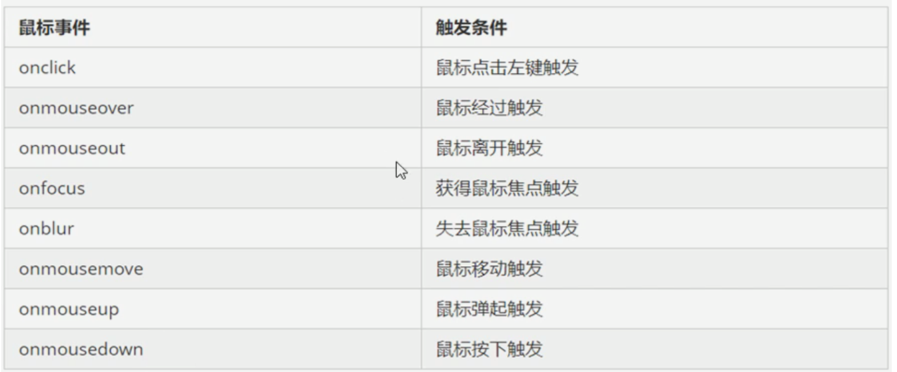
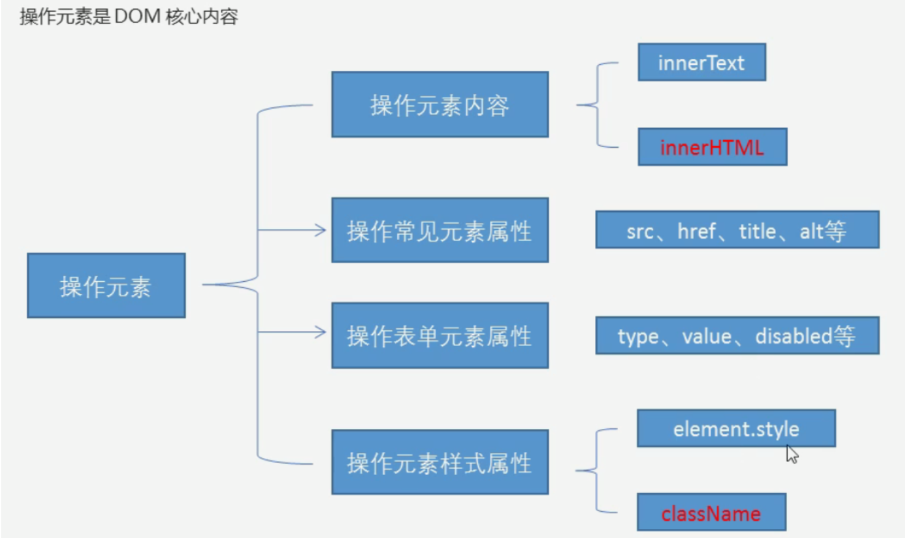
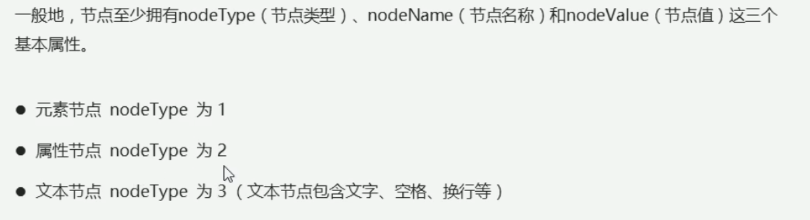

# Dom操作

## 如何获取页面元素

### 根据id获取

- 使用 getElementByid()来获取带有id的对象

```js
 <!DOCTYPE html>
<html lang="en">
<head>
    <meta charset="UTF-8">
    <meta http-equiv="X-UA-Compatible" content="IE=edge">
    <!--[if lt IE 9]>
      <script src="https://cdn.jsdelivr.net/npm/html5shiv@3.7.3/dist/html5shiv.min.js"></script>
      <script src="https://cdn.jsdelivr.net/npm/respond.js@1.4.2/dest/respond.min.js"></script>
    <![endif]-->
    <link href="bootstrap/css/bootstrap.min.css" rel="stylesheet">
    <title>Title</title>
</head>
<body>
    <div id="time">2020-1-1</div>
    <script>
        // 因为文档页面从上往下加载 所以先得有标签 所以script写在dev的下边
        // id必须是大小写敏感的字符串 它返回的是一个元素对象
        var tim = document.getElementById('time');
        console.log(tim);
        // 打印返回的元素对象更好地查看里边的元素和方法
        console.dir(tim);
    </script>
</body>
</html>
```

### 根据标签名来获取元素

```js
 <!DOCTYPE html>
<html lang="en">
<head>
    <meta charset="UTF-8">
    <meta http-equiv="X-UA-Compatible" content="IE=edge">
    <!--[if lt IE 9]>
      <script src="https://cdn.jsdelivr.net/npm/html5shiv@3.7.3/dist/html5shiv.min.js"></script>
      <script src="https://cdn.jsdelivr.net/npm/respond.js@1.4.2/dest/respond.min.js"></script>
    <![endif]-->
    <link href="bootstrap/css/bootstrap.min.css" rel="stylesheet">
    <title>Title</title>
</head>
<body>
    <ul>
        <li>知否知否</li>
        <li>知否知否</li>
        <li>知否知否</li>
        <li>知否知否</li>
        <li>知否知否</li>
    </ul>
    <script>
        // 返回的是一个获取过来元素对象的集合 以伪数组的形式存储
        var test = document.getElementsByTagName('li');
        console.log(test)
    </script>
</body>
</html>
```

### 根据类名获取 h5新增方法

```js
 <!DOCTYPE html>
<html lang="en">
<head>
    <meta charset="UTF-8">
    <meta http-equiv="X-UA-Compatible" content="IE=edge">
    <!--[if lt IE 9]>
      <script src="https://cdn.jsdelivr.net/npm/html5shiv@3.7.3/dist/html5shiv.min.js"></script>
      <script src="https://cdn.jsdelivr.net/npm/respond.js@1.4.2/dest/respond.min.js"></script>
    <![endif]-->
    <link href="bootstrap/css/bootstrap.min.css" rel="stylesheet">
    <title>Title</title>
</head>
<body>
    <div class="box">盒子</div>
    <div class="box">盒子</div>
    <div id="nav">
        <ul>
            <li>首页1</li>
            <li>首页2</li>
        </ul>
    </div>
    <script>
        var test = document.getElementsByClassName('box');
        console.log(test);
        // querySelector 返回指定选择器的第一个元素对象 里边的选择器需要加符号
        var firstbox = document.querySelector('.box');
        console.log(firstbox);
        var nav = document.querySelector('#nav');
        console.log(nav);
        var li1 = document.querySelector('li');
        console.log(li1);

        // querySelectorAll 返回指定选择器的所有对象
        var allbox = document.querySelectorAll('.box')
        console.log(allbox)
    </script>
</body>
</html>
```

###  获取特殊元素

```js
 <!DOCTYPE html>
<html lang="en">
<head>
    <meta charset="UTF-8">
    <meta http-equiv="X-UA-Compatible" content="IE=edge">
    <!--[if lt IE 9]>
      <script src="https://cdn.jsdelivr.net/npm/html5shiv@3.7.3/dist/html5shiv.min.js"></script>
      <script src="https://cdn.jsdelivr.net/npm/respond.js@1.4.2/dest/respond.min.js"></script>
    <![endif]-->
    <link href="bootstrap/css/bootstrap.min.css" rel="stylesheet">
    <title>Title</title>
</head>
<body>

    <script>
        // 获取body元素
        var bodyele = document.body;
        console.log(bodyele);
        // 获取html元素
        var htmlele = document.documentElement;
        console.log(htmlele)
    </script>
</body>
</html>
```

## 事件基础

```js
 <!DOCTYPE html>
<html lang="en">
<head>
    <meta charset="UTF-8">
    <meta http-equiv="X-UA-Compatible" content="IE=edge">
    <!--[if lt IE 9]>
      <script src="https://cdn.jsdelivr.net/npm/html5shiv@3.7.3/dist/html5shiv.min.js"></script>
      <script src="https://cdn.jsdelivr.net/npm/respond.js@1.4.2/dest/respond.min.js"></script>
    <![endif]-->
    <link href="bootstrap/css/bootstrap.min.css" rel="stylesheet">
    <title>Title</title>
</head>
<body>
    <button id="btn">唐伯虎</button>
    <script>
        // 点击上边的按钮 弹出对话框
        // 事件由三部分组成 事件源 事件类型 事件处理程序
        // 事件源 事件被触发的对象
        // 事件类型 鼠标点击(obclick) 鼠标经过 键盘按下
        // 事件处理程序 通过函数赋值的方式完成
        //获取事件源
        var btn = document.getElementById('btn');
          //  绑定事件 并添加处理程序
			btn.onclick = function () {
            alert('dian qiu xiang')
        }
    </script>
</body>
</html>
```

### 常见的鼠标事件



## 操作元素

### 改变元素的内容

#### innerText

```js
 <!DOCTYPE html>
<html lang="en">
<head>
    <meta charset="UTF-8">
    <meta http-equiv="X-UA-Compatible" content="IE=edge">
    <!--[if lt IE 9]>
      <script src="https://cdn.jsdelivr.net/npm/html5shiv@3.7.3/dist/html5shiv.min.js"></script>
      <script src="https://cdn.jsdelivr.net/npm/respond.js@1.4.2/dest/respond.min.js"></script>
    <![endif]-->
    <link href="bootstrap/css/bootstrap.min.css" rel="stylesheet">
    <title>Title</title>
</head>
<body>
    <button id="btn">显示当前系统时间</button>
    <div>某个时间</div>
    <p>123</p>
    <script>
        // 点击按钮 div里边的文字发生变化
        // 1.获取元素
        var btn = document.querySelector('button');
        var div = document.querySelector('div');
        // 注册事件
        btn.onclick=function () {
            var date = new Date();
            div.innerText = date.getDay()
        };
        var date = new Date();
        var p = document.querySelector('p');
        p.innerText = date.getTime();

    </script>
</body>
</html>
```

#### innerHTML

```js
 <!DOCTYPE html>
<html lang="en">
<head>
    <meta charset="UTF-8">
    <meta http-equiv="X-UA-Compatible" content="IE=edge">
    <!--[if lt IE 9]>
      <script src="https://cdn.jsdelivr.net/npm/html5shiv@3.7.3/dist/html5shiv.min.js"></script>
      <script src="https://cdn.jsdelivr.net/npm/respond.js@1.4.2/dest/respond.min.js"></script>
    <![endif]-->
    <link href="bootstrap/css/bootstrap.min.css" rel="stylesheet">
    <title>Title</title>
</head>
<body>
    <button id="btn">显示当前系统时间</button>
    <div>某个时间</div>
    <p>我是文字
        <span>
            123
        </span>
    </p>
    <script>

        var date = new Date();
        var p = document.querySelector('p');
       // p.innerText = '<strong>今天是：</strong> 2019'; //不会解析标签 并去除换行和空格
       // p.innerHTML = '<strong>今天是：</strong> 2019'; //会解析标签 并保留空格和换行
        // 这两个属性是可读写的
        console.log(p.innerText);
        console.log(p.innerHTML);
    </script>
</body>
</html>
```

### 改变元素属性

```js
 <!DOCTYPE html>
<html lang="en">
<head>
    <meta charset="UTF-8">
    <meta http-equiv="X-UA-Compatible" content="IE=edge">
    <!--[if lt IE 9]>
      <script src="https://cdn.jsdelivr.net/npm/html5shiv@3.7.3/dist/html5shiv.min.js"></script>
      <script src="https://cdn.jsdelivr.net/npm/respond.js@1.4.2/dest/respond.min.js"></script>
    <![endif]-->
    <link href="bootstrap/css/bootstrap.min.css" rel="stylesheet">
    <title>Title</title>
</head>
<body>
    <button id="qq">qq</button>
    <button id="360">360</button>
    
    <script>
        var qq = document.getElementById('qq');
        var sec = document.getElementById('360');
        var img = document.querySelector('img');
        sec.onclick=function () {
            img.src = 'images/360.png';
        };
        qq.onclick = function () {
            img.src = "images/qq.png";
        }
        
    </script>
</body>
</html>
```

### 表单元素属性的操作

```js
 <!DOCTYPE html>
<html lang="en">
<head>
    <meta charset="UTF-8">
    <meta http-equiv="X-UA-Compatible" content="IE=edge">
    <!--[if lt IE 9]>
      <script src="https://cdn.jsdelivr.net/npm/html5shiv@3.7.3/dist/html5shiv.min.js"></script>
      <script src="https://cdn.jsdelivr.net/npm/respond.js@1.4.2/dest/respond.min.js"></script>
    <![endif]-->
    <link href="bootstrap/css/bootstrap.min.css" rel="stylesheet">
    <title>Title</title>
</head>
<body>
    <button>按钮</button>
    <input type="text" value="输入内容 ">
    <script>
        var btn = document.querySelector('button');
        var inpu = document.querySelector('input');
        btn.onclick = function () {
            // 表单里边的文字内容是通过value来修改的
            inpu.value = "输入了什么";
            // 如果想要某个表单被禁用 点击一次之后就不能再点击 disabled
            //btn.disabled = true;
            // this 指向了这个函数的调用者
            this.disabled = true;
        }
    </script>
</body>
</html>
```

#### 切换密码框来查看密码

```js
 <!DOCTYPE html>
<html lang="en">
<head>
    <meta charset="UTF-8">
    <meta http-equiv="X-UA-Compatible" content="IE=edge">
    <title>Title</title>
    <style>
            .box{
                position: relative;
                width: 400px;
                border-bottom: 1px solid #ccc;
                margin: 100px auto;
            }
            .box input {
                width: 370px;
                height: 30px;
                /*去除输入框默认的边框*/
                border: 0;
                /*去除点击输入框后的篮筐*/
                outline: none;
            }

            .box img {
                position: absolute;
                top: 2px;
                right: 30px;

                width: 24px;
            }
    </style>
</head>
<body>
    <div class="box">
        <label for="">
                
        </label>
        <input type="password" name="" id="">
    </div>
    <script>
        var img = document.querySelector('img');
        var inpu = document.querySelector('input');
        var flag = 0;
        img.onclick = function () {
            // 使用赋值的方式算法来实现
            if (flag == 0) {
                flag = 1;
                img.src = 'images/360.png';
                inpu.type = 'text';
            } else {
                flag = 0;
                img.src = 'images/qq.png';
                inpu.type = 'password';
            }
        };

    </script>
</body>
</html>
```

## 样式属性操作

```js
 <!DOCTYPE html>
<html lang="en">
<head>
    <meta charset="UTF-8">
    <meta http-equiv="X-UA-Compatible" content="IE=edge">
    <title>Title</title>
    <style>
            .box{
                width: 200px;
                height: 200px;
                background-color: pink;
            }

    </style>
</head>
<body>
    <div class="box">

    </div>
    <script>
        var bo = document.querySelector('div');
        bo.onclick = function () {
            // 鼠标点击修改背景颜色
            this.style.backgroundColor= 'red';
            // 鼠标点击修改宽度
            this.style.width = '300px';

        }

    </script>
</body>
</html>
```

#### 隐藏二维码案例

```js
 <!DOCTYPE html>
<html lang="en">
<head>
    <meta charset="UTF-8">
    <meta http-equiv="X-UA-Compatible" content="IE=edge">
    <title>Title</title>
    <style>
            .box{
                position: relative;
                width: 200px;
                height: 200px;
                border: 1px solid #cccccc;
            }
            .box img {
                position: absolute;
                right: 0;
                top: 0;
                width: 90%;
                height: 100%;
            }
            .box li {
                list-style: none;
            }
    </style>
</head>
<body>
    <div class="box">
        <li class="close-btn">x</li>
        
    </div>
    <script>
            var btn = document.querySelector('.close-btn');
            var box = document.querySelector('.box');
            // 绑定事件 绑定的时候不会有提示输出 需要自己写完
            btn.onclick = function () {
                box.style.display = 'none';
            }
    </script>
</body>
</html>
```

#### 显示隐藏文本框内容

- 获得焦点 onfocus
- 失去焦点 onblur

```js
 <!DOCTYPE html>
<html lang="en">
<head>
    <meta charset="UTF-8">
    <meta http-equiv="X-UA-Compatible" content="IE=edge">
    <title>Title</title>
    <style>
        input {
            color: #999999;
        }
    </style>
</head>
<body>
    <input type="text" value="手机" >
    <script>
        var test = document.querySelector('input');
        // 获得焦点事件
        test.onfocus = function () {
            if (test.value === '手机'){
                test.value = '';
            }
            // 获得焦点需要把文本框的字体颜色加深
            test.style.color = 'red';
        };
        // 失去焦点事件
        test.onblur = function () {
            if (test.value === ''){
                test.value = '手机';
            }
            // 失去焦点颜色变钱
            test.style.color = '#999';
        };


    </script>
</body>
</html>
```

### 触发事件的时候使用类

```js
 <!DOCTYPE html>
<html lang="en">
<head>
    <meta charset="UTF-8">
    <meta http-equiv="X-UA-Compatible" content="IE=edge">
    <title>Title</title>
    <style>
        .box {
            width: 200px;
            height: 200px;
            background-color: #92B0DD;
        }
        .change {
            width: 300px;
            height: 300px;
            background-color: #999999;
            margin-top: 100px;
        }
    </style>
</head>
<body>
    <div class="box">文本</div>
    <script>
        var div = document.querySelector('.box');
        div.onclick = function () {
            // 让当前元素的类名改为了change 使用了定义好的change类
            div.className = 'change';
        }

    </script>
</body>
</html>
```

#### 密码框格式提示错误信息案例

```js
 <!DOCTYPE html>
<html lang="en">
<head>
    <meta charset="UTF-8">
    <meta http-equiv="X-UA-Compatible" content="IE=edge">
    <title>Title</title>
    <style>
        div {
            width: 300px;
            margin: 100px auto;
        }
        .message{
            display: inline-block;
            font-size: 12px;
            padding-left: 20px;
        }
    </style>
</head>
<body>
    <div>
        <input type="password" class="ipt">
        <p class="message">请输入6~15位数字</p>
    </div>
    <script>
        var ipt = document.querySelector('.ipt');
        var message = document.querySelector('.message');
        ipt.onblur = function () {
            if (ipt.value.length >= 6 && ipt.value.length <= 15){
                message.style.display = 'none';
            }else{
                message.style.display = 'inline-block';
            }
        }

    </script>
</body>
</html>
```




### 多按钮点击事件

```js
 <!DOCTYPE html>
<html lang="en">
<head>
    <meta charset="UTF-8">
    <meta http-equiv="X-UA-Compatible" content="IE=edge">
    <title>Title</title>

</head>
<body>
    <button>按钮</button>
    <button>按钮</button>
    <button>按钮</button>
    <button>按钮</button>
    <button>按钮</button>
    <script>
            // 获取所有元素
        var btns = document.getElementsByTagName('button');
            for (let i = 0; i < btns.length ; i++) {
                btns[i].onclick = function () {
                    this.style.backgroundColor = 'red';
                };
                btns[i].onblur = function () {
                    this.style.backgroundColor = '';
                }

            }


    </script>
</body>
</html>
```

#### 表格鼠标经过就改变颜色案例

```js
 <!DOCTYPE html>
<html lang="en">
<head>
    <meta charset="UTF-8">
    <meta http-equiv="X-UA-Compatible" content="IE=edge">
    <title>Title</title>
    <style>
        thead tr {
            height: 30px;
            background-color: #383f49;
        }

        tbody tr {
            height: 20px;
        }
        tbody td {
            border-bottom: 1px solid #999999;
            font-size: 12px;
            color: blue;
        }
        .bg {
            background-color: #999999;
        }
    </style>
</head>
<body>
    <table>
        <thead>
        <tr>
           <th>代码</th><th>名称</th><th>最新公布值</th><th>累计净值</th><th>单位净值</th>
        </tr>
        </thead>
        <tbody>
            <tr>
                <td>002020</td>
                <td>农行</td>
                <td>1.075</td>
                <td>1.079</td>
                <td>1.074</td>
            </tr>
            <tr>
                <td>002020</td>
                <td>农行</td>
                <td>1.075</td>
                <td>1.079</td>
                <td>1.074</td>
            </tr>
            <tr>
                <td>002020</td>
                <td>农行</td>
                <td>1.075</td>
                <td>1.079</td>
                <td>1.074</td>
            </tr>
            <tr>
                <td>002020</td>
                <td>农行</td>
                <td>1.075</td>
                <td>1.079</td>
                <td>1.074</td>
            </tr>
            <tr>
                <td>002020</td>
                <td>农行</td>
                <td>1.075</td>
                <td>1.079</td>
                <td>1.074</td>
            </tr>
        </tbody>
    </table>
    <script>
        // 获取的是tbody里边所有的行
        var trs = document.querySelector('tbody').querySelectorAll('tr');
        // 利用循环注册事件
        for (i = 0;i < trs.length;i++){
            // onmouseover 鼠标经过事件
            trs[i].onmouseover = function () {
                this.className = 'bg';
            };
            // onmouseout 鼠标离开事件
            trs[i].onmouseout = function () {
                this.className = '';
            };
        }
    </script>
</body>
</html>
```

#### 全选反选案例

```js
 <!DOCTYPE html>
<html lang="en">
<head>
    <meta charset="UTF-8">
    <meta http-equiv="X-UA-Compatible" content="IE=edge">
    <title>Title</title>
    <style>
        thead tr {
            height: 30px;
            background-color: #383f49;
        }

        tbody tr {
            height: 20px;
        }
        tbody td {
            border-bottom: 1px solid #999999;
            font-size: 12px;
            color: blue;
        }
        .bg {
            background-color: #999999;
        }
    </style>
</head>
<body>
    <table cellspacing="0">
        <thead>
        <tr>
           <th><input type="checkbox" id="ipt"></th><th>商品</th><th>价格</th>
        </tr>
        </thead>
        <tbody id="tbd">
            <tr>
                <td><input type="checkbox"></td>
                <td>iphone8</td>
                <td>2000</td>
            </tr>
            <tr>
                <td><input type="checkbox"></td>
                <td>ipad</td>
                <td>1000</td>
            </tr>
            <tr>
                <td><input type="checkbox"></td>
                <td>mac</td>
                <td>3000</td>
            </tr>
            <tr>
                <td><input type="checkbox"></td>
                <td>win</td>
                <td>1000</td>
            </tr>
        </tbody>
    </table>
    <script>
        // 全选和取消全选的做法 让下面所有复选框的checked属性 (选中状态) 跟随 全选按钮即可
        // 获取所有元素
        var inputs = document.getElementById('ipt'); //全选按钮
        var tdbs = document.getElementById('tbd').getElementsByTagName('input');//复选框获取
        inputs.onclick = function () {
            // this.checked可以得到当前选项的选中状态 如果是true就是选中 如果是false就是没选
            // if (this.checked == true) {
            //     for (i = 0; i < tdbs.length; i++) {
            //         tdbs[i].checked = true;
            //     }
            // }else {
            //     for (i = 0; i < tdbs.length; i++) {
            //         tdbs[i].checked = false;
            //     }
            // }
               for (i = 0; i < tdbs.length; i++) {
                tdbs[i].checked = this.checked;
            }
               // 下面复原框需要全部选中 上面的全选才选中
            for (i = 0;i < tdbs.length;i++){
                tdbs[i].onclick = function () {
                    var flag = true;
                    // 每次点击下面的复选框都要循环检查这四个小按钮是否全被选中
                    for (i = 0;i < tdbs.length;i++){
                        // 如果有一个不是在选中状态
                        if (!tdbs[i].checked){
                            flag = false;
                            // 就赋值false 并退出此次循环 因为再循环也没啥意义
                            break;
                        }
                    }
                    inputs.checked = flag;
                }
            }

        }


    </script>
</body>
</html>
```

### 自定义属性的操作

#### 获取属性的值

```js
 <!DOCTYPE html>
<html lang="en">
<head>
    <meta charset="UTF-8">
    <meta http-equiv="X-UA-Compatible" content="IE=edge">
    <title>Title</title>
    <style>

    </style>
</head>
<body>
    <div id="demo"></div>
    <script>
        var div = document.querySelector('div');
        // getAttribute 获取属性的值
        console.log(div.getAttribute('id')) // 获取id属性的值

    </script>
</body>
</html>
```

#### 设置属性的值

```js
 <!DOCTYPE html>
<html lang="en">
<head>
    <meta charset="UTF-8">
    <meta http-equiv="X-UA-Compatible" content="IE=edge">
    <title>Title</title>
    <style>

    </style>
</head>
<body>
    <div id="demo"></div>
    <script>
        var div = document.querySelector('div');
        // 将原来的id属性的demo值改成test
        div.setAttribute('id','test');
        console.log(div.getAttribute('id'))

    </script>
</body>
</html>
```

#### 移出属性的值

```js
 <!DOCTYPE html>
<html lang="en">
<head>
    <meta charset="UTF-8">
    <meta http-equiv="X-UA-Compatible" content="IE=edge">
    <title>Title</title>
    <style>

    </style>
</head>
<body>
    <div id="demo"></div>
    <script>
        var div = document.querySelector('div');
        // 将原来的id属性的demo值改成test
        div.removeAttribute('id');
        console.log(div.getAttribute('id'))

    </script>
</body>
</html>
```

#### 规格 价格 评价 详情页案例 点击切换案例

```js
 <!DOCTYPE html>
<html lang="en">
<head>
    <meta charset="UTF-8">
    <meta http-equiv="X-UA-Compatible" content="IE=edge">
    <title>Title</title>
    <style>
        ul{
            background-color: #999999;
        }
        ul li {
            padding: 5px;
            list-style: none;
            display: inline-block;

        }
        div {
            display: none;
        }
        .nav1 {
            background-color: red;
        }
    </style>
</head>
<body>
    <ul>
        <li class="nav1">商品介绍</li>
        <li>规格与包装</li>
        <li>售后保障</li>
        <li>商品评价</li>
    </ul>
    <div class="item" style="display: block">商品介绍内容</div>
    <div class="item">规格内容</div>
    <div class="item">售后保障</div>
    <div class="item">商品评价</div>
    <script>
        // 选项卡点击某一个 当前这个选项卡是红色 然后其他的不变
        var lis = document.querySelector('ul').querySelectorAll('li');
        var items = document.querySelectorAll('.item');
        for (var i = 0;i < lis.length;i++){
            // 给选项卡li设定编号
            lis[i].setAttribute('index',i);
            lis[i].onclick = function () {
                // 选项卡变色部分
                for (var i = 0;i < lis.length;i++){
                    lis[i].className = '';

                }
                this.className = 'nav1';
                // 选项卡对应的内容展示部分
                // 给选项卡所有的li添加自定义属性 属性从0开始编号 然后给下边的展示内容也对应设定自定义编号
                // 获取点击的index值
                var index = this.getAttribute('index');
                // console.log(index)
                // 点击后先清空所有的显示内容
                for (var z = 0;z < items.length;z++){
                    items[z].style.display = 'none';

                }
                // 显示当前模块下的内容
                items[index].style.display = 'block';

            };
        }
    </script>
</body>
</html>
```

- h5自定义属性规定需要以data-开头 让人一看就是自定义

## 节点操作



### 父级节点

  ```js
 <!DOCTYPE html>
<html lang="en">
<head>
    <meta charset="UTF-8">
    <meta http-equiv="X-UA-Compatible" content="IE=edge">
    <title>Title</title>
    <style>
        .box {

        }
        .erweima {

        }
    </style>
</head>
<body>
    <div class="demo">
        <div class="box">
            <span class="erweima">x</span>
        </div>
    </div>

    <script>
        // 父级节点
        // 原来写法
        var erweima = document.querySelector('.erweima');
        // var box = document.querySelector('.box');
        // 节点操作 获取的是离元素最近的节点 如果找不到父节点则返回null
        console.log(erweima.parentNode);

    </script>
</body>
</html>
  ```

### 子节点

```js
 <!DOCTYPE html>
<html lang="en">
<head>
    <meta charset="UTF-8">
    <meta http-equiv="X-UA-Compatible" content="IE=edge">
    <title>Title</title>
    <style>
        .box {

        }
        .erweima {

        }
    </style>
</head>
<body>
    <ul>
        <li></li>
        <li></li>
        <li></li>
        <li></li>
    </ul>

    <script>
        // 子节点操作
        var ul = document.querySelector('ul');
        // 节点操作 所有的节点 包含文本节点和元素节点 我们需要将文本节点去掉
        // 去掉需要通过判断节点的值来进行 元素节点1 属性节点2 文本节点3  只获取元素节点
        // 第一种方式
        for (var i = 0;i < ul.childNodes.length;i++){
            if (ul.childNodes[i].nodeType == 1){
                console.log(ul.childNodes[i])
            }
        }
        // 第二种方式 获取元素的所有子节点
        console.log(ul.children)

    </script>
</body>
</html>
```

#### 获取子节点第一个和最后一个

```js
 <!DOCTYPE html>
<html lang="en">
<head>
    <meta charset="UTF-8">
    <meta http-equiv="X-UA-Compatible" content="IE=edge">
    <title>Title</title>
    <style>
        .box {

        }
        .erweima {

        }
    </style>
</head>
<body>
    <ul>
        <li>1</li>
        <li></li>
        <li></li>
        <li>4</li>
    </ul>

    <script>
        // 获取第一个子节点和最后一个子节点
        var ul = document.querySelector('ul');
        // firstchild lastchild获取的是第一个子节点 或者最后一个子节点 不管是文本节点或者是元素节点
        console.log(ul.firstChild);
        console.log(ul.lastChild);
        // 获取的是第一个子元素节点
        console.log(ul.firstElementChild);
        // 获取的是最后一个子元素节点
        console.log(ul.lastElementChild);
        // 以上两种有兼容性问题 实际开发中如下
        console.log(ul.children[0]); //第一个
        console.log(ul.children[ul.children.length - 1]); // 最后一个
    </script>
</body>
</html>
```

### 下拉菜单案例

```js
<!DOCTYPE html>
<html lang="en">
<head>
    <meta charset="UTF-8">
    <title>Document</title>
    <style>
        ul{
            list-style: none;
        }
        .nav>li{
            float: left;
        }
        ul a{
            display: block;
            text-decoration: none;
            width: 100px;
            height: 50px;
            text-align: center;
            line-height: 50px;
            color: white;
            background-color: #2f3e45;
        }
        .nav>li:first-child a{
            border-radius: 10px 0 0 10px;
        }
        .nav>li:last-child a{
            border-radius: 0 10px 10px 0;
        }
        .drop-down{
            /*position: relative;*/
        }
        .drop-down-content{
            padding: 0;
            display: none;
            /*position: absolute;*/
        }

        h3{
            font-size: 30px;
            clear: both;
        }
        .drop-down-content li:hover a{
            background-color:red;
        }
        .nav .drop-down:hover .drop-down-content{
            display: block;
        }
</style>
</head>
<body>
    <ul class="nav">
        <li class="drop-down"><a href="#">下拉菜单</a>
            <ul class="drop-down-content">
                <li><a href="#">我是1</a></li>
                <li><a href="#">我是2</a></li>
                <li><a href="#">我是3</a></li>
            </ul>
        </li>
        <li class="drop-down"><a href="#">下拉菜单</a>
            <ul class="drop-down-content">
                <li><a href="#">我是1</a></li>
                <li><a href="#">我是2</a></li>
                <li><a href="#">我是3</a></li>
            </ul>
            </li>
        <li><a href="#">下拉菜单</a></li>
        <li><a href="#">下拉菜单</a></li>
        <li><a href="#">下拉菜单</a></li>
    </ul>

</body>
</html>
```


