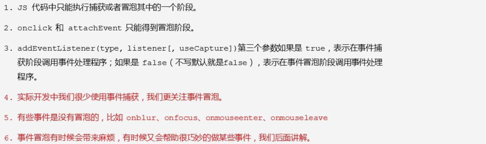
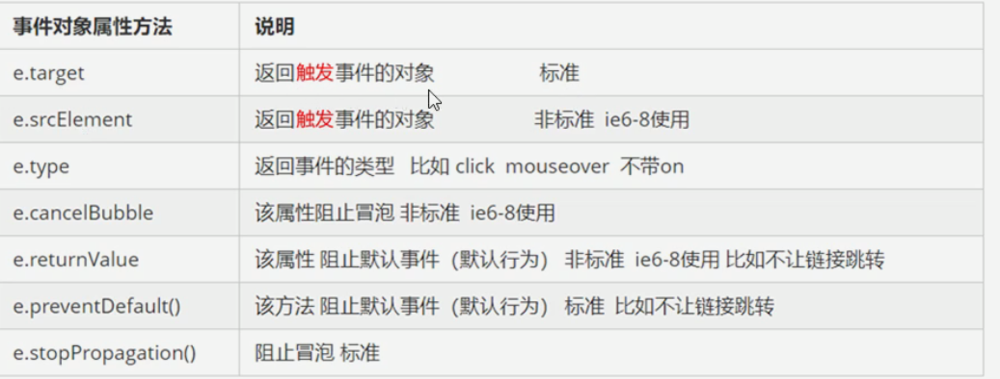
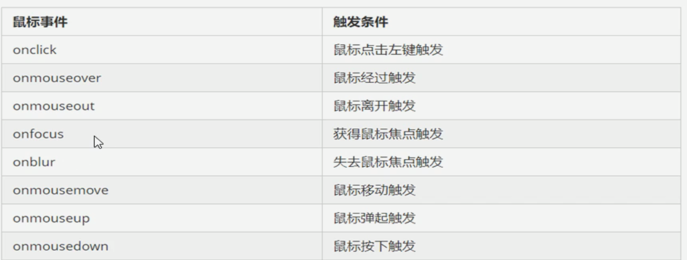
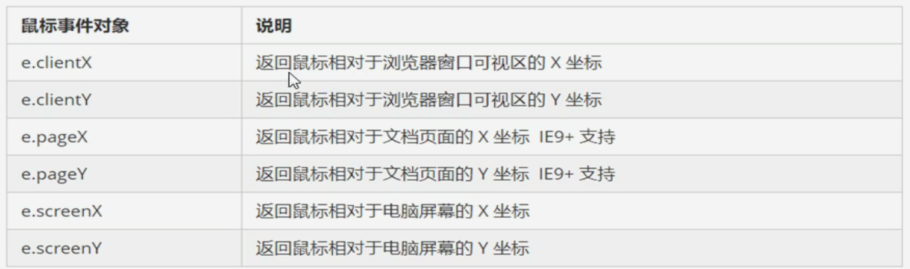
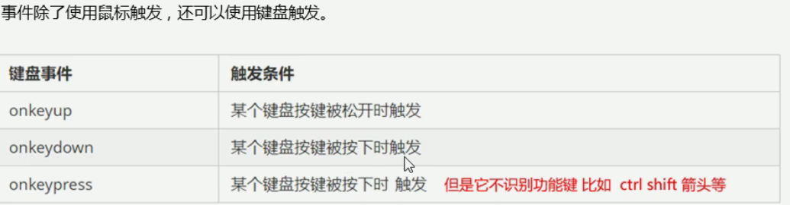

# Dom操作

## 如何获取页面元素

### 根据id获取

- 使用 getElementByid()来获取带有id的对象

```js
 <!DOCTYPE html>
<html lang="en">
<head>
    <meta charset="UTF-8">
    <meta http-equiv="X-UA-Compatible" content="IE=edge">
    <!--[if lt IE 9]>
      <script src="https://cdn.jsdelivr.net/npm/html5shiv@3.7.3/dist/html5shiv.min.js"></script>
      <script src="https://cdn.jsdelivr.net/npm/respond.js@1.4.2/dest/respond.min.js"></script>
    <![endif]-->
    <link href="bootstrap/css/bootstrap.min.css" rel="stylesheet">
    <title>Title</title>
</head>
<body>
    <div id="time">2020-1-1</div>
    <script>
        // 因为文档页面从上往下加载 所以先得有标签 所以script写在dev的下边
        // id必须是大小写敏感的字符串 它返回的是一个元素对象
        var tim = document.getElementById('time');
        console.log(tim);
        // 打印返回的元素对象更好地查看里边的元素和方法
        console.dir(tim);
    </script>
</body>
</html>
```

### 根据标签名来获取元素

```js
 <!DOCTYPE html>
<html lang="en">
<head>
    <meta charset="UTF-8">
    <meta http-equiv="X-UA-Compatible" content="IE=edge">
    <!--[if lt IE 9]>
      <script src="https://cdn.jsdelivr.net/npm/html5shiv@3.7.3/dist/html5shiv.min.js"></script>
      <script src="https://cdn.jsdelivr.net/npm/respond.js@1.4.2/dest/respond.min.js"></script>
    <![endif]-->
    <link href="bootstrap/css/bootstrap.min.css" rel="stylesheet">
    <title>Title</title>
</head>
<body>
    <ul>
        <li>知否知否</li>
        <li>知否知否</li>
        <li>知否知否</li>
        <li>知否知否</li>
        <li>知否知否</li>
    </ul>
    <script>
        // 返回的是一个获取过来元素对象的集合 以伪数组的形式存储
        var test = document.getElementsByTagName('li');
        console.log(test)
    </script>
</body>
</html>
```

### 根据类名获取 h5新增方法

```js
 <!DOCTYPE html>
<html lang="en">
<head>
    <meta charset="UTF-8">
    <meta http-equiv="X-UA-Compatible" content="IE=edge">
    <!--[if lt IE 9]>
      <script src="https://cdn.jsdelivr.net/npm/html5shiv@3.7.3/dist/html5shiv.min.js"></script>
      <script src="https://cdn.jsdelivr.net/npm/respond.js@1.4.2/dest/respond.min.js"></script>
    <![endif]-->
    <link href="bootstrap/css/bootstrap.min.css" rel="stylesheet">
    <title>Title</title>
</head>
<body>
    <div class="box">盒子</div>
    <div class="box">盒子</div>
    <div id="nav">
        <ul>
            <li>首页1</li>
            <li>首页2</li>
        </ul>
    </div>
    <script>
        var test = document.getElementsByClassName('box');
        console.log(test);
        // querySelector 返回指定选择器的第一个元素对象 里边的选择器需要加符号
        var firstbox = document.querySelector('.box');
        console.log(firstbox);
        var nav = document.querySelector('#nav');
        console.log(nav);
        var li1 = document.querySelector('li');
        console.log(li1);

        // querySelectorAll 返回指定选择器的所有对象
        var allbox = document.querySelectorAll('.box')
        console.log(allbox)
    </script>
</body>
</html>
```

###  获取特殊元素

```js
 <!DOCTYPE html>
<html lang="en">
<head>
    <meta charset="UTF-8">
    <meta http-equiv="X-UA-Compatible" content="IE=edge">
    <!--[if lt IE 9]>
      <script src="https://cdn.jsdelivr.net/npm/html5shiv@3.7.3/dist/html5shiv.min.js"></script>
      <script src="https://cdn.jsdelivr.net/npm/respond.js@1.4.2/dest/respond.min.js"></script>
    <![endif]-->
    <link href="bootstrap/css/bootstrap.min.css" rel="stylesheet">
    <title>Title</title>
</head>
<body>

    <script>
        // 获取body元素
        var bodyele = document.body;
        console.log(bodyele);
        // 获取html元素
        var htmlele = document.documentElement;
        console.log(htmlele)
    </script>
</body>
</html>
```

## 事件基础

```js
 <!DOCTYPE html>
<html lang="en">
<head>
    <meta charset="UTF-8">
    <meta http-equiv="X-UA-Compatible" content="IE=edge">
    <!--[if lt IE 9]>
      <script src="https://cdn.jsdelivr.net/npm/html5shiv@3.7.3/dist/html5shiv.min.js"></script>
      <script src="https://cdn.jsdelivr.net/npm/respond.js@1.4.2/dest/respond.min.js"></script>
    <![endif]-->
    <link href="bootstrap/css/bootstrap.min.css" rel="stylesheet">
    <title>Title</title>
</head>
<body>
    <button id="btn">唐伯虎</button>
    <script>
        // 点击上边的按钮 弹出对话框
        // 事件由三部分组成 事件源 事件类型 事件处理程序
        // 事件源 事件被触发的对象
        // 事件类型 鼠标点击(obclick) 鼠标经过 键盘按下
        // 事件处理程序 通过函数赋值的方式完成
        //获取事件源
        var btn = document.getElementById('btn');
          //  绑定事件 并添加处理程序
			btn.onclick = function () {
            alert('dian qiu xiang')
        }
    </script>
</body>
</html>
```

### 常见的鼠标事件


## 操作元素

### 改变元素的内容

#### innerText

```js
 <!DOCTYPE html>
<html lang="en">
<head>
    <meta charset="UTF-8">
    <meta http-equiv="X-UA-Compatible" content="IE=edge">
    <!--[if lt IE 9]>
      <script src="https://cdn.jsdelivr.net/npm/html5shiv@3.7.3/dist/html5shiv.min.js"></script>
      <script src="https://cdn.jsdelivr.net/npm/respond.js@1.4.2/dest/respond.min.js"></script>
    <![endif]-->
    <link href="bootstrap/css/bootstrap.min.css" rel="stylesheet">
    <title>Title</title>
</head>
<body>
    <button id="btn">显示当前系统时间</button>
    <div>某个时间</div>
    <p>123</p>
    <script>
        // 点击按钮 div里边的文字发生变化
        // 1.获取元素
        var btn = document.querySelector('button');
        var div = document.querySelector('div');
        // 注册事件
        btn.onclick=function () {
            var date = new Date();
            div.innerText = date.getDay()
        };
        var date = new Date();
        var p = document.querySelector('p');
        p.innerText = date.getTime();

    </script>
</body>
</html>
```

#### innerHTML

```js
 <!DOCTYPE html>
<html lang="en">
<head>
    <meta charset="UTF-8">
    <meta http-equiv="X-UA-Compatible" content="IE=edge">
    <!--[if lt IE 9]>
      <script src="https://cdn.jsdelivr.net/npm/html5shiv@3.7.3/dist/html5shiv.min.js"></script>
      <script src="https://cdn.jsdelivr.net/npm/respond.js@1.4.2/dest/respond.min.js"></script>
    <![endif]-->
    <link href="bootstrap/css/bootstrap.min.css" rel="stylesheet">
    <title>Title</title>
</head>
<body>
    <button id="btn">显示当前系统时间</button>
    <div>某个时间</div>
    <p>我是文字
        <span>
            123
        </span>
    </p>
    <script>

        var date = new Date();
        var p = document.querySelector('p');
       // p.innerText = '<strong>今天是：</strong> 2019'; //不会解析标签 并去除换行和空格
       // p.innerHTML = '<strong>今天是：</strong> 2019'; //会解析标签 并保留空格和换行
        // 这两个属性是可读写的
        console.log(p.innerText);
        console.log(p.innerHTML);
    </script>
</body>
</html>
```

### 改变元素属性

```js
 <!DOCTYPE html>
<html lang="en">
<head>
    <meta charset="UTF-8">
    <meta http-equiv="X-UA-Compatible" content="IE=edge">
    <!--[if lt IE 9]>
      <script src="https://cdn.jsdelivr.net/npm/html5shiv@3.7.3/dist/html5shiv.min.js"></script>
      <script src="https://cdn.jsdelivr.net/npm/respond.js@1.4.2/dest/respond.min.js"></script>
    <![endif]-->
    <link href="bootstrap/css/bootstrap.min.css" rel="stylesheet">
    <title>Title</title>
</head>
<body>
    <button id="qq">qq</button>
    <button id="360">360</button>
    
    <script>
        var qq = document.getElementById('qq');
        var sec = document.getElementById('360');
        var img = document.querySelector('img');
        sec.onclick=function () {
            img.src = 'images/360.png';
        };
        qq.onclick = function () {
            img.src = "images/qq.png";
        }
        
    </script>
</body>
</html>
```

### 表单元素属性的操作

```js
 <!DOCTYPE html>
<html lang="en">
<head>
    <meta charset="UTF-8">
    <meta http-equiv="X-UA-Compatible" content="IE=edge">
    <!--[if lt IE 9]>
      <script src="https://cdn.jsdelivr.net/npm/html5shiv@3.7.3/dist/html5shiv.min.js"></script>
      <script src="https://cdn.jsdelivr.net/npm/respond.js@1.4.2/dest/respond.min.js"></script>
    <![endif]-->
    <link href="bootstrap/css/bootstrap.min.css" rel="stylesheet">
    <title>Title</title>
</head>
<body>
    <button>按钮</button>
    <input type="text" value="输入内容 ">
    <script>
        var btn = document.querySelector('button');
        var inpu = document.querySelector('input');
        btn.onclick = function () {
            // 表单里边的文字内容是通过value来修改的
            inpu.value = "输入了什么";
            // 如果想要某个表单被禁用 点击一次之后就不能再点击 disabled
            //btn.disabled = true;
            // this 指向了这个函数的调用者
            this.disabled = true;
        }
    </script>
</body>
</html>
```

#### 切换密码框来查看密码

```js
 <!DOCTYPE html>
<html lang="en">
<head>
    <meta charset="UTF-8">
    <meta http-equiv="X-UA-Compatible" content="IE=edge">
    <title>Title</title>
    <style>
            .box{
                position: relative;
                width: 400px;
                border-bottom: 1px solid #ccc;
                margin: 100px auto;
            }
            .box input {
                width: 370px;
                height: 30px;
                /*去除输入框默认的边框*/
                border: 0;
                /*去除点击输入框后的篮筐*/
                outline: none;
            }

            .box img {
                position: absolute;
                top: 2px;
                right: 30px;

                width: 24px;
            }
    </style>
</head>
<body>
    <div class="box">
        <label for="">
                
        </label>
        <input type="password" name="" id="">
    </div>
    <script>
        var img = document.querySelector('img');
        var inpu = document.querySelector('input');
        var flag = 0;
        img.onclick = function () {
            // 使用赋值的方式算法来实现
            if (flag == 0) {
                flag = 1;
                img.src = 'images/360.png';
                inpu.type = 'text';
            } else {
                flag = 0;
                img.src = 'images/qq.png';
                inpu.type = 'password';
            }
        };

    </script>
</body>
</html>
```

## 样式属性操作

```js
 <!DOCTYPE html>
<html lang="en">
<head>
    <meta charset="UTF-8">
    <meta http-equiv="X-UA-Compatible" content="IE=edge">
    <title>Title</title>
    <style>
            .box{
                width: 200px;
                height: 200px;
                background-color: pink;
            }

    </style>
</head>
<body>
    <div class="box">

    </div>
    <script>
        var bo = document.querySelector('div');
        bo.onclick = function () {
            // 鼠标点击修改背景颜色
            this.style.backgroundColor= 'red';
            // 鼠标点击修改宽度
            this.style.width = '300px';

        }

    </script>
</body>
</html>
```

#### 隐藏二维码案例

```js
 <!DOCTYPE html>
<html lang="en">
<head>
    <meta charset="UTF-8">
    <meta http-equiv="X-UA-Compatible" content="IE=edge">
    <title>Title</title>
    <style>
            .box{
                position: relative;
                width: 200px;
                height: 200px;
                border: 1px solid #cccccc;
            }
            .box img {
                position: absolute;
                right: 0;
                top: 0;
                width: 90%;
                height: 100%;
            }
            .box li {
                list-style: none;
            }
    </style>
</head>
<body>
    <div class="box">
        <li class="close-btn">x</li>
        
    </div>
    <script>
            var btn = document.querySelector('.close-btn');
            var box = document.querySelector('.box');
            // 绑定事件 绑定的时候不会有提示输出 需要自己写完
            btn.onclick = function () {
                box.style.display = 'none';
            }
    </script>
</body>
</html>
```

#### 显示隐藏文本框内容

- 获得焦点 onfocus
- 失去焦点 onblur

```js
 <!DOCTYPE html>
<html lang="en">
<head>
    <meta charset="UTF-8">
    <meta http-equiv="X-UA-Compatible" content="IE=edge">
    <title>Title</title>
    <style>
        input {
            color: #999999;
        }
    </style>
</head>
<body>
    <input type="text" value="手机" >
    <script>
        var test = document.querySelector('input');
        // 获得焦点事件
        test.onfocus = function () {
            if (test.value === '手机'){
                test.value = '';
            }
            // 获得焦点需要把文本框的字体颜色加深
            test.style.color = 'red';
        };
        // 失去焦点事件
        test.onblur = function () {
            if (test.value === ''){
                test.value = '手机';
            }
            // 失去焦点颜色变钱
            test.style.color = '#999';
        };


    </script>
</body>
</html>
```

### 触发事件的时候使用类

```js
 <!DOCTYPE html>
<html lang="en">
<head>
    <meta charset="UTF-8">
    <meta http-equiv="X-UA-Compatible" content="IE=edge">
    <title>Title</title>
    <style>
        .box {
            width: 200px;
            height: 200px;
            background-color: #92B0DD;
        }
        .change {
            width: 300px;
            height: 300px;
            background-color: #999999;
            margin-top: 100px;
        }
    </style>
</head>
<body>
    <div class="box">文本</div>
    <script>
        var div = document.querySelector('.box');
        div.onclick = function () {
            // 让当前元素的类名改为了change 使用了定义好的change类
            div.className = 'change';
        }

    </script>
</body>
</html>
```

#### 密码框格式提示错误信息案例

```js
 <!DOCTYPE html>
<html lang="en">
<head>
    <meta charset="UTF-8">
    <meta http-equiv="X-UA-Compatible" content="IE=edge">
    <title>Title</title>
    <style>
        div {
            width: 300px;
            margin: 100px auto;
        }
        .message{
            display: inline-block;
            font-size: 12px;
            padding-left: 20px;
        }
    </style>
</head>
<body>
    <div>
        <input type="password" class="ipt">
        <p class="message">请输入6~15位数字</p>
    </div>
    <script>
        var ipt = document.querySelector('.ipt');
        var message = document.querySelector('.message');
        ipt.onblur = function () {
            if (ipt.value.length >= 6 && ipt.value.length <= 15){
                message.style.display = 'none';
            }else{
                message.style.display = 'inline-block';
            }
        }

    </script>
</body>
</html>
```


### 多按钮点击事件

```js
 <!DOCTYPE html>
<html lang="en">
<head>
    <meta charset="UTF-8">
    <meta http-equiv="X-UA-Compatible" content="IE=edge">
    <title>Title</title>

</head>
<body>
    <button>按钮</button>
    <button>按钮</button>
    <button>按钮</button>
    <button>按钮</button>
    <button>按钮</button>
    <script>
            // 获取所有元素
        var btns = document.getElementsByTagName('button');
            for (let i = 0; i < btns.length ; i++) {
                btns[i].onclick = function () {
                    this.style.backgroundColor = 'red';
                };
                btns[i].onblur = function () {
                    this.style.backgroundColor = '';
                }

            }


    </script>
</body>
</html>
```

#### 表格鼠标经过就改变颜色案例

```js
 <!DOCTYPE html>
<html lang="en">
<head>
    <meta charset="UTF-8">
    <meta http-equiv="X-UA-Compatible" content="IE=edge">
    <title>Title</title>
    <style>
        thead tr {
            height: 30px;
            background-color: #383f49;
        }

        tbody tr {
            height: 20px;
        }
        tbody td {
            border-bottom: 1px solid #999999;
            font-size: 12px;
            color: blue;
        }
        .bg {
            background-color: #999999;
        }
    </style>
</head>
<body>
    <table>
        <thead>
        <tr>
           <th>代码</th><th>名称</th><th>最新公布值</th><th>累计净值</th><th>单位净值</th>
        </tr>
        </thead>
        <tbody>
            <tr>
                <td>002020</td>
                <td>农行</td>
                <td>1.075</td>
                <td>1.079</td>
                <td>1.074</td>
            </tr>
            <tr>
                <td>002020</td>
                <td>农行</td>
                <td>1.075</td>
                <td>1.079</td>
                <td>1.074</td>
            </tr>
            <tr>
                <td>002020</td>
                <td>农行</td>
                <td>1.075</td>
                <td>1.079</td>
                <td>1.074</td>
            </tr>
            <tr>
                <td>002020</td>
                <td>农行</td>
                <td>1.075</td>
                <td>1.079</td>
                <td>1.074</td>
            </tr>
            <tr>
                <td>002020</td>
                <td>农行</td>
                <td>1.075</td>
                <td>1.079</td>
                <td>1.074</td>
            </tr>
        </tbody>
    </table>
    <script>
        // 获取的是tbody里边所有的行
        var trs = document.querySelector('tbody').querySelectorAll('tr');
        // 利用循环注册事件
        for (i = 0;i < trs.length;i++){
            // onmouseover 鼠标经过事件
            trs[i].onmouseover = function () {
                this.className = 'bg';
            };
            // onmouseout 鼠标离开事件
            trs[i].onmouseout = function () {
                this.className = '';
            };
        }
    </script>
</body>
</html>
```

#### 全选反选案例

```js
 <!DOCTYPE html>
<html lang="en">
<head>
    <meta charset="UTF-8">
    <meta http-equiv="X-UA-Compatible" content="IE=edge">
    <title>Title</title>
    <style>
        thead tr {
            height: 30px;
            background-color: #383f49;
        }

        tbody tr {
            height: 20px;
        }
        tbody td {
            border-bottom: 1px solid #999999;
            font-size: 12px;
            color: blue;
        }
        .bg {
            background-color: #999999;
        }
    </style>
</head>
<body>
    <table cellspacing="0">
        <thead>
        <tr>
           <th><input type="checkbox" id="ipt"></th><th>商品</th><th>价格</th>
        </tr>
        </thead>
        <tbody id="tbd">
            <tr>
                <td><input type="checkbox"></td>
                <td>iphone8</td>
                <td>2000</td>
            </tr>
            <tr>
                <td><input type="checkbox"></td>
                <td>ipad</td>
                <td>1000</td>
            </tr>
            <tr>
                <td><input type="checkbox"></td>
                <td>mac</td>
                <td>3000</td>
            </tr>
            <tr>
                <td><input type="checkbox"></td>
                <td>win</td>
                <td>1000</td>
            </tr>
        </tbody>
    </table>
    <script>
        // 全选和取消全选的做法 让下面所有复选框的checked属性 (选中状态) 跟随 全选按钮即可
        // 获取所有元素
        var inputs = document.getElementById('ipt'); //全选按钮
        var tdbs = document.getElementById('tbd').getElementsByTagName('input');//复选框获取
        inputs.onclick = function () {
            // this.checked可以得到当前选项的选中状态 如果是true就是选中 如果是false就是没选
            // if (this.checked == true) {
            //     for (i = 0; i < tdbs.length; i++) {
            //         tdbs[i].checked = true;
            //     }
            // }else {
            //     for (i = 0; i < tdbs.length; i++) {
            //         tdbs[i].checked = false;
            //     }
            // }
               for (i = 0; i < tdbs.length; i++) {
                tdbs[i].checked = this.checked;
            }
               // 下面复原框需要全部选中 上面的全选才选中
            for (i = 0;i < tdbs.length;i++){
                tdbs[i].onclick = function () {
                    var flag = true;
                    // 每次点击下面的复选框都要循环检查这四个小按钮是否全被选中
                    for (i = 0;i < tdbs.length;i++){
                        // 如果有一个不是在选中状态
                        if (!tdbs[i].checked){
                            flag = false;
                            // 就赋值false 并退出此次循环 因为再循环也没啥意义
                            break;
                        }
                    }
                    inputs.checked = flag;
                }
            }

        }


    </script>
</body>
</html>
```

### 自定义属性的操作

#### 获取属性的值

```js
 <!DOCTYPE html>
<html lang="en">
<head>
    <meta charset="UTF-8">
    <meta http-equiv="X-UA-Compatible" content="IE=edge">
    <title>Title</title>
    <style>

    </style>
</head>
<body>
    <div id="demo"></div>
    <script>
        var div = document.querySelector('div');
        // getAttribute 获取属性的值
        console.log(div.getAttribute('id')) // 获取id属性的值

    </script>
</body>
</html>
```

#### 设置属性的值

```js
 <!DOCTYPE html>
<html lang="en">
<head>
    <meta charset="UTF-8">
    <meta http-equiv="X-UA-Compatible" content="IE=edge">
    <title>Title</title>
    <style>

    </style>
</head>
<body>
    <div id="demo"></div>
    <script>
        var div = document.querySelector('div');
        // 将原来的id属性的demo值改成test
        div.setAttribute('id','test');
        console.log(div.getAttribute('id'))

    </script>
</body>
</html>
```

#### 移出属性的值

```js
 <!DOCTYPE html>
<html lang="en">
<head>
    <meta charset="UTF-8">
    <meta http-equiv="X-UA-Compatible" content="IE=edge">
    <title>Title</title>
    <style>

    </style>
</head>
<body>
    <div id="demo"></div>
    <script>
        var div = document.querySelector('div');
        // 将原来的id属性的demo值改成test
        div.removeAttribute('id');
        console.log(div.getAttribute('id'))

    </script>
</body>
</html>
```

#### 规格 价格 评价 详情页案例 点击切换案例

```js
 <!DOCTYPE html>
<html lang="en">
<head>
    <meta charset="UTF-8">
    <meta http-equiv="X-UA-Compatible" content="IE=edge">
    <title>Title</title>
    <style>
        ul{
            background-color: #999999;
        }
        ul li {
            padding: 5px;
            list-style: none;
            display: inline-block;

        }
        div {
            display: none;
        }
        .nav1 {
            background-color: red;
        }
    </style>
</head>
<body>
    <ul>
        <li class="nav1">商品介绍</li>
        <li>规格与包装</li>
        <li>售后保障</li>
        <li>商品评价</li>
    </ul>
    <div class="item" style="display: block">商品介绍内容</div>
    <div class="item">规格内容</div>
    <div class="item">售后保障</div>
    <div class="item">商品评价</div>
    <script>
        // 选项卡点击某一个 当前这个选项卡是红色 然后其他的不变
        var lis = document.querySelector('ul').querySelectorAll('li');
        var items = document.querySelectorAll('.item');
        for (var i = 0;i < lis.length;i++){
            // 给选项卡li设定编号
            lis[i].setAttribute('index',i);
            lis[i].onclick = function () {
                // 选项卡变色部分
                for (var i = 0;i < lis.length;i++){
                    lis[i].className = '';

                }
                this.className = 'nav1';
                // 选项卡对应的内容展示部分
                // 给选项卡所有的li添加自定义属性 属性从0开始编号 然后给下边的展示内容也对应设定自定义编号
                // 获取点击的index值
                var index = this.getAttribute('index');
                // console.log(index)
                // 点击后先清空所有的显示内容
                for (var z = 0;z < items.length;z++){
                    items[z].style.display = 'none';

                }
                // 显示当前模块下的内容
                items[index].style.display = 'block';

            };
        }
    </script>
</body>
</html>
```

- h5自定义属性规定需要以data-开头 让人一看就是自定义

## 节点操作


### 父级节点

  ```js
 <!DOCTYPE html>
<html lang="en">
<head>
    <meta charset="UTF-8">
    <meta http-equiv="X-UA-Compatible" content="IE=edge">
    <title>Title</title>
    <style>
        .box {

        }
        .erweima {

        }
    </style>
</head>
<body>
    <div class="demo">
        <div class="box">
            <span class="erweima">x</span>
        </div>
    </div>

    <script>
        // 父级节点
        // 原来写法
        var erweima = document.querySelector('.erweima');
        // var box = document.querySelector('.box');
        // 节点操作 获取的是离元素最近的节点 如果找不到父节点则返回null
        console.log(erweima.parentNode);

    </script>
</body>
</html>
  ```

### 子节点

```js
 <!DOCTYPE html>
<html lang="en">
<head>
    <meta charset="UTF-8">
    <meta http-equiv="X-UA-Compatible" content="IE=edge">
    <title>Title</title>
    <style>
        .box {

        }
        .erweima {

        }
    </style>
</head>
<body>
    <ul>
        <li></li>
        <li></li>
        <li></li>
        <li></li>
    </ul>

    <script>
        // 子节点操作
        var ul = document.querySelector('ul');
        // 节点操作 所有的节点 包含文本节点和元素节点 我们需要将文本节点去掉
        // 去掉需要通过判断节点的值来进行 元素节点1 属性节点2 文本节点3  只获取元素节点
        // 第一种方式
        for (var i = 0;i < ul.childNodes.length;i++){
            if (ul.childNodes[i].nodeType == 1){
                console.log(ul.childNodes[i])
            }
        }
        // 第二种方式 获取元素的所有子节点
        console.log(ul.children)

    </script>
</body>
</html>
```

#### 获取子节点第一个和最后一个

```js
 <!DOCTYPE html>
<html lang="en">
<head>
    <meta charset="UTF-8">
    <meta http-equiv="X-UA-Compatible" content="IE=edge">
    <title>Title</title>
    <style>
        .box {

        }
        .erweima {

        }
    </style>
</head>
<body>
    <ul>
        <li>1</li>
        <li></li>
        <li></li>
        <li>4</li>
    </ul>

    <script>
        // 获取第一个子节点和最后一个子节点
        var ul = document.querySelector('ul');
        // firstchild lastchild获取的是第一个子节点 或者最后一个子节点 不管是文本节点或者是元素节点
        console.log(ul.firstChild);
        console.log(ul.lastChild);
        // 获取的是第一个子元素节点
        console.log(ul.firstElementChild);
        // 获取的是最后一个子元素节点
        console.log(ul.lastElementChild);
        // 以上两种有兼容性问题 实际开发中如下
        console.log(ul.children[0]); //第一个
        console.log(ul.children[ul.children.length - 1]); // 最后一个
    </script>
</body>
</html>
```

### 下拉菜单案例

```js
<!DOCTYPE html>
<html lang="en">
<head>
    <meta charset="UTF-8">
    <title>Document</title>
    <style>
        * {
            /*修改真个页面的margin和padding*/
            margin: 0;
            padding: 0;
        }
        li {
            /*去掉li的小黑点*/
            list-style: none;
        }
        a {
            /*去掉a的下划线*/
            /*修改a标签的字体大小*/
            text-decoration: none;
            font-size: 14px;
        }
        .nav {

            margin: 100px;
        }
        .nav>li {
            position: relative;
            float: left;
            /*给li设置宽高*/
            width: 80px;
            height: 41px;
            /*border: 1px solid red;*/
            text-align: center;
        }
        .nav li a {
            /*将a转换成块级元素*/
            display: block;
            /*给a的宽高设置成li的大小*/
            width: 100%;
            height: 100%;
            /*垂直居中*/
            line-height: 41px;
            color: #333;
        }
        .nav>li>a:hover{
            /*导航栏的鼠标变色*/
            background-color: #eee;
        }
        .nav ul {
            /*下拉菜单的 ul和导航栏的li属于是父子关系 它的定位相对于导航栏的li*/
            position: absolute;
            /*隐藏下拉菜单*/
            top: 41px;
            left: 0;
            display: none;
            width: 100%;
            border-left: 1px solid #FECC5B;
            border-right: 1px solid #FECC5B;
        }
        .nav ul li {
            border-bottom: 1px solid #FECC5B;
        }
        .nav ul li a:hover{
            background-color: #FFF5DA;
        }


    </style>
</head>
<body>
    <ul class="nav">
        <li>
            <a href="#">微博</a>
            <ul>
                <li>
                    <a href="">私信</a>
                </li>
                <li>
                    <a href="">评论</a>
                </li>
                <li>
                    <a href="">@我</a>
                </li>
            </ul>
        </li>
        <li>
            <a href="#">微博</a>
            <ul>
                <li>
                    <a href="">私信</a>
                </li>
                <li>
                    <a href="">评论</a>
                </li>
                <li>
                    <a href="">@我</a>
                </li>
            </ul>
        </li>
        <li>
            <a href="#">微博</a>
            <ul>
                <li>
                    <a href="">私信</a>
                </li>
                <li>
                    <a href="">评论</a>
                </li>
                <li>
                    <a href="">@我</a>
                </li>
            </ul>
        </li>
    </ul>
    <script>
        // 下拉菜单事件元素获取
        // 首先 当鼠标经过上边的 微博 导航栏时 而经过这个动作 获取事件源那就是微博
        var navli = document.querySelector('.nav').children; //通过children获取到它的三个小li
        // 循环注册事件
        for (i=0;i<navli.length;i++){
            // 为每个导航栏的li注册事件
            navli[i].onmouseover = function () {
                // 每个导航栏的li元素分别有两个标签 a ul  那么 触发该事件的是li 即this的孩子的1也就是ul
                this.children[1].style.display = 'block';
            };
            navli[i].onmouseout = function () {
                this.children[1].style.display = 'none';
            }
        }
    </script>

</body>
</html>
```

### 兄弟节点

```js
<!DOCTYPE html>
<html lang="en">
<head>
    <meta charset="UTF-8">
    <title>Document</title>
    <style>


    </style>
</head>
<body>
    <ul>
        
    </ul>
    <div>我是div</div>
    <span>我是span</span>
    <script>
        var div = document.querySelector('div');
        // nextsibling得到的是下一个节点 但是它包含元素节点和文本节点 所以如下得到的是text
        console.log(div.nextSibling);
        // 如下也是获取下一个节点 它得到的只包含元素节点
        console.log(div.nextElementSibling);
        // 得到上一个节点 包含文本和元素节点
        console.log(div.previousSibling);
        // 得到上一个节点 只包含元素节点 如果没有则返回null 
        console.log(div.previousElementSibling);
        // 但是如上两种方式都有兼容问题
    </script>

</body>
</html>
```

### 创建节点

```js
<!DOCTYPE html>
<html lang="en">
<head>
    <meta charset="UTF-8">
    <title>Document</title>
    <style>


    </style>
</head>
<body>
    <ul>
        <li>123</li>
    </ul>
    <script>
        var ul =document.querySelector('ul');
        // 创建节点
        var li = document.createElement('li');
        // 添加节点 给谁添加节点就写谁 如果不添加 只是创建了那依然不生效
        ul.appendChild(li); //appendchild是在ul的后边追加元素节点
        var lili = document.createElement('li');
        ul.insertBefore(lili,ul.children[0]); //在前面追加元素节点 但是它需要指定插入在谁的前面
    </script>

</body>
</html>
```

#### 简单的发布案例

```js
<!DOCTYPE html>
<html lang="en">
<head>
    <meta charset="UTF-8">
    <title>Document</title>
    <style>
        li {
            background-color: #999999;
            margin-bottom: 10px;
        }

    </style>
</head>
<body>
<!--    创建一个文本域-->
    <textarea name="" id="" cols="30" rows="10"></textarea>
    <button>发布</button>
    <ul>

    </ul>
    <script>
        var btn = document.querySelector('button');
        var text = document.querySelector('textarea');
        var ul = document.querySelector('ul');
        // 注册事件
        btn.onclick = function () {
            // 判断文本域的值是否为空
            if (text.value == ''){
                alert('您没有输入内容');
            } else {
                // 创建元素
                var li = document.createElement('li');
                // 给li赋值 innerhtml是可读写的 既可以获取值 也可以赋值
                li.innerHTML = text.value;
                // 添加元素
                ul.appendChild(li);
                text.value = '';
            }

        }

    </script>

</body>
</html>
```

### 删除节点

```js
<!DOCTYPE html>
<html lang="en">
<head>
    <meta charset="UTF-8">
    <title>Document</title>
    <style>
        li {
            background-color: #999999;
            margin-bottom: 10px;
        }

    </style>
</head>
<body>
    <button>删除</button>
    <ul>
        <li>熊大</li>
        <li>熊二</li>
        <li>雄三</li>
    </ul>
    <script>
        var ul = document.querySelector('ul');
        // 删除元素
        // ul.removeChild(ul.children[0]);
        // 点一下删除按钮就删除一个li
        var btn = document.querySelector('button');
        btn.onclick = function () {
            if (ul.children.length == 0){
                alert('当前无内容可删除')
            }else {
                ul.removeChild(ul.children[0]);
            };
        }


    </script>

</body>
</html>
```

#### 删除留言案例

```js
<!DOCTYPE html>
<html lang="en">
<head>
    <meta charset="UTF-8">
    <title>Document</title>
    <style>
        li {
            background-color: #999999;
            margin-bottom: 10px;
            width: 300px;
        }
        li a {
            text-decoration: none;
            color: red;
            float: right;
        }

    </style>
</head>
<body>
<!--    创建一个文本域-->
    <textarea name="" id="" cols="30" rows="10"></textarea>
    <button>发布</button>
    <ul>

    </ul>
    <script>
        var btn = document.querySelector('button');
        var text = document.querySelector('textarea');
        var ul = document.querySelector('ul');
        // 注册事件
        btn.onclick = function () {
            // 判断文本域的值是否为空
            if (text.value == ''){
                alert('您没有输入内容');
            } else {
                // 创建元素
                var li = document.createElement('li');
                // 给li赋值 innerhtml是可读写的 既可以获取值 也可以赋值
                //                             javascript:;阻止连接跳转
                li.innerHTML = text.value + "<a href='javascript:;'>删除</a>";
                // 添加元素
                ul.appendChild(li);
                text.value = '';
                var delli = document.querySelectorAll('a');
                for (i=0;i<delli.length;i++){
                  delli[i].onclick = function () {
                        ul.removeChild(this.parentNode);
                  }
                }
            }
        };

    </script>

</body>
</html>
```

### 复制节点

```js
<!DOCTYPE html>
<html lang="en">
<head>
    <meta charset="UTF-8">
    <title>Document</title>
    <style>
        li {
            background-color: #999999;
            margin-bottom: 10px;
            width: 300px;
        }
        li a {
            text-decoration: none;
            color: red;
            float: right;
        }

    </style>
</head>
<body>
    <ul>
        <li>1</li>
        <li>2</li>
        <li>3</li>
    </ul>
    <script>
        var ul = document.querySelector('ul');
        // 如果clonenode的括号为空或者里边是false 是浅拷贝 只会克隆节点本身而不会克隆里边的子节点
        // 如果是true 那么是深拷贝 既复制节点又复制内容
        var cloneli = ul.children[0].cloneNode(true);
        ul.appendChild(cloneli)
    </script>

</body>
</html>
```

#### 动态生成表格

```js
<!DOCTYPE html>
<html lang="en">
<head>
    <meta charset="UTF-8">
    <title>Document</title>
    <style>
        li {
            background-color: #999999;
            margin-bottom: 10px;
            width: 300px;
        }
        li a {
            text-decoration: none;
            color: red;
            float: right;
        }
        table {
            width: 500px;
            margin: 100px auto;
            /*合并两个相邻的框*/
            border-collapse: collapse;
            text-align: center;
        }
        td,
        th {
            border: 1px solid #333;
        }
        thead tr {
            height: 40px;
            background-color: #999999;
        }

    </style>
</head>
<body>
    <table>
        <thead>
            <tr>
                <th> 年龄</th>
                <th> 科目</th>
                <th> 成绩</th>
                <th> 操作</th>
            </tr>
        </thead>
        <tbody>

        </tbody>
    </table>
    <script>
        // 准备好学生数据
        var datas = [{
            name: '梁亚旺',
            subnect: 'js',
            score: '100'
        },
            {
            name: '小红',
            subnect: 'js',
            score: '80'
        },
            {
            name: '小明',
            subnect: 'js',
            score: '90'
        },
            {
            name: '小黑',
            subnect: 'js',
            score: '23'
        }
        ];
        // 往tbody里边创建行  有几个人就创建几个行
        var tbody = document.querySelector('tbody');
        for (var i=0;i<datas.length;i++){
            // 创建tr行
            var tr = document.createElement('tr');
            tbody.appendChild(tr);
            // 创建单元格 取决于每个对象里边的属性个数
            for (var k in datas[i]){
                // 创建单元格
                var td = document.createElement('td');
                // 创建单元格的同时将对象里的值给td
                td.innerHTML = datas[i][k];
                tr.appendChild(td);
            }
            // 创建含删除两个字的单元格
            var td = document.createElement('td');
            td.innerHTML = "<a href='#'>删除</a>";
            tr.appendChild(td);
        }
        // 删除事件绑定
        var a = document.querySelectorAll('a');
        for (i=0;i<a.length;i++){
            a[i].onclick = function () {
                // a的父亲是td单元格 但是我们需要删除整行 而单元格的父亲是行 所以需要往上找 而行是tbody的孩子
                tbody.removeChild(this.parentNode.parentNode)
            }
        }
        // 遍历对象 并获取值
        // for(var k in obj) {
        //     k 得到的是属性名
        //     obj[k] 得到是属性值
        // }

    </script>

</body>
</html>
```

## 事件高级

### 注册事件

addEventListener 事件监听方式

- type 事件类型字符串 比如 click mouseover  这里不需要带on
- listener  事件处理函数 事件发生时 会调用该监听函数
- useCapture 可选参数 是一个布尔值 默认是false 

```js
<!DOCTYPE html>
<html lang="en">
<head>
    <meta charset="UTF-8">
    <title>Document</title>
    <style>


    </style>
</head>
<body>
    <button>传统注册事件</button>
    <button>监听注册事件</button>
    <script>
        // 传统方式注册事件
        var btn = document.querySelectorAll('button');
        btn[0].onclick = function () {
            alert('传统事件1')
        };
        // 下边的这个函数会把上边的这个函数覆盖 传统方式是唯一性的
        btn[0].onclick = function () {
            alert('传统事件2')
        };
        // 事件监听方式注册事件 里边的事件类型是字符串 而且不带on
        btn[1].addEventListener('click',function () {
            alert('事件监听方式1')
        });
        // 可以添加多个处理程序 事件监听方式
        btn[1].addEventListener('click',function () {
            alert('事件监听方式2')
        })
    </script>

</body>
</html>
```

### 解绑事件

```js
<!DOCTYPE html>
<html lang="en">
<head>
    <meta charset="UTF-8">
    <title>Document</title>
    <style>
        div{
            width: 100px;
            height: 100px;
            background-color: #999999;
        }

    </style>
</head>
<body>
    <div>1</div>
    <div>2</div>
    <div>3</div>
    <script>
        var div = document.querySelectorAll('div');
        div[0].onclick = function () {
            alert('div1');
            // 解绑事件 传统方式注册解绑事件
            div[0].onclick = null;
        };
        // 事件监听方式 的注册解绑事件 里边的函数不需要加小括号
        div[1].addEventListener('click',func1);
        function func1() {
            alert('div2');
            div[1].removeEventListener('click',func1);
        }

    </script>

</body>
</html>
```



### 事件冒泡和捕获

```js
<!DOCTYPE html>
<html lang="en">

<head>
    <meta charset="UTF-8">
    <meta name="viewport" content="width=device-width, initial-scale=1.0">
    <meta http-equiv="X-UA-Compatible" content="ie=edge">
    <title>Document</title>
    <style>
        .father {
            overflow: hidden;
            width: 300px;
            height: 300px;
            margin: 100px auto;
            background-color: pink;
            text-align: center;
        }

        .son {
            width: 200px;
            height: 200px;
            margin: 50px;
            background-color: purple;
            line-height: 200px;
            color: #fff;
        }
    </style>
</head>

<body>
    <div class="father">
        <div class="son">son盒子</div>
    </div>
    <script>
        // dom 事件流 三个阶段
        // 1. JS 代码中只能执行捕获或者冒泡其中的一个阶段。
        // 2. onclick 和 attachEvent（ie） 只能得到冒泡阶段。
        // 3. 捕获阶段 如果addEventListener 第三个参数是 true 那么则处于捕获阶段  document -> html -> body -> father -> son
        // var son = document.querySelector('.son');
        // son.addEventListener('click', function() {
        //     alert('son');
        // }, true);
        // var father = document.querySelector('.father');
        // father.addEventListener('click', function() {
        //     alert('father');
        // }, true);
        // 4. 冒泡阶段 如果addEventListener 第三个参数是 false 或者 省略 那么则处于冒泡阶段  son -> father ->body -> html -> document
        var son = document.querySelector('.son');
        son.addEventListener('click', function() {
            alert('son');
        }, false);
        var father = document.querySelector('.father');
        father.addEventListener('click', function() {
            alert('father');
        }, false);
        document.addEventListener('click', function() {
            alert('document');
        })
    </script>
</body>

</html>
```

### 事件对象

```js
<!DOCTYPE html>
<html lang="en">

<head>
    <meta charset="UTF-8">
    <meta name="viewport" content="width=device-width, initial-scale=1.0">
    <meta http-equiv="X-UA-Compatible" content="ie=edge">
    <title>Document</title>
    <style>

    </style>
</head>

<body>
    <div>123</div>
    <script>
        var div = document.querySelector('div');
        div.onclick = function (event) {
            // event就是事件对象 写到监听函数里 小括号里边
            // 事件对象 只有有了事件才会存在 它是系统给我们自动创建的不需要我们传参
            // 事件对象是我们事件的一系列相关数据的集合 跟事件相关的
            console.log(event)
        }


    </script>
</body>

</html>
```

#### 需要掌握的事件对象



##### target

```js
<!DOCTYPE html>
<html lang="en">

<head>
    <meta charset="UTF-8">
    <meta name="viewport" content="width=device-width, initial-scale=1.0">
    <meta http-equiv="X-UA-Compatible" content="ie=edge">
    <title>Document</title>
    <style>

    </style>
</head>

<body>
    <div>123</div>
    <ul>
        <li>abc</li>
        <li>adb</li>
        <li>abb</li>
    </ul>
    <script>
        var div = document.querySelector('div');
        div.addEventListener('click',func1);
        function func1(e) {
            // target返回的是触发事件的对象
            // this返回的是绑定事件的对象
            console.log(e.target);
            console.log(this)
        }
        // 从ul和li的事件中就可以看出this和target的不同
        var ul = document.querySelector('ul');
        ul.addEventListener('click',func2);
        function func2(e) {
            // console.log(e.target);
            console.log(this);
        }
    </script>
</body>

</html>
```

##### type

```js
<!DOCTYPE html>
<html lang="en">

<head>
    <meta charset="UTF-8">
    <meta name="viewport" content="width=device-width, initial-scale=1.0">
    <meta http-equiv="X-UA-Compatible" content="ie=edge">
    <title>Document</title>
    <style>

    </style>
</head>

<body>
    <div>123</div>

    <script>
        var div = document.querySelector('div');
        div.addEventListener('click',func1);
        div.addEventListener('mouseover',func1);
        div.addEventListener('mouseout',func1);
        function func1(e) {
            // 判断触发事件的类型
            console.log(e.type);
        }

    </script>
</body>

</html>
```

##### preventDefault

```js
<!DOCTYPE html>
<html lang="en">

<head>
    <meta charset="UTF-8">
    <meta name="viewport" content="width=device-width, initial-scale=1.0">
    <meta http-equiv="X-UA-Compatible" content="ie=edge">
    <title>Document</title>
    <style>

    </style>
</head>

<body>
    <div>123</div>
    <a href="http:///www.baidu.com">百度</a>
    <form action="http://www.baidu.com">
        <input type="submit" value="提交" name="sub">
    </form>

    <script>
        // 阻止默认行为 让连接不跳转 或者让提交按钮不提交
        var a = document.querySelector('a');
        a.addEventListener('click',func1);
        function func1(e) {
            e.preventDefault(); //标准写法
        }
    </script>
</body>

</html>
```

##### stopPropagation

```js
<!DOCTYPE html>
<html lang="en">

<head>
    <meta charset="UTF-8">
    <meta name="viewport" content="width=device-width, initial-scale=1.0">
    <meta http-equiv="X-UA-Compatible" content="ie=edge">
    <title>Document</title>
    <style>
        .father{
            overflow: hidden;
            width: 100px;
            height: 100px;
            margin: 100px auto;
            background-color: pink;
            text-align: center;
        }
        .son{
            width: 70%;
            height: 70%;
            background-color: purple;
            margin: 15px;
            line-height: 70px;
        }
    </style>
</head>

<body>
    <div class="father">
        <div class="son">son儿子</div>
    </div>


    <script>
        // 阻止冒泡 dom推荐的标准
        var son = document.querySelector('.son');
        son.addEventListener('click',func);
        function func(e) {
            alert('son');
            e.stopPropagation(); //阻止冒泡 
        }
        var father = document.querySelector('.father');
        father.addEventListener('click',func1);
        function func1() {
            alert('father');
        }
        document.addEventListener('click',func2);
        function func2() {
            alert('document');

        }

    </script>
</body>

</html>
```

##### 事件委托

```js
<!DOCTYPE html>
<html lang="en">

<head>
    <meta charset="UTF-8">
    <meta name="viewport" content="width=device-width, initial-scale=1.0">
    <meta http-equiv="X-UA-Compatible" content="ie=edge">
    <title>Document</title>
    <style>
        .father{
            overflow: hidden;
            width: 100px;
            height: 100px;
            margin: 100px auto;
            background-color: pink;
            text-align: center;
        }
        .son{
            width: 70%;
            height: 70%;
            background-color: purple;
            margin: 15px;
            line-height: 70px;
        }
    </style>
</head>

<body>
    <ul>
        <li>1</li>
        <li>2</li>
        <li>3</li>
    </ul>


    <script>
        // 事件委托 给父节点添加事件监听 然后通过冒泡影响子元素
        var ul = document.querySelector('ul');
        ul.addEventListener('click',func);
        function func(e) {
            alert('test');
            e.target.style.backgroundColor = 'pink';
        }
    </script>
</body>

</html>
```


#### 常用的鼠标事件



##### 鼠标事件对象MouseEvent



```js
<!DOCTYPE html>
<html lang="en">

<head>
    <meta charset="UTF-8">
    <meta name="viewport" content="width=device-width, initial-scale=1.0">
    <meta http-equiv="X-UA-Compatible" content="ie=edge">
    <title>Document</title>
    <style>
        body{
            height: 3000px;
        }
    </style>
</head>

<body>

    <script>
        document.addEventListener('click',function (e) {
            console.log(e);
            //client返回的是鼠标在可视区的x和y坐标
            console.log(e.clientX);
            console.log(e.clientY);
            // page是相对于文档页面的x和y坐标
            console.log(e.pageX);
            console.log(e.pageY);
        })
    </script>
</body>

</html>
```

##### 图片跟着鼠标移动案例

```js
<!DOCTYPE html>
<html lang="en">

<head>
    <meta charset="UTF-8">
    <meta name="viewport" content="width=device-width, initial-scale=1.0">
    <meta http-equiv="X-UA-Compatible" content="ie=edge">
    <title>Document</title>
    <style>
        img{
            width: 20px;
            height: 20px;
            position: absolute;
        }
    </style>
</head>

<body>
    
    <script>
        var img = document.querySelector('img');
        document.addEventListener('mousemove',func);
        function func(e) {
            // 每次移动鼠标都会获得鼠标坐标把这个图片的x和y作为图片的top和left
            var x = e.pageX;
            var y = e.pageY;
            // console.log(x);
            // console.log(y);
            // 千万不要忘了加px
            img.style.left = x + 'px';
            img.style.top = y + 'px';
        }
    </script>
</body>

</html>
```

#### 键盘触发事件



```js
<!DOCTYPE html>
<html lang="en">

<head>
    <meta charset="UTF-8">
    <meta name="viewport" content="width=device-width, initial-scale=1.0">
    <meta http-equiv="X-UA-Compatible" content="ie=edge">
    <title>Document</title>
    <style>
        img{
            width: 20px;
            height: 20px;
            position: absolute;
        }
    </style>
</head>

<body>
    
    <script>
        var img = document.querySelector('img');
        // keyup 键盘按下弹起的时候触发
        //document.onkeyup = function () {
          //  console.log('我弹起来了')
        //}

        // keydown 按键按下的时候触发
        document.onkeydown = function () {
            console.log('按下来了')
        }
        // keypress 按键按下的时候触发 不能识别功能键

    </script>
</body>

</html>
```

##### 键盘事件对象

```js
<!DOCTYPE html>
<html lang="en">

<head>
    <meta charset="UTF-8">
    <meta name="viewport" content="width=device-width, initial-scale=1.0">
    <meta http-equiv="X-UA-Compatible" content="ie=edge">
    <title>Document</title>
    <style>
        img{
            width: 20px;
            height: 20px;
            position: absolute;
        }
    </style>
</head>

<body>
    
    <script>
        document.addEventListener('keyup',func);
        function func(e) {
            console.log(e.keyCode);
            // keyup和keydown不区分大小写 所以大a小a都是ascll码65
            // keypress是区分大小写的
        }

    </script>
</body>

</html>
```

##### 按s光标定到input框

```js
<!DOCTYPE html>
<html lang="en">

<head>
    <meta charset="UTF-8">
    <meta name="viewport" content="width=device-width, initial-scale=1.0">
    <meta http-equiv="X-UA-Compatible" content="ie=edge">
    <title>Document</title>
    <style>

    </style>
</head>

<body>
    <input type="text">
    <script>
        var search = document.querySelector('input');
        document.addEventListener('keyup',func);
        function func(e) {
            if (e.keyCode === 83){
                search.focus();

            }
        }

    </script>
</body>

</html>
```


