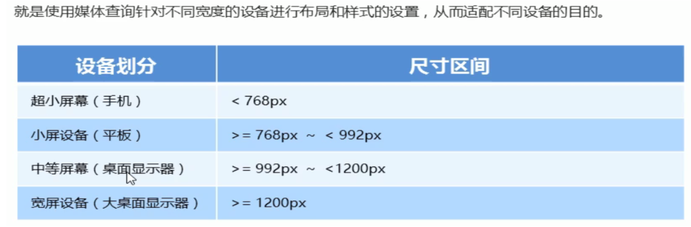

### bootstrap响应式布局

#### 响应式开发原理



#### 响应式布局容器


```
<!doctype html>
<html lang="en">
<head>
    <meta charset="UTF-8">
    <meta name="viewport"
          content="width=device-width, user-scalable=no, initial-scale=1.0, maximum-scale=1.0, minimum-scale=1.0">
    <meta http-equiv="X-UA-Compatible" content="ie=edge">
    <title>Document</title>
    <style>
        .container{
            height: 150px;
            background-color: pink;
            margin: 0 auto;
        }
        /*1. 超小屏幕下 小于768 布局容器宽度为100%*/
        @media screen and (max-width: 767px) {
            .container{
                width: 100%;
            }
        }
        /*小屏幕下 大于等于768 布局容器改为750px*/
        @media screen and (min-width: 768px){
            .container{
                width: 750px;
            }
        }
        /*中等屏幕下 992px  布局容器修改为970px*/
        @media screen and (min-width: 992px){
            .container{
                width: 970px;
            }
        }
        /*大屏幕下 大于等于1200px  布局容器修改为1170*/
        @media screen and (min-width: 1200px) {
            .container{
                width: 1170px;
            }
        }


    </style>
</head>
<body>
    <!--    响应式开发里面 首先需要一个布局容器-->
    <div class="container"></div>
</body>
</html>
```

#### bootstrap框架


#### bootstrap使用


```css
<!DOCTYPE html>
<html lang="en">
<head>
    <meta charset="UTF-8">
    <meta http-equiv="X-UA-Compatible" content="IE=edge">
    <!--[if lt IE 9]>
      <script src="https://cdn.jsdelivr.net/npm/html5shiv@3.7.3/dist/html5shiv.min.js"></script>
      <script src="https://cdn.jsdelivr.net/npm/respond.js@1.4.2/dest/respond.min.js"></script>
    <![endif]-->
    <link href="bootstrap/css/bootstrap.min.css" rel="stylesheet">
    <title>Title</title>
</head>
<body>
    123
</body>
</html>
```

##### 调用样式示例

```css
<!DOCTYPE html>
<html lang="en">
<head>
    <meta charset="UTF-8">
    <meta http-equiv="X-UA-Compatible" content="IE=edge">
    <!--[if lt IE 9]>
      <script src="https://cdn.jsdelivr.net/npm/html5shiv@3.7.3/dist/html5shiv.min.js"></script>
      <script src="https://cdn.jsdelivr.net/npm/respond.js@1.4.2/dest/respond.min.js"></script>
    <![endif]-->
    <link href="bootstrap/css/bootstrap.min.css" rel="stylesheet">
    <title>Title</title>
</head>
<body>
    <!-- Indicates a successful or positive action -->
    <button type="button" class="btn btn-success">（成功）Success</button>

</body>
</html>
```


#### 布局容器

##### container 类


```css
<!DOCTYPE html>
<html lang="en">
<head>
    <meta charset="UTF-8">
    <meta http-equiv="X-UA-Compatible" content="IE=edge">
    <!--[if lt IE 9]>
      <script src="https://cdn.jsdelivr.net/npm/html5shiv@3.7.3/dist/html5shiv.min.js"></script>
      <script src="https://cdn.jsdelivr.net/npm/respond.js@1.4.2/dest/respond.min.js"></script>
    <![endif]-->
    <link href="bootstrap/css/bootstrap.min.css" rel="stylesheet">
    <title>Title</title>
</head>
<body>
    <div class="container">123</div>
    <div class="container-fluid"></div>
</body>
</html>
```

##### containe-fluid 类


#### 栅格系统


```
<!DOCTYPE html>
<html lang="en">
<head>
    <meta charset="UTF-8">
    <meta http-equiv="X-UA-Compatible" content="IE=edge">
    <!--[if lt IE 9]>
      <script src="https://cdn.jsdelivr.net/npm/html5shiv@3.7.3/dist/html5shiv.min.js"></script>
      <script src="https://cdn.jsdelivr.net/npm/respond.js@1.4.2/dest/respond.min.js"></script>
    <![endif]-->
    <link href="bootstrap/css/bootstrap.min.css" rel="stylesheet">
    <title>Title</title>
    <style>
        [class ^="col"]{
            border: 1px solid red;
        }
    </style>
</head>
<body>
    <div class="container">
        <div class="row">
            <div class="col-lg-3">1</div>
            <div class="col-lg-3">2</div>
            <div class="col-lg-3">3</div>
            <div class="col-lg-3">4</div>
        </div>
<!--        如果孩子的份数相加等于12 则孩子能占满整个的container的宽度-->
        <div class="row">
            <div class="col-lg-6">1</div>
            <div class="col-lg-2">2</div>
            <div class="col-lg-2">3</div>
            <div class="col-lg-2">4</div>
        </div>
<!--        如果孩子的份数相加小于12 则占不满整个container的宽度 会有空白-->
        <div class="row">
            <div class="col-lg-6">1</div>
            <div class="col-lg-2">2</div>
            <div class="col-lg-2">3</div>
            <div class="col-lg-1">4</div>
        </div>
<!--        如果孩子的份数相加大于12 则多余的那一列会另起一行显示-->
        <div class="row">
            <div class="col-lg-4">1</div>
            <div class="col-lg-3">2</div>
            <div class="col-lg-3">3</div>
            <div class="col-lg-3">4</div>
        </div>
    </div>

</body>
</html>
```

```css
<!DOCTYPE html>
<html lang="en">
<head>
    <meta charset="UTF-8">
    <meta http-equiv="X-UA-Compatible" content="IE=edge">
    <!--[if lt IE 9]>
      <script src="https://cdn.jsdelivr.net/npm/html5shiv@3.7.3/dist/html5shiv.min.js"></script>
      <script src="https://cdn.jsdelivr.net/npm/respond.js@1.4.2/dest/respond.min.js"></script>
    <![endif]-->
    <link href="bootstrap/css/bootstrap.min.css" rel="stylesheet">
    <title>Title</title>
    <style>
        [class ^="col"]{
            border: 1px solid red;
        }
    </style>
</head>
<body>
    <div class="container">
        <div class="row">
<!--            lg md sm xs 分别是 大屏幕 中等屏幕 小屏幕 超小屏幕的 占比显示-->
            <div class="col-lg-3 col-md-4 col-sm-6 col-xs-12">1</div>
            <div class="col-lg-3 col-md-4 col-sm-6 col-xs-12">2</div>
            <div class="col-lg-3 col-md-4 col-sm-6 col-xs-12">3</div>
            <div class="col-lg-3 col-md-4 col-sm-6 col-xs-12">4</div>
        </div>
    </div>

</body>
</html>
```

##### 列嵌套


```css
<!DOCTYPE html>
<html lang="en">
<head>
    <meta charset="UTF-8">
    <meta http-equiv="X-UA-Compatible" content="IE=edge">
    <!--[if lt IE 9]>
      <script src="https://cdn.jsdelivr.net/npm/html5shiv@3.7.3/dist/html5shiv.min.js"></script>
      <script src="https://cdn.jsdelivr.net/npm/respond.js@1.4.2/dest/respond.min.js"></script>
    <![endif]-->
    <link href="bootstrap/css/bootstrap.min.css" rel="stylesheet">
    <title>Title</title>
    <style>
        [class ^="col"]{
            border: 1px solid red;
        }
        .row > div{
            height: 60px;
            background-color: pink;
        }
    </style>
</head>
<body>
    <div class="container">
        <div class="row">
<!--            lg md sm xs 分别是 大屏幕 中等屏幕 小屏幕 超小屏幕的 占比显示-->
            <div class="col-md-4 ">
                <div class="row">
                   <!-- 列嵌套最好加1个行row 这样可以取消父元素的padding值 而且高度自动和父级一样高-->
                    <div class="col-md-6">a</div>
                    <div class="col-md-6">b</div>
                </div>
            </div>
            <div class="col-md-4 ">2</div>
            <div class="col-md-4 ">3</div>
        </div>
    </div>

</body>
</html>
```

##### 列偏移


```css
<!DOCTYPE html>
<html lang="en">
<head>
    <meta charset="UTF-8">
    <meta http-equiv="X-UA-Compatible" content="IE=edge">
    <!--[if lt IE 9]>
      <script src="https://cdn.jsdelivr.net/npm/html5shiv@3.7.3/dist/html5shiv.min.js"></script>
      <script src="https://cdn.jsdelivr.net/npm/respond.js@1.4.2/dest/respond.min.js"></script>
    <![endif]-->
    <link href="bootstrap/css/bootstrap.min.css" rel="stylesheet">
    <title>Title</title>
    <style>
        [class ^="col"]{
            border: 1px solid red;
        }
        .row > div{
            height: 60px;
            background-color: pink;
        }
    </style>
</head>
<body>
    <div class="container">
        <div class="row">
<!--                    列嵌套最好加1个行row 这样可以取消父元素的padding值 而且高度自动和父级一样高-->
            <div class="col-md-5">a</div>
<!--                    偏移的份数就是12减去两个盒子的所占相加的份数 -->
            <div class="col-md-5 col-md-offset-2">b</div>
        </div>
        <div class="row">
<!--            如果只有一个盒子 那么就等于12减去盒子的份数除以2 那么就实现了居中-->
            <div class="col-md-8 col-md-offset-2" >中间盒子</div>
        </div>
    </div>
</body>
</html>
```

##### 列排序


```css
<!DOCTYPE html>
<html lang="en">
<head>
    <meta charset="UTF-8">
    <meta http-equiv="X-UA-Compatible" content="IE=edge">
    <!--[if lt IE 9]>
      <script src="https://cdn.jsdelivr.net/npm/html5shiv@3.7.3/dist/html5shiv.min.js"></script>
      <script src="https://cdn.jsdelivr.net/npm/respond.js@1.4.2/dest/respond.min.js"></script>
    <![endif]-->
    <link href="bootstrap/css/bootstrap.min.css" rel="stylesheet">
    <title>Title</title>
    <style>
        [class ^="col"]{
            border: 1px solid red;
        }
        .row > div{
            height: 60px;
            background-color: pink;
        }
    </style>
</head>
<body>
    <div class="container">
        <div class="row">
            <div class="col-md-4 col-md-push-8">左侧</div>
            <div class="col-md-8 col-md-pull-4">右侧</div>
        </div>
    </div>
</body>
</html>
```

##### 响应式工具


```css
<!DOCTYPE html>
<html lang="en">
<head>
    <meta charset="UTF-8">
    <meta http-equiv="X-UA-Compatible" content="IE=edge">
    <!--[if lt IE 9]>
      <script src="https://cdn.jsdelivr.net/npm/html5shiv@3.7.3/dist/html5shiv.min.js"></script>
      <script src="https://cdn.jsdelivr.net/npm/respond.js@1.4.2/dest/respond.min.js"></script>
    <![endif]-->
    <link href="bootstrap/css/bootstrap.min.css" rel="stylesheet">
    <title>Title</title>
    <style>
        [class ^="col"]{
            border: 1px solid red;
        }
        .row > div{
            height: 60px;
            background-color: pink;
        }
        .row div:nth-child(3){
            background-color: #92B0DD;
        }
    </style>
</head>
<body>
    <div class="container">
        <div class="row">
            <div class="col-xs-3">1</div>
            <div class="col-xs-3">2</div>
<!--            中等屏幕隐藏 -->
            <div class="col-xs-3 hidden-md">我会变模式</div>
            <div class="col-xs-3 visible-lg">我会显示的</div>
        </div>
    </div>
</body>
</html>
```


