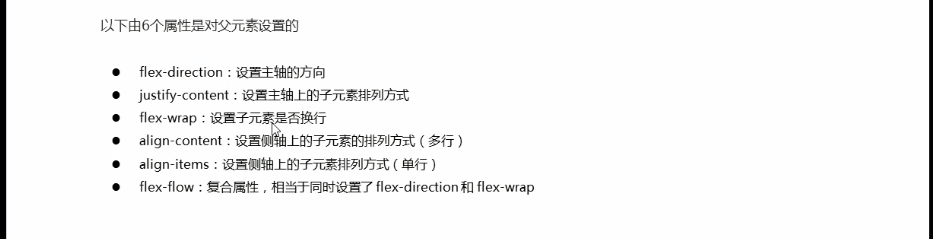
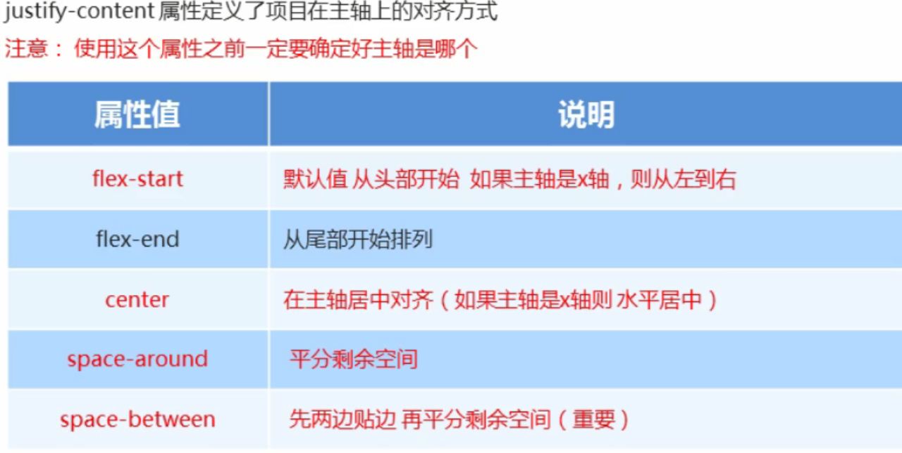
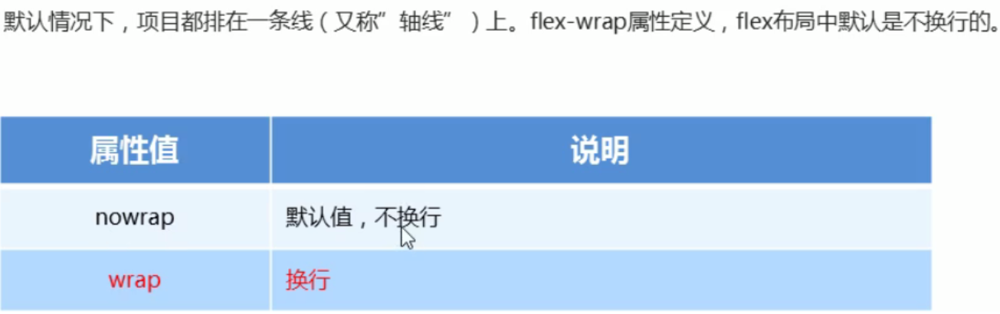
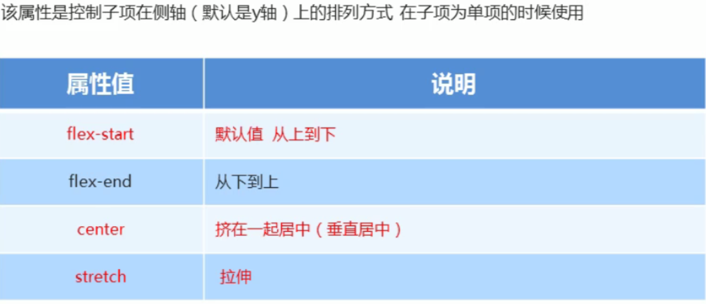
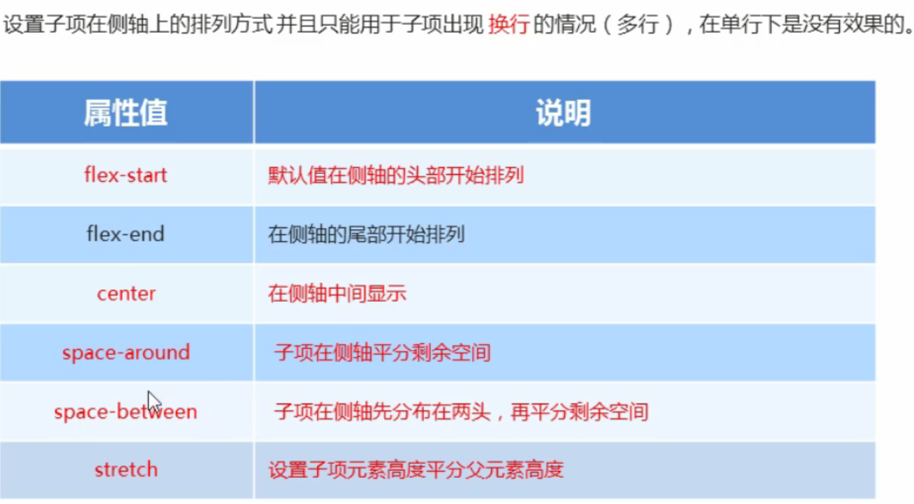
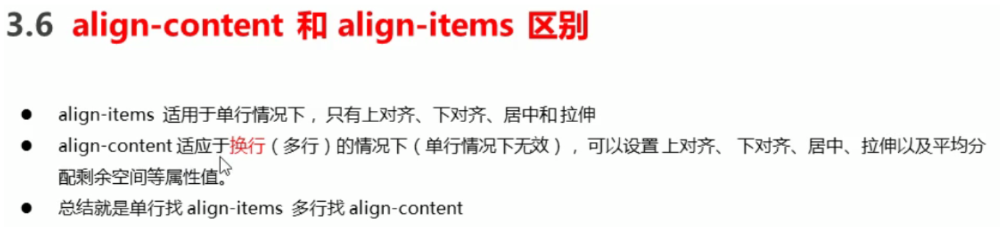
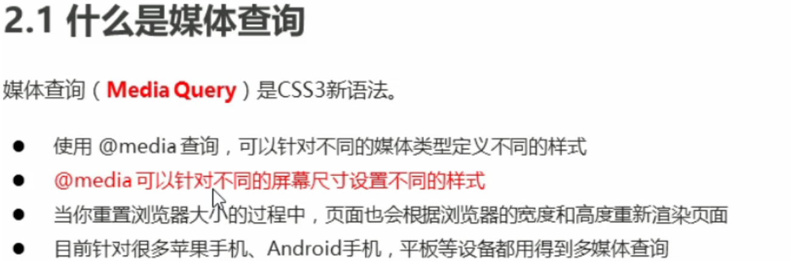
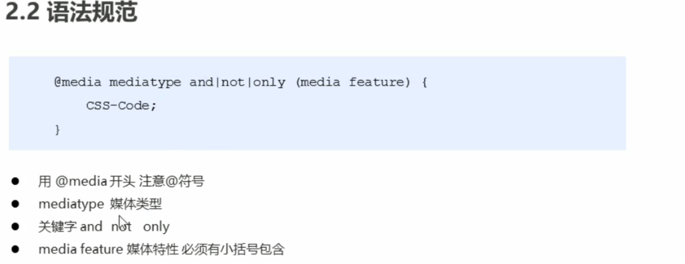
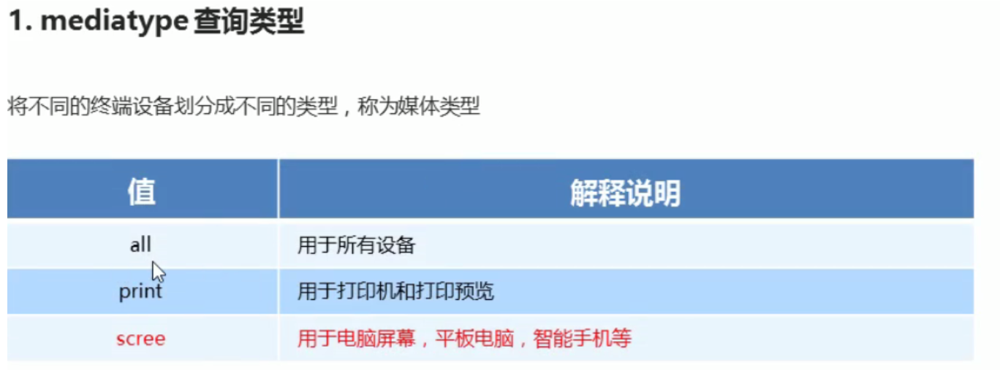
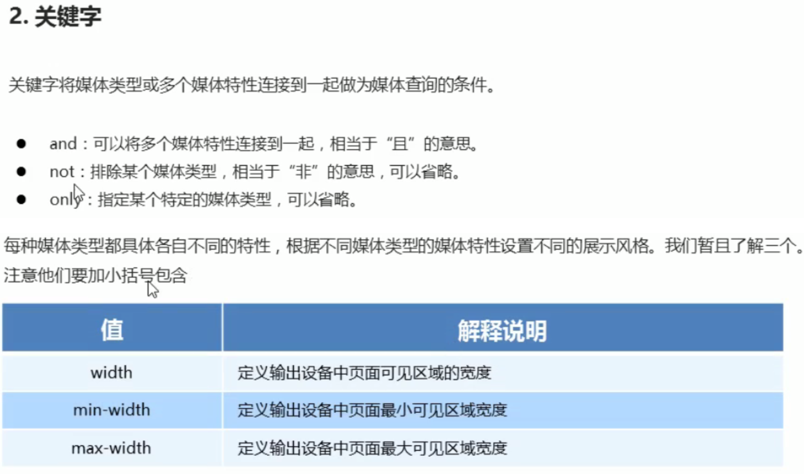

### flex布局

- 通过给父盒子添加flex属性 来控制子盒子的位置和排列方式

#### 父项常见的属性



##### flex-direction 设置主轴的方向

- 默认主轴方向是x轴方向 水平向右
- 默认侧轴就是y轴方向 水平向下
    - row 默认值 从左到右
    - row-reverse 从右到左
    - column 从上到下 
    - column-reverse 从下到上

```css
<!doctype html>
<html lang=zh-CN>
<head>
    <meta charset="UTF-8">
    <meta name="viewport"
          content="width=device-width, user-scalable=no, initial-scale=1.0, maximum-scale=1.0, minimum-scale=1.0">
    <meta http-equiv="X-UA-Compatible" content="ie=edge">
    <title>Document</title>
    <style>
        div{
            /*给父盒子添加flex属性*/
            display: flex;
            width: 90%;
            height: 300px;
            background-color: pink;
            /*默认的主轴是x轴 row y轴就是侧轴*/
            /*元素是跟着主轴来排列的*/
            /*flex-direction: row;*/
            /*从右到左 翻转排列*/
            /*flex-direction: row-reverse;*/
            /*可以把主轴设置为y轴 那么x轴就成了侧轴*/
            flex-direction: column;
        }
        div span{
            width: 150px;
            height: 100px;
            background-color: #2b323c;
        }

    </style>

</head>
<body>
    <div>
        <span>1</span>
        <span>2</span>
        <span>3</span>
    </div>
</body>
</html>
```

##### justify-content 设置主轴上子元素的排列方式



```css
<!doctype html>
<html lang=zh-CN>
<head>
    <meta charset="UTF-8">
    <meta name="viewport"
          content="width=device-width, user-scalable=no, initial-scale=1.0, maximum-scale=1.0, minimum-scale=1.0">
    <meta http-equiv="X-UA-Compatible" content="ie=edge">
    <title>Document</title>
    <style>
        div{
            /*给父盒子添加flex属性*/
            display: flex;
            width: 90%;
            height: 300px;
            background-color: pink;
            /*默认的主轴是x轴 row y轴就是侧轴*/
            /*元素是跟着主轴来排列的*/
            /*flex-direction: row;*/
            /*justify-content: 是设置主轴上子元素的排列方式;*/
            /*默认就是从做到右 */
            /*justify-content: flex-start;*/
            /*这事从右到左*/
            /*justify-content: flex-end;*/
            /*让子元素居中对齐*/
            /*justify-content: center;*/
            /*平分剩余空间*/
            /*justify-content: space-around;*/
            /*先两边贴边 再平分剩余空间*/
            justify-content: space-between;
        }
        div span{
            width: 150px;
            height: 100px;
            background-color: #2b323c;
        }

    </style>

</head>
<body>
    <div>
        <span>1</span>
        <span>2</span>
        <span>3</span>
        <span>4</span>
    </div>
</body>
</html>
```

##### flex-wrap设置子元素是否换行



```CSS
<!doctype html>
<html lang=zh-CN>
<head>
    <meta charset="UTF-8">
    <meta name="viewport"
          content="width=device-width, user-scalable=no, initial-scale=1.0, maximum-scale=1.0, minimum-scale=1.0">
    <meta http-equiv="X-UA-Compatible" content="ie=edge">
    <title>Document</title>
    <style>
        div{
            /*给父盒子添加flex属性*/
            display: flex;
            width: 90%;
            height: 300px;
            background-color: pink;
            /*flex布局中 默认的子元素是不换行的 如果放不下会缩小子元素的宽度来放到父元素的盒子里边*/
            /*flex-wrap: nowrap;*/
            /*换行*/
            flex-wrap: wrap;
        }
        div span{
            width: 150px;
            height: 100px;
            background-color: #2b323c;
            margin: 10px;
        }

    </style>

</head>
<body>
    <div>
        <span>1</span>
        <span>2</span>
        <span>3</span>
        <span>4</span>
        <span>4</span>
    </div>
</body>
</html>
```

##### align-items  设置侧轴上子元素的排列方式(单行)



```css
<!doctype html>
<html lang=zh-CN>
<head>
    <meta charset="UTF-8">
    <meta name="viewport"
          content="width=device-width, user-scalable=no, initial-scale=1.0, maximum-scale=1.0, minimum-scale=1.0">
    <meta http-equiv="X-UA-Compatible" content="ie=edge">
    <title>Document</title>
    <style>
        div{
            /*给父盒子添加flex属性*/
            display: flex;
            width: 90%;
            height: 300px;
            background-color: pink;
            /*沿着主轴居中对齐*/
            justify-content: center;
            /*沿着侧轴居中对齐*/
            /*align-items: center;*/
            /*拉伸 但是子盒子不能给高度*/
            align-items: stretch;
        }
        div span{
            width: 150px;
            /*height: 100px;*/
            background-color: #2b323c;
            margin: 10px;
        }

    </style>

</head>
<body>
    <div>
        <span>1</span>
        <span>2</span>
        <span>3</span>

    </div>
</body>
</html>
```

##### align-content 设置侧轴上子元素的排列方式（多行）



```css
<!doctype html>
<html lang=zh-CN>
<head>
    <meta charset="UTF-8">
    <meta name="viewport"
          content="width=device-width, user-scalable=no, initial-scale=1.0, maximum-scale=1.0, minimum-scale=1.0">
    <meta http-equiv="X-UA-Compatible" content="ie=edge">
    <title>Document</title>
    <style>
        div{
            /*给父盒子添加flex属性*/
            display: flex;
            width: 90%;
            height: 300px;
            background-color: pink;
            flex-wrap: wrap;
            /*因为有了换行 此时我们控制元素就得使用align-content*/
            /*align-content: flex-start;*/
            /*align-content: center;*/
            align-content: space-between;
        }
        div span{
            width: 150px;
            height: 100px;
            background-color: #2b323c;
            margin: 10px;
        }

    </style>

</head>
<body>
    <div>
        <span>1</span>
        <span>2</span>
        <span>3</span>
        <span>3</span>
        <span>3</span>
        <span>3</span>
        <span>3</span>
        <span>3</span>

    </div>
</body>
</html>
```



##### flex-flow 

- flex-flow是flex-direction和flex-wrap的复合型写法

```csss
<!doctype html>
<html lang=zh-CN>
<head>
    <meta charset="UTF-8">
    <meta name="viewport"
          content="width=device-width, user-scalable=no, initial-scale=1.0, maximum-scale=1.0, minimum-scale=1.0">
    <meta http-equiv="X-UA-Compatible" content="ie=edge">
    <title>Document</title>
    <style>
        div{
            /*给父盒子添加flex属性*/
            display: flex;
            width: 90%;
            height: 300px;
            background-color: pink;
            /*flex-direction: column;*/
            /*flex-wrap: wrap;*/
            /*把设置主轴方向和是否换行 简写*/
            flex-flow: column wrap;
        }
        div span{
            width: 150px;
            height: 100px;
            background-color: #2b323c;
            margin: 10px;
        }

    </style>

</head>
<body>
    <div>
        <span>1</span>
        <span>2</span>
        <span>3</span>
        <span>3</span>
        <span>3</span>


    </div>
</body>
</html>
```

#### 子项常见属性

##### flex属性

- flex属性 定义子项目分配剩余空间 用flex表示占多少份数 默认是0

```css
<!doctype html>
<html lang="en">
<head>
    <meta charset="UTF-8">
    <meta name="viewport"
          content="width=device-width, user-scalable=no, initial-scale=1.0, maximum-scale=1.0, minimum-scale=1.0">
    <meta http-equiv="X-UA-Compatible" content="ie=edge">
    <title>Document</title>
    <style>
        section{
            display: flex;
            width: 80%;
            height: 150px;
            background-color: pink;
            margin: 0 auto;
        }
        section div:nth-child(1){
            width: 150px;
            height: 150px;
            background-color: #383f49;
        }
        section div:nth-child(2){
            flex: 1;
            background-color: #92B0DD;
        }
        section div:nth-child(3){
            width: 150px;
            height: 150px;
            background-color: red;
        }
        p {
            display: flex;
            width: 80%;
            height: 150px;
            background-color: pink;
            margin: 100px auto;
        }
        p span{
            flex: 1;
        }
        p span:nth-child(2){
            flex: 2;
            background-color: #383f49;
        }
    </style>
</head>
<body>
    <section>
        <div></div>
        <div></div>
        <div></div>
    </section>
    <p>
        <span>1</span>
        <span>2</span>
        <span>3</span>
    </p>
</body>
</html>
```

#####  align-self 控制子项自己在侧轴上的排列方式

- align-self 允许单个项目与其他项目不一样的对齐方式 可覆盖align-items属性 默认值为auto

```css
<!doctype html>
<html lang="en">
<head>
    <meta charset="UTF-8">
    <meta name="viewport"
          content="width=device-width, user-scalable=no, initial-scale=1.0, maximum-scale=1.0, minimum-scale=1.0">
    <meta http-equiv="X-UA-Compatible" content="ie=edge">
    <title>Document</title>
    <style>
        div{
            display: flex;
            width: 80%;
            height: 500px;
            background-color: pink;
            /*三个盒子一起下去了*/
            /*align-items: flex-end;*/
            /*让第三个盒子下去*/

        }
        div span{
            width: 150px;
            height: 100px;
            background-color: #383f49;
            margin-right: 5px;
        }
        div span:nth-child(3){
            align-self: flex-end;
        }
    </style>
</head>
<body>
    <div>
        <span></span>
        <span></span>
        <span></span>
    </div>
</body>
</html>
```

#### 媒体查询










```css
<!doctype html>
<html lang="en">
<head>
    <meta charset="UTF-8">
    <meta name="viewport"
          content="width=device-width, user-scalable=no, initial-scale=1.0, maximum-scale=1.0, minimum-scale=1.0">
    <meta http-equiv="X-UA-Compatible" content="ie=edge">
    <title>Document</title>
    <style>
        /*这句话的意思是在我屏幕上 并且最大的宽度是800px 设置我们想要的样式*/
        /*max-width 小于等于800*/
        /*媒体查询可以根据不同的屏幕尺寸改变不同的样式*/
        @media  screen and (max-width: 800px){
            body{
                background-color: pink;
            }
        }
        @media screen and (max-width: 500px){
            body{
                background-color: purple;
            }

        }
    </style>
</head>
<body>
    <div>
        
    </div>
</body>
</html>
```


