# javascript基础

## 书写格式

### 行内式

 ```js
<!DOCTYPE html>
<html lang="en">
<head>
    <meta charset="UTF-8">
    <meta http-equiv="X-UA-Compatible" content="IE=edge">
    <!--[if lt IE 9]>
      <script src="https://cdn.jsdelivr.net/npm/html5shiv@3.7.3/dist/html5shiv.min.js"></script>
      <script src="https://cdn.jsdelivr.net/npm/respond.js@1.4.2/dest/respond.min.js"></script>
    <![endif]-->
    <link href="bootstrap/css/bootstrap.min.css" rel="stylesheet">
    <title>Title</title>

</head>
<body>
<!--    行内式js 直接写到元素内部-->
    <input type="button" value="唐伯虎" onclick="alert('秋香')">
</body>
</html>
 ```

### 内嵌式

```js
 <!DOCTYPE html>
<html lang="en">
<head>
    <meta charset="UTF-8">
    <meta http-equiv="X-UA-Compatible" content="IE=edge">
    <!--[if lt IE 9]>
      <script src="https://cdn.jsdelivr.net/npm/html5shiv@3.7.3/dist/html5shiv.min.js"></script>
      <script src="https://cdn.jsdelivr.net/npm/respond.js@1.4.2/dest/respond.min.js"></script>
    <![endif]-->
    <link href="bootstrap/css/bootstrap.min.css" rel="stylesheet">
    <title>Title</title>
    <script>
        alert('秋香')
    </script>

</head>
<body>

</body>
</html>
```

### 外部js

```js
<!DOCTYPE html>
<html lang="en">
<head>
    <meta charset="UTF-8">
    <meta http-equiv="X-UA-Compatible" content="IE=edge">
    <!--[if lt IE 9]>
      <script src="https://cdn.jsdelivr.net/npm/html5shiv@3.7.3/dist/html5shiv.min.js"></script>
      <script src="https://cdn.jsdelivr.net/npm/respond.js@1.4.2/dest/respond.min.js"></script>
    <![endif]-->
    <link href="bootstrap/css/bootstrap.min.css" rel="stylesheet">
    <title>Title</title>
    <script src="my.js"></script>

</head>
<body>

</body>
</html>
```

## 注释

```js
// 单行注释
/*多行注释
多行注释*/
alert('测试 哈哈')
```

## 输入输出语句

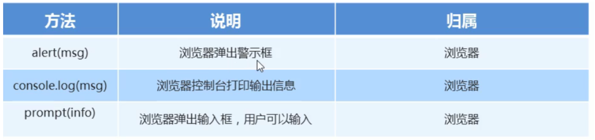

```js
<!DOCTYPE html>
<html lang="en">
<head>
    <meta charset="UTF-8">
    <meta http-equiv="X-UA-Compatible" content="IE=edge">
    <!--[if lt IE 9]>
      <script src="https://cdn.jsdelivr.net/npm/html5shiv@3.7.3/dist/html5shiv.min.js"></script>
      <script src="https://cdn.jsdelivr.net/npm/respond.js@1.4.2/dest/respond.min.js"></script>
    <![endif]-->
    <link href="bootstrap/css/bootstrap.min.css" rel="stylesheet">
    <title>Title</title>
    <script>
        // 这是一个输入框
        prompt("请输入您的年龄")
        // 弹出警示框 输出的 展示给用户的
        alert('计算结果是')
        // 控制台输出 给程序员测试用的
        console.log('我是程序员能看到的')
    </script>

</head>
<body>

</body>
</html>
```

## 变量

### 申明赋值变量

```js
<!DOCTYPE html>
<html lang="en">
<head>
    <meta charset="UTF-8">
    <meta http-equiv="X-UA-Compatible" content="IE=edge">
    <!--[if lt IE 9]>
      <script src="https://cdn.jsdelivr.net/npm/html5shiv@3.7.3/dist/html5shiv.min.js"></script>
      <script src="https://cdn.jsdelivr.net/npm/respond.js@1.4.2/dest/respond.min.js"></script>
    <![endif]-->
    <link href="bootstrap/css/bootstrap.min.css" rel="stylesheet">
    <title>Title</title>
    <script>
        //申明了一个age变量
        var age;
        // 给变量赋值
        age = 10;
        // 输出结果
        alert(age)
        // 变量的初始化
        var myname = 'liang';
        alert(myname)

    </script>

</head>
<body>

</body>
</html>
```

#### 变量使用案例

```js
<!DOCTYPE html>
<html lang="en">
<head>
    <meta charset="UTF-8">
    <meta http-equiv="X-UA-Compatible" content="IE=edge">
    <!--[if lt IE 9]>
      <script src="https://cdn.jsdelivr.net/npm/html5shiv@3.7.3/dist/html5shiv.min.js"></script>
      <script src="https://cdn.jsdelivr.net/npm/respond.js@1.4.2/dest/respond.min.js"></script>
    <![endif]-->
    <link href="bootstrap/css/bootstrap.min.css" rel="stylesheet">
    <title>Title</title>
    <script>
        var age = prompt('请输入年龄');
        alert(age)

    </script>

</head>
<body>

</body>
</html>
```

- 同时声明多个变量 之间用逗号隔开 最后一个后边加封号
- 只声明变量不赋值 程序结果是undefined 未定义的
- 不声明变量 也不赋值 程序结果是报错
- 不声明变量 直接赋值使用 也可以使用

### 变量命名规范

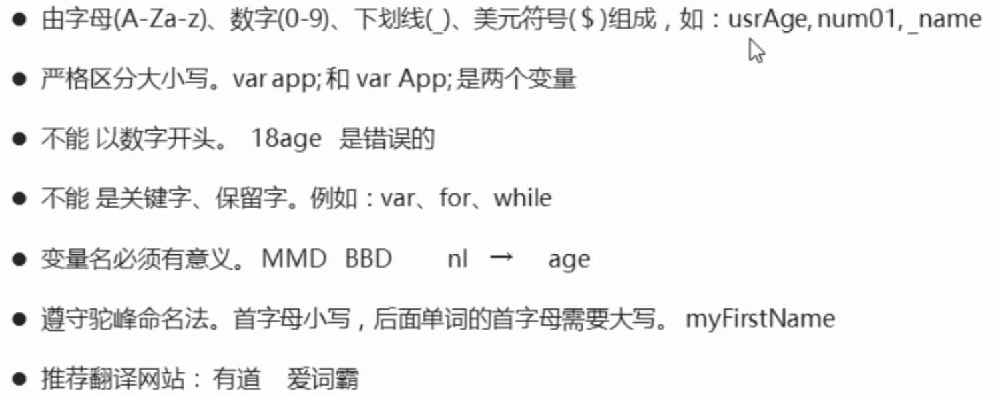

### 变量交换

```js
<!DOCTYPE html>
<html lang="en">
<head>
    <meta charset="UTF-8">
    <meta http-equiv="X-UA-Compatible" content="IE=edge">
    <!--[if lt IE 9]>
      <script src="https://cdn.jsdelivr.net/npm/html5shiv@3.7.3/dist/html5shiv.min.js"></script>
      <script src="https://cdn.jsdelivr.net/npm/respond.js@1.4.2/dest/respond.min.js"></script>
    <![endif]-->
    <link href="bootstrap/css/bootstrap.min.css" rel="stylesheet">
    <title>Title</title>
    <script>
        /*我们需要一个临时变量
        将变量1 给我们的临时变量
        将变量2 里边的值给变量1
        强临时变量里的值 给变量2
        */
        // 声明一个临时变量
        var teamp;
        var app1  = 'jingdong';
        var app2 = 'alibaba';
        teamp = app1;
        app1 = app2;
        app2 = teamp;
        alert(app1);
        alert(app2);


    </script>

</head>
<body>

</body>
</html>
```

## 数据类型

#### 简单数据类型

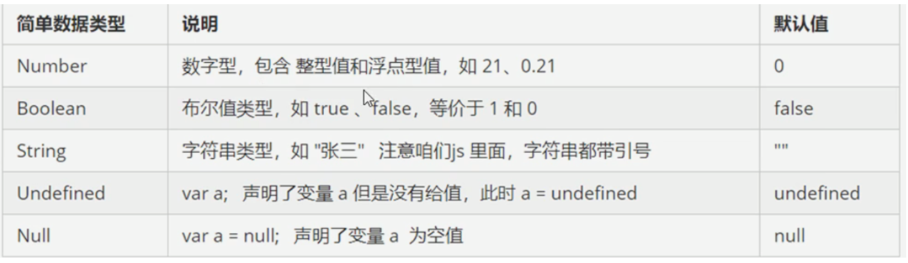


##### Number

```js
<!DOCTYPE html>
<html lang="en">
<head>
    <meta charset="UTF-8">
    <meta http-equiv="X-UA-Compatible" content="IE=edge">
    <!--[if lt IE 9]>
      <script src="https://cdn.jsdelivr.net/npm/html5shiv@3.7.3/dist/html5shiv.min.js"></script>
      <script src="https://cdn.jsdelivr.net/npm/respond.js@1.4.2/dest/respond.min.js"></script>
    <![endif]-->
    <link href="bootstrap/css/bootstrap.min.css" rel="stylesheet">
    <title>Title</title>
    <script>
         //var num; //这里的num是不确定属于那种类型的数据
        // js的变量数据类型是只有程序在运行过程中根据等于号右边的值来确定的
        var num = 10; //这就是数字类型
        var text = 'liang'; //这就是字符串类型的变量
        // js是动态语言 变量的数据类型是可以变化的
        var x = 10;
        x = 'pink';
        var PI =3.14;      //pi类型数字
        var num1 = 010;    // 八进制
        var num2 =  0x9;
         console.log(num2); // 数字的前面加0x就是十六进制
        // 数字型的最大值
         console.log(Number.MAX_VALUE);
        // 数字型的最小值
        console.log(Number.MIN_VALUE);
        // 数字特殊类型 无穷大
        console.log(Number.MAX_VALUE *2) ;//infinity 无穷大
        // 数字类型 无穷小
         console.log(-Number.MAX_VALUE *2 ); //-infinity 无穷小
        // NAN  非数字
         console.log( 'liang' - 100);  //NaN
        // isNaN() 此方法用来判断非数字 并且返回一个值 如果是数字返回false 如果不是数字返回true
         console.log(isNaN('sdfsd'))


    </script>

</head>
<body>

</body>
</html>
```

##### string类型

```js
<!DOCTYPE html>
<html lang="en">
<head>
    <meta charset="UTF-8">
    <meta http-equiv="X-UA-Compatible" content="IE=edge">
    <!--[if lt IE 9]>
      <script src="https://cdn.jsdelivr.net/npm/html5shiv@3.7.3/dist/html5shiv.min.js"></script>
      <script src="https://cdn.jsdelivr.net/npm/respond.js@1.4.2/dest/respond.min.js"></script>
    <![endif]-->
    <link href="bootstrap/css/bootstrap.min.css" rel="stylesheet">
    <title>Title</title>
    <script>
         // js 里字符串 推荐使用单引号
        // 字符串类型必须加引号
        //  如果字符串中需要有嵌套关系 那么遵循 （外双内单  或者  外单内双）
        var str = '这是一个测试"是吧 "';
    </script>

</head>
<body>

</body>
</html>
```

##### 字符串转义字符

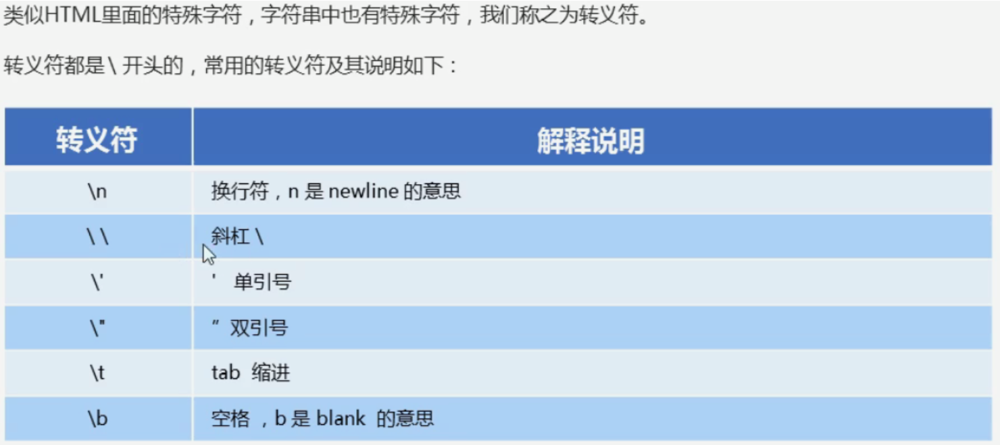

##### 字符串拼接

```
<!DOCTYPE html>
<html lang="en">
<head>
    <meta charset="UTF-8">
    <meta http-equiv="X-UA-Compatible" content="IE=edge">
    <!--[if lt IE 9]>
      <script src="https://cdn.jsdelivr.net/npm/html5shiv@3.7.3/dist/html5shiv.min.js"></script>
      <script src="https://cdn.jsdelivr.net/npm/respond.js@1.4.2/dest/respond.min.js"></script>
    <![endif]-->
    <link href="bootstrap/css/bootstrap.min.css" rel="stylesheet">
    <title>Title</title>
    <script>

        var str = '这是一个测试 \n 是吧';
        // alert(str)
        // 检测字符串长度 length
        var str1 = 'my name is test ';
        console.log(str1.length);
        // 字符串的拼接
        // 字符串之间可以使用+ 拼接 只要有字符型的  后边不管任何类型都可拼接
        console.log('lianjing' + ' liangyawang');
        console.log('pink' + 18);
        // 字符串拼接 加强
        console.log('pink' + 18 + '岁');
        var age = 18;
        console.log('liang' + age + '岁');
    </script>

</head>
<body>

</body>
</html>
```

##### 案例 报年龄

```js
<!DOCTYPE html>
<html lang="en">
<head>
    <meta charset="UTF-8">
    <meta http-equiv="X-UA-Compatible" content="IE=edge">
    <!--[if lt IE 9]>
      <script src="https://cdn.jsdelivr.net/npm/html5shiv@3.7.3/dist/html5shiv.min.js"></script>
      <script src="https://cdn.jsdelivr.net/npm/respond.js@1.4.2/dest/respond.min.js"></script>
    <![endif]-->
    <link href="bootstrap/css/bootstrap.min.css" rel="stylesheet">
    <title>Title</title>
    <script>

        var  age =  prompt('请输入您的年龄');
        alert('您的年龄为' + age);
    </script>

</head>
<body>

</body>
</html>
```

##### bool类型

```js
<!DOCTYPE html>
<html lang="en">
<head>
    <meta charset="UTF-8">
    <meta http-equiv="X-UA-Compatible" content="IE=edge">
    <!--[if lt IE 9]>
      <script src="https://cdn.jsdelivr.net/npm/html5shiv@3.7.3/dist/html5shiv.min.js"></script>
      <script src="https://cdn.jsdelivr.net/npm/respond.js@1.4.2/dest/respond.min.js"></script>
    <![endif]-->
    <link href="bootstrap/css/bootstrap.min.css" rel="stylesheet">
    <title>Title</title>
    <script>
        // bool类型值
        var flag = true;
        var flag1 = false;


    </script>

</head>
<body>

</body>
</html>
```

##### undefined

- 如果一个变量没给值 那就是undefined

##### null 空

```js
<!DOCTYPE html>
<html lang="en">
<head>
    <meta charset="UTF-8">
    <meta http-equiv="X-UA-Compatible" content="IE=edge">
    <!--[if lt IE 9]>
      <script src="https://cdn.jsdelivr.net/npm/html5shiv@3.7.3/dist/html5shiv.min.js"></script>
      <script src="https://cdn.jsdelivr.net/npm/respond.js@1.4.2/dest/respond.min.js"></script>
    <![endif]-->
    <link href="bootstrap/css/bootstrap.min.css" rel="stylesheet">
    <title>Title</title>
    <script>
        // null
        var space = null;
        console.log(space + 'liang')
    </script>

</head>
<body>

</body>
</html>
```

#### 获取变量数据类型

- typeof 可用来检测变量存放的数据是什么数据类型

```js
<!DOCTYPE html>
<html lang="en">
<head>
    <meta charset="UTF-8">
    <meta http-equiv="X-UA-Compatible" content="IE=edge">
    <!--[if lt IE 9]>
      <script src="https://cdn.jsdelivr.net/npm/html5shiv@3.7.3/dist/html5shiv.min.js"></script>
      <script src="https://cdn.jsdelivr.net/npm/respond.js@1.4.2/dest/respond.min.js"></script>
    <![endif]-->
    <link href="bootstrap/css/bootstrap.min.css" rel="stylesheet">
    <title>Title</title>
    <script>
        var num = 10;
        console.log(typeof  num);
        var test = 'liang';
        console.log(typeof  test);

        var flag = true;
        console.log(typeof  flag);


    </script>

</head>
<body>

</body>
</html>
```

#### 数据类型转换

```js
<!DOCTYPE html>
<html lang="en">
<head>
    <meta charset="UTF-8">
    <meta http-equiv="X-UA-Compatible" content="IE=edge">
    <!--[if lt IE 9]>
      <script src="https://cdn.jsdelivr.net/npm/html5shiv@3.7.3/dist/html5shiv.min.js"></script>
      <script src="https://cdn.jsdelivr.net/npm/respond.js@1.4.2/dest/respond.min.js"></script>
    <![endif]-->
    <link href="bootstrap/css/bootstrap.min.css" rel="stylesheet">
    <title>Title</title>
    <script>
        // 转换为字符串类型
        var num = 1;
        var str = num.toString();
        console.log(typeof str);
        console.log(typeof  String(num));
        // 转换为 数字类型
        var strnum = '10';
        console.log(typeof parseInt(strnum));  //取整
        console.log(typeof  parseFloat(strnum));  // 取小数
        console.log( typeof Number(strnum))
        // 转换为bool
        var test = null;
        console.log(Boolean(test))


    </script>

</head>
<body>

</body>
</html>
```

## 运算符

### 算数运算符

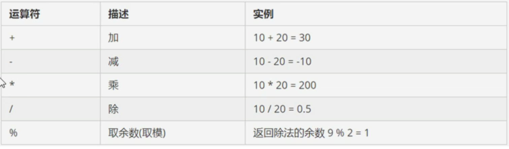

```js
<!DOCTYPE html>
<html lang="en">
<head>
    <meta charset="UTF-8">
    <meta http-equiv="X-UA-Compatible" content="IE=edge">
    <!--[if lt IE 9]>
      <script src="https://cdn.jsdelivr.net/npm/html5shiv@3.7.3/dist/html5shiv.min.js"></script>
      <script src="https://cdn.jsdelivr.net/npm/respond.js@1.4.2/dest/respond.min.js"></script>
    <![endif]-->
    <link href="bootstrap/css/bootstrap.min.css" rel="stylesheet">
    <title>Title</title>
    <script>
        console.log( 1 + 1 );
        console.log( 2 * 8);
        console.log( 6 / 2);
        console.log( 8 - 5 );
        console.log(7 % 2);
        

    </script>

</head>
<body>

</body>
</html>
```

#### 递增递减运算符

```js
<!DOCTYPE html>
<html lang="en">
<head>
    <meta charset="UTF-8">
    <meta http-equiv="X-UA-Compatible" content="IE=edge">
    <!--[if lt IE 9]>
      <script src="https://cdn.jsdelivr.net/npm/html5shiv@3.7.3/dist/html5shiv.min.js"></script>
      <script src="https://cdn.jsdelivr.net/npm/respond.js@1.4.2/dest/respond.min.js"></script>
    <![endif]-->
    <link href="bootstrap/css/bootstrap.min.css" rel="stylesheet">
    <title>Title</title>
    <script>
        // 让变量自己加1
        var num = 1;
        //num ++;
        ++num;
        console.log(num);
        var num1 = 3;
        //num1 --;
        -- num1
        console.log(num1);
    </script>

</head>
<body>

</body>
</html>
```

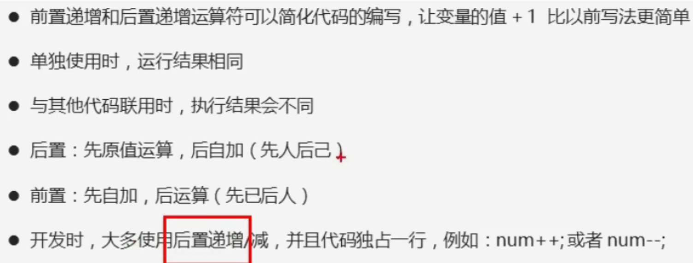

### 比较运算符

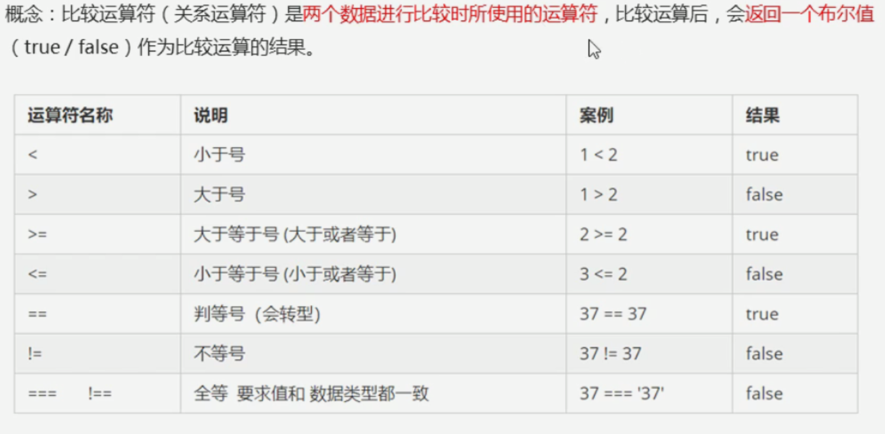

```js
<!DOCTYPE html>
<html lang="en">
<head>
    <meta charset="UTF-8">
    <meta http-equiv="X-UA-Compatible" content="IE=edge">
    <!--[if lt IE 9]>
      <script src="https://cdn.jsdelivr.net/npm/html5shiv@3.7.3/dist/html5shiv.min.js"></script>
      <script src="https://cdn.jsdelivr.net/npm/respond.js@1.4.2/dest/respond.min.js"></script>
    <![endif]-->
    <link href="bootstrap/css/bootstrap.min.css" rel="stylesheet">
    <title>Title</title>
    <script>
        console.log(3 > 5); //false
        console.log(3 >= 5); //false
        console.log(2 < 4);  //true
        console.log(2 <= 4);  //false
        // 程序里边的等于号 是 == 默认会转换数据类型 会把字符串型的数字转换为数字型
        console.log(18 == 18);  // true
        console.log(18 == '18'); //true
        console.log(18 != 18); //false
        // 三个等于号 要求两侧的值以及数据类型完全一致才可以
        console.log(18 === 18); //true
        console.log(18 === '18') //false
    </script>

</head>
<body>

</body>
</html>
```

### 逻辑运算符

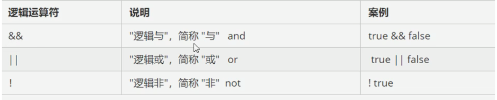

```js
<!DOCTYPE html>
<html lang="en">
<head>
    <meta charset="UTF-8">
    <meta http-equiv="X-UA-Compatible" content="IE=edge">
    <!--[if lt IE 9]>
      <script src="https://cdn.jsdelivr.net/npm/html5shiv@3.7.3/dist/html5shiv.min.js"></script>
      <script src="https://cdn.jsdelivr.net/npm/respond.js@1.4.2/dest/respond.min.js"></script>
    <![endif]-->
    <link href="bootstrap/css/bootstrap.min.css" rel="stylesheet">
    <title>Title</title>
    <script>
        console.log(3 > 5 && 3 > 2); // false
        console.log(3 > 5 || 4 > 2); //true
        console.log(!true)
    </script>

</head>
<body>

</body>
</html>
```

#### 逻辑与运算

```js
<!DOCTYPE html>
<html lang="en">
<head>
    <meta charset="UTF-8">
    <meta http-equiv="X-UA-Compatible" content="IE=edge">
    <!--[if lt IE 9]>
      <script src="https://cdn.jsdelivr.net/npm/html5shiv@3.7.3/dist/html5shiv.min.js"></script>
      <script src="https://cdn.jsdelivr.net/npm/respond.js@1.4.2/dest/respond.min.js"></script>
    <![endif]-->
    <link href="bootstrap/css/bootstrap.min.css" rel="stylesheet">
    <title>Title</title>
    <script>
        console.log(3 < 5 && 6);
    </script>

</head>
<body>

</body>
</html>
```


#### 逻辑或运算

```js
<!DOCTYPE html>
<html lang="en">
<head>
    <meta charset="UTF-8">
    <meta http-equiv="X-UA-Compatible" content="IE=edge">
    <!--[if lt IE 9]>
      <script src="https://cdn.jsdelivr.net/npm/html5shiv@3.7.3/dist/html5shiv.min.js"></script>
      <script src="https://cdn.jsdelivr.net/npm/respond.js@1.4.2/dest/respond.min.js"></script>
    <![endif]-->
    <link href="bootstrap/css/bootstrap.min.css" rel="stylesheet">
    <title>Title</title>
    <script>
        console.log(3 > 5 || 6)
    </script>

</head>
<body>

</body>
</html>
```

### 赋值运算符

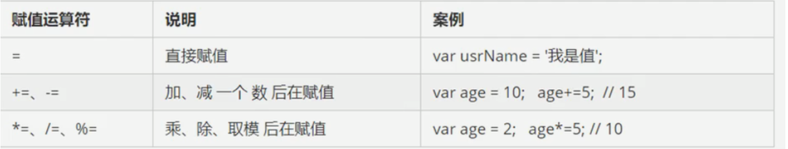

##### 运算符优先级

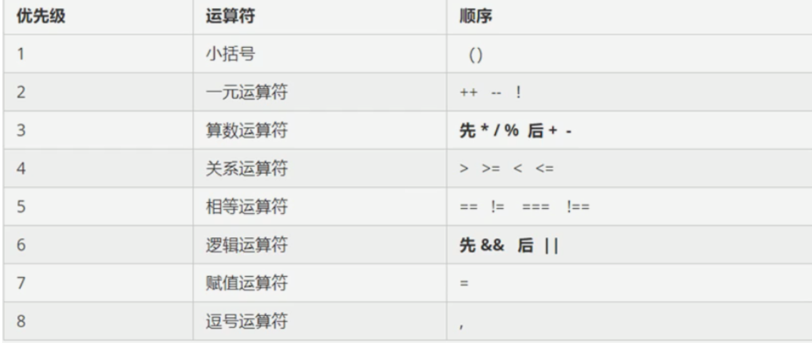

## 流程控制 分支

```js
<!DOCTYPE html>
<html lang="en">
<head>
    <meta charset="UTF-8">
    <meta http-equiv="X-UA-Compatible" content="IE=edge">
    <!--[if lt IE 9]>
      <script src="https://cdn.jsdelivr.net/npm/html5shiv@3.7.3/dist/html5shiv.min.js"></script>
      <script src="https://cdn.jsdelivr.net/npm/respond.js@1.4.2/dest/respond.min.js"></script>
    <![endif]-->
    <link href="bootstrap/css/bootstrap.min.css" rel="stylesheet">
    <title>Title</title>
    <script>
        // if语法结构
        // if (条件表达式) {
        //     执行语句
        // }
        // 如果if条件表达式结果为真那么就执行语句 如果为假就不行语句
        if (3 < 5) {
            alert('沙漠骆驼')
        }
    </script>
</head>
<body>

</body>
</html>
```

### 进入网吧案例

```js
<!DOCTYPE html>
<html lang="en">
<head>
    <meta charset="UTF-8">
    <meta http-equiv="X-UA-Compatible" content="IE=edge">
    <!--[if lt IE 9]>
      <script src="https://cdn.jsdelivr.net/npm/html5shiv@3.7.3/dist/html5shiv.min.js"></script>
      <script src="https://cdn.jsdelivr.net/npm/respond.js@1.4.2/dest/respond.min.js"></script>
    <![endif]-->
    <link href="bootstrap/css/bootstrap.min.css" rel="stylesheet">
    <title>Title</title>
    <script>
        var age = prompt('请输入您的年龄');
        if (age >= 18) {
            alert('请您进入')
        } else {
            alert('您的年龄不够')
        }
    </script>
</head>
<body>

</body>
</html>
```

### if else if 多分支语句

```js
<!DOCTYPE html>
<html lang="en">
<head>
    <meta charset="UTF-8">
    <meta http-equiv="X-UA-Compatible" content="IE=edge">
    <!--[if lt IE 9]>
      <script src="https://cdn.jsdelivr.net/npm/html5shiv@3.7.3/dist/html5shiv.min.js"></script>
      <script src="https://cdn.jsdelivr.net/npm/respond.js@1.4.2/dest/respond.min.js"></script>
    <![endif]-->
    <link href="bootstrap/css/bootstrap.min.css" rel="stylesheet">
    <title>Title</title>
    <script>
       var money = prompt('请输入您的金额');
        if (money < 100) {
            alert('您的钱多余100')
        } else if (money > 100) {
            alert('您的钱这是第二个步骤')
        } else if (money = 100) {
            alert('你牛逼')
       }
    </script>
</head>
<body>

</body>
</html>
```

### 三元表达式

- 由三元运算符组成的式子称为三元表达式

```js
<!DOCTYPE html>
<html lang="en">
<head>
    <meta charset="UTF-8">
    <meta http-equiv="X-UA-Compatible" content="IE=edge">
    <!--[if lt IE 9]>
      <script src="https://cdn.jsdelivr.net/npm/html5shiv@3.7.3/dist/html5shiv.min.js"></script>
      <script src="https://cdn.jsdelivr.net/npm/respond.js@1.4.2/dest/respond.min.js"></script>
    <![endif]-->
    <link href="bootstrap/css/bootstrap.min.css" rel="stylesheet">
    <title>Title</title>
    <script>
       // 三元运算符语法结构
       // 条件表达式 ？ 表达式1：表达式2
       //  如果条件表达式结果为真 则返回条件表达式1的值 如果条件表达式结果为假 则返回表达式2的值
        var num = 10;
        // 表达式是有返回值的
        var res = num < 5 ? 'yes' : 'no';
       console.log(res)

    </script>
</head>
<body>

</body>
</html>
```

### switch语句

```js
<!DOCTYPE html>
<html lang="en">
<head>
    <meta charset="UTF-8">
    <meta http-equiv="X-UA-Compatible" content="IE=edge">
    <!--[if lt IE 9]>
      <script src="https://cdn.jsdelivr.net/npm/html5shiv@3.7.3/dist/html5shiv.min.js"></script>
      <script src="https://cdn.jsdelivr.net/npm/respond.js@1.4.2/dest/respond.min.js"></script>
    <![endif]-->
    <link href="bootstrap/css/bootstrap.min.css" rel="stylesheet">
    <title>Title</title>
    <script>
       // switch  也是多分支语句
       //  switch ( 表达式) {
       //      case value1:
       //          执行语句1;
       //          break;
       //      case value2:
       //          执行语句2;
       //          break;
       //      default:
       //          执行没有选项的语句;
       //  }

        switch (10) {
            case 10:
                console.log('这是10');
                break;
            case 12:
                console.log('这是12');
                break;
            default:
                console.log('无匹配项')
        }
    </script>
</head>
<body>

</body>
</html>
```

### switch案例

```js
<!DOCTYPE html>
<html lang="en">
<head>
    <meta charset="UTF-8">
    <meta http-equiv="X-UA-Compatible" content="IE=edge">
    <!--[if lt IE 9]>
      <script src="https://cdn.jsdelivr.net/npm/html5shiv@3.7.3/dist/html5shiv.min.js"></script>
      <script src="https://cdn.jsdelivr.net/npm/respond.js@1.4.2/dest/respond.min.js"></script>
    <![endif]-->
    <link href="bootstrap/css/bootstrap.min.css" rel="stylesheet">
    <title>Title</title>
    <script>
        var choose = prompt('请输入您想看的水果');
        switch (choose) {
                case '苹果':
                    alert(choose + ' 15/kg');
                    break;
                case  '香蕉':
                    alert(choose + '30/kg');
                    break;
                default:
                    alert('您输入的商品不存在')
        }
        


    </script>
</head>
<body>

</body>
</html>
```

## 循环

### for循环

```js
<!DOCTYPE html>
<html lang="en">
<head>
    <meta charset="UTF-8">
    <meta http-equiv="X-UA-Compatible" content="IE=edge">
    <!--[if lt IE 9]>
      <script src="https://cdn.jsdelivr.net/npm/html5shiv@3.7.3/dist/html5shiv.min.js"></script>
      <script src="https://cdn.jsdelivr.net/npm/respond.js@1.4.2/dest/respond.min.js"></script>
    <![endif]-->
    <link href="bootstrap/css/bootstrap.min.css" rel="stylesheet">
    <title>Title</title>
    <script>
        //for (初始化变量；条件表达式；操作表达式；){
          //  循环体
       // }
       //  初始化变量 就是用var 声明的一个普通变量 通常用于作为计数器使用
       //  条件表达式 就是用来决定每一次循环是否继续执行 就是终止的条件
       //  操作表达式 每次循环最后执行的代码 用于计数器变量 经藏对变量进行更新 递增或者递减
        for (var i=1;i<=100;i++) {
            console.log('hahah')
        }
    </script>
</head>
<body>

</body>
</html>
```

### while循环

```js
<!DOCTYPE html>
<html lang="en">
<head>
    <meta charset="UTF-8">
    <meta http-equiv="X-UA-Compatible" content="IE=edge">
    <!--[if lt IE 9]>
      <script src="https://cdn.jsdelivr.net/npm/html5shiv@3.7.3/dist/html5shiv.min.js"></script>
      <script src="https://cdn.jsdelivr.net/npm/respond.js@1.4.2/dest/respond.min.js"></script>
    <![endif]-->
    <link href="bootstrap/css/bootstrap.min.css" rel="stylesheet">
    <title>Title</title>
    <script>
        // while (条件表达式){
        //     循环体
        // }
        // 当条件表达式为true时 执行循环体
        var num = 1;

        while (num < 100){
            console.log('how are you')
            num ++;
            // 里边应该写计数器防止死循环
        }


    </script>
</head>
<body>

</body>
</html>
```


### do while循环

```js
<!DOCTYPE html>
<html lang="en">
<head>
    <meta charset="UTF-8">
    <meta http-equiv="X-UA-Compatible" content="IE=edge">
    <!--[if lt IE 9]>
      <script src="https://cdn.jsdelivr.net/npm/html5shiv@3.7.3/dist/html5shiv.min.js"></script>
      <script src="https://cdn.jsdelivr.net/npm/respond.js@1.4.2/dest/respond.min.js"></script>
    <![endif]-->
    <link href="bootstrap/css/bootstrap.min.css" rel="stylesheet">
    <title>Title</title>
    <script>
        // do while 写法
        // do {
            // 循环体
        // } while (条件表达式)

        // do while是先执行一次循环体 再判断while 如果条件表达式结果为真择继续执行循环体 否则推出循环
        var i =1;
        do {
            console.log('how are you;imfine');
            i++;
        } while (i < 100)


    </script>
</head>
<body>

</body>
</html>
```

### continue break

- continue 立即跳出本次循环执行下次循环
- break 跳出循环

```js
<!DOCTYPE html>
<html lang="en">
<head>
    <meta charset="UTF-8">
    <meta http-equiv="X-UA-Compatible" content="IE=edge">
    <!--[if lt IE 9]>
      <script src="https://cdn.jsdelivr.net/npm/html5shiv@3.7.3/dist/html5shiv.min.js"></script>
      <script src="https://cdn.jsdelivr.net/npm/respond.js@1.4.2/dest/respond.min.js"></script>
    <![endif]-->
    <link href="bootstrap/css/bootstrap.min.css" rel="stylesheet">
    <title>Title</title>
    <script>
        // continue 写法
        for (var i=1;i<=10;i++){
            if (i === 3){
                continue
            }
            console.log(i)

        }
    </script>
</head>
<body>

</body>
</html>
```

```js
<!DOCTYPE html>
<html lang="en">
<head>
    <meta charset="UTF-8">
    <meta http-equiv="X-UA-Compatible" content="IE=edge">
    <!--[if lt IE 9]>
      <script src="https://cdn.jsdelivr.net/npm/html5shiv@3.7.3/dist/html5shiv.min.js"></script>
      <script src="https://cdn.jsdelivr.net/npm/respond.js@1.4.2/dest/respond.min.js"></script>
    <![endif]-->
    <link href="bootstrap/css/bootstrap.min.css" rel="stylesheet">
    <title>Title</title>
    <script>
        // continue 写法
        for (var i=1;i<=10;i++){
            if (i === 3){
                break;
            }
            console.log(i)

        }
    </script>
</head>
<body>

</body>
</html>
```

## 数组

```js
<!DOCTYPE html>
<html lang="en">
<head>
    <meta charset="UTF-8">
    <meta http-equiv="X-UA-Compatible" content="IE=edge">
    <!--[if lt IE 9]>
      <script src="https://cdn.jsdelivr.net/npm/html5shiv@3.7.3/dist/html5shiv.min.js"></script>
      <script src="https://cdn.jsdelivr.net/npm/respond.js@1.4.2/dest/respond.min.js"></script>
    <![endif]-->
    <link href="bootstrap/css/bootstrap.min.css" rel="stylesheet">
    <title>Title</title>
    <script>
        // 利用new 创建数组
        //var arr = new Array(); //创建了一个空的数组
        // 利用数字面量创建数组
        //var arr = []; 创建了一个数组
        var arr = ['red','green','blue','hah'];
        // console.log(arr[1])
        var str = '';
        // 遍历数组
        for (var i=0;i<arr.length;i++){
            str += '|' + arr[i]
        }
        console.log(str);
        // 数组中新增元素
        var arr1 = ['red','green'];
        // 通过修改length长度来新增数组元素
        // 将原来arr1数组的两个元素增加为5个元素
        arr1.length = 5;
        console.log(arr1);
        // 通过修改数组的索引号来实现数组增加
        var arr2 = ['rad','gress'];
        arr2[2] = 'bluea';
        console.log(arr2);
        //数据存放 存放1-100

        var arr3 = [];
        for (var j=0;j<101;j++){
            arr3[j] = j+1
        }
        console.log(arr3.length -1)

    </script>
</head>
<body>

</body>
</html>
```

## 函数

```js
 <!DOCTYPE html>
<html lang="en">
<head>
    <meta charset="UTF-8">
    <meta http-equiv="X-UA-Compatible" content="IE=edge">
    <!--[if lt IE 9]>
      <script src="https://cdn.jsdelivr.net/npm/html5shiv@3.7.3/dist/html5shiv.min.js"></script>
      <script src="https://cdn.jsdelivr.net/npm/respond.js@1.4.2/dest/respond.min.js"></script>
    <![endif]-->
    <link href="bootstrap/css/bootstrap.min.css" rel="stylesheet">
    <title>Title</title>
    <script>
        // 函数就是封装了可以重复调用的代码块
        // function func(num1,num2) {
        //     var sum = 0;
        //     for (var i=num1;i<num2;i++){
        //         sum += 1;
        //     }
        //     // console.log(sum)
        // }
        // func(1,100);
        // function test() {
        //     return 3;
        // }
        // var res = test();
        // console.log(res);
        // // js语言 形参和实参不匹配也可运行
        // function sum(num1,num2,num3) {
        //     number = 0;
        //     for (var i=num1;i<=num2;i++){
        //         number += i;
        //     }
        //     return number;
        // }
        // // 求1-100的和 并返回
        // console.log(sum(1,100));

        // arguments的使用
        function fn() {
            // 我们可以使用遍历数组的方式取出arguments里的值
            for (var i = 0;i < arguments.length;i++){
                console.log(arguments[i]);
            }
        }
        fn(1,2,3);


    </script>
</head>
<body>

</body>
</html>
```

## 作用域

- 作用域 就是代码名字 在某个范围内起作用和效果 减少命名冲突

```js
 <!DOCTYPE html>
<html lang="en">
<head>
    <meta charset="UTF-8">
    <meta http-equiv="X-UA-Compatible" content="IE=edge">
    <!--[if lt IE 9]>
      <script src="https://cdn.jsdelivr.net/npm/html5shiv@3.7.3/dist/html5shiv.min.js"></script>
      <script src="https://cdn.jsdelivr.net/npm/respond.js@1.4.2/dest/respond.min.js"></script>
    <![endif]-->
    <link href="bootstrap/css/bootstrap.min.css" rel="stylesheet">
    <title>Title</title>
    <script>
        // 全局作用域 整个script或者整个js文件都生效
        var num = 32;
        // 局部作用域 在函数内部就是局部作用域 此作用只在函数内部起作用
        function f() {
            var num = 33;
            console.log(num)
        }
        f();
        // 变量的作用域 根据作用域的不同变量分为全局作用域和局部作用域
        // 全局变量 在全局作用域下的变量
        var num1 = 10;
        function f1() {
            var num1 = 11;
            console.log(num1);
        // 就近原则
        }
        f1();


    </script>
</head>
<body>

</body>
</html>
```

### 面向对象

#### 字面量创建对象

```js
 <!DOCTYPE html>
<html lang="en">
<head>
    <meta charset="UTF-8">
    <meta http-equiv="X-UA-Compatible" content="IE=edge">
    <!--[if lt IE 9]>
      <script src="https://cdn.jsdelivr.net/npm/html5shiv@3.7.3/dist/html5shiv.min.js"></script>
      <script src="https://cdn.jsdelivr.net/npm/respond.js@1.4.2/dest/respond.min.js"></script>
    <![endif]-->
    <link href="bootstrap/css/bootstrap.min.css" rel="stylesheet">
    <title>Title</title>
    <script>
        //创建对象的三种方式
        // 对象字面量 就是花括号{} 里面包含了表达这个具体事物的属性和方法
        //var obj = {} //创建了一个空对象
        var obj = {
            uname: '张三丰',
            age: 18,
            sex: '男',
            sayhi: function () {
                console.log('hai')
            }
        };
        console.log(obj.age);
        obj.sayhi()

    </script>
</head>
<body>

</body>
</html>
```

#### new创建对象

```js
 <!DOCTYPE html>
<html lang="en">
<head>
    <meta charset="UTF-8">
    <meta http-equiv="X-UA-Compatible" content="IE=edge">
    <!--[if lt IE 9]>
      <script src="https://cdn.jsdelivr.net/npm/html5shiv@3.7.3/dist/html5shiv.min.js"></script>
      <script src="https://cdn.jsdelivr.net/npm/respond.js@1.4.2/dest/respond.min.js"></script>
    <![endif]-->
    <link href="bootstrap/css/bootstrap.min.css" rel="stylesheet">
    <title>Title</title>
    <script>
        var obj = new Object(); //创建了一个空对象
        obj.uname = '张三丰';
        obj.age = 18;
        obj.sex = '男';
        console.log(obj.sex)

    </script>
</head>
<body>

</body>
</html>
```

### 利用构造函数创建对象

```js
 <!DOCTYPE html>
<html lang="en">
<head>
    <meta charset="UTF-8">
    <meta http-equiv="X-UA-Compatible" content="IE=edge">
    <!--[if lt IE 9]>
      <script src="https://cdn.jsdelivr.net/npm/html5shiv@3.7.3/dist/html5shiv.min.js"></script>
      <script src="https://cdn.jsdelivr.net/npm/respond.js@1.4.2/dest/respond.min.js"></script>
    <![endif]-->
    <link href="bootstrap/css/bootstrap.min.css" rel="stylesheet">
    <title>Title</title>
    <script>
        var liudehua = {
            uname: 'liudehua',
            age: 18,
            sex: 'man'
        };
        var zhangxueyou = {
            uname: 'zhangxueyou',
            age: 18,
            sex: 'man'
        };
        function Buildfunc(uname,age,sex) {
            this.name = uname;
            this.age = age;
            this.sex = sex;
        }
        var liu = new Buildfunc('liudehua',18,'man');
        console.log(liu.name)

    </script>
</head>
<body>

</body>
</html>
```

#### 遍历对象

```js
 <!DOCTYPE html>
<html lang="en">
<head>
    <meta charset="UTF-8">
    <meta http-equiv="X-UA-Compatible" content="IE=edge">
    <!--[if lt IE 9]>
      <script src="https://cdn.jsdelivr.net/npm/html5shiv@3.7.3/dist/html5shiv.min.js"></script>
      <script src="https://cdn.jsdelivr.net/npm/respond.js@1.4.2/dest/respond.min.js"></script>
    <![endif]-->
    <link href="bootstrap/css/bootstrap.min.css" rel="stylesheet">
    <title>Title</title>
    <script>
        var obj = {
            name: 'pink',
            age: 18,
            sex: 'woman'
        };

        for (var k in obj){
            console.log(obj[k])
        }


    </script>
</head>
<body>

</body>
</html>
```

### 内置对象

- js提供了多个内置对象 Math Date Array  String

#### Math

math不是一个构造函数 不需要new来调用 使用的时候直接使用属性和方法即可 

- math.PI   圆周率
- math.floor()  向下取整
- math.ceil() 向上取整
- math.round() 四舍五入版就近取整
- math.abs() 绝对值
- math.max()/ math.min() 求最大和最小值
- random 返回随机数

```js
 <!DOCTYPE html>
<html lang="en">
<head>
    <meta charset="UTF-8">
    <meta http-equiv="X-UA-Compatible" content="IE=edge">
    <!--[if lt IE 9]>
      <script src="https://cdn.jsdelivr.net/npm/html5shiv@3.7.3/dist/html5shiv.min.js"></script>
      <script src="https://cdn.jsdelivr.net/npm/respond.js@1.4.2/dest/respond.min.js"></script>
    <![endif]-->
    <link href="bootstrap/css/bootstrap.min.css" rel="stylesheet">
    <title>Title</title>
    <script>
        var res = Math.max(1,2,3); // 取最大值
        console.log(Math.max(1,2,'liang')); // NaN
        console.log(Math.max()); //如果没有值则返回-infinity
        console.log(Math.PI); // 圆周率属性
        console.log(Math.min(1,2,3));
        console.log(Math.abs(-1));
        console.log(Math.abs('-1')); //会将字符串型的-1转换成数字型
        // Math.floor() 向下取整 往最小取值
        console.log(Math.floor(1.1)); //返回值为1
        console.log(Math.ceil(1.1)); //向上取整 返回值为2
        console.log(Math.round(1.1)); // 四舍五入
        console.log(Math.round(1.5)); // 四舍五入
        // random返回随机数小数方法 返回数值范围为 0~1之间 但是包括0不包括1

        console.log(Math.random())


    </script>
</head>
<body>

</body>
</html>
```


#### 日期对象

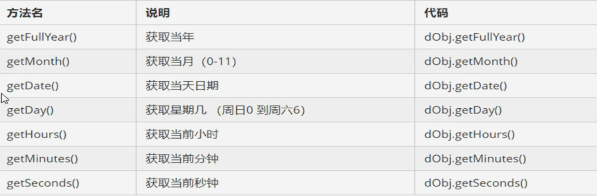

```js
 <!DOCTYPE html>
<html lang="en">
<head>
    <meta charset="UTF-8">
    <meta http-equiv="X-UA-Compatible" content="IE=edge">
    <!--[if lt IE 9]>
      <script src="https://cdn.jsdelivr.net/npm/html5shiv@3.7.3/dist/html5shiv.min.js"></script>
      <script src="https://cdn.jsdelivr.net/npm/respond.js@1.4.2/dest/respond.min.js"></script>
    <![endif]-->
    <link href="bootstrap/css/bootstrap.min.css" rel="stylesheet">
    <title>Title</title>
    <script>
        // Data是一个构造函数 使用的时候必须使用new来调用创建我们的日期对象

        var date = new Date();

        console.log(date);
        //参数常用写法
        var date1 = new Date(2020,10,1); //数字参数有问题 它会自动加1
        console.log(date1);
        var date2 = new Date('2020-10-10 20:40:36'); //推荐使用字符串的形式
        console.log(date2);

        // 日期格式化
        console.log(date2.getFullYear());
        console.log(date2.getMinutes());
        console.log(date2.getSeconds());
        console.log(date.getTime()); 
    </script>
</head>
<body>

</body>
</html>
```

#### 数组对象

```js
 <!DOCTYPE html>
<html lang="en">
<head>
    <meta charset="UTF-8">
    <meta http-equiv="X-UA-Compatible" content="IE=edge">
    <!--[if lt IE 9]>
      <script src="https://cdn.jsdelivr.net/npm/html5shiv@3.7.3/dist/html5shiv.min.js"></script>
      <script src="https://cdn.jsdelivr.net/npm/respond.js@1.4.2/dest/respond.min.js"></script>
    <![endif]-->
    <link href="bootstrap/css/bootstrap.min.css" rel="stylesheet">
    <title>Title</title>
    <script>
        // 使用 new Array创建数组
        var arr = new Array(2); //这里边的2 表示数组的长度为2 如果括号里只写一个值 那么它表示数组的长度
        var arr1 = new Array(1,2,3); //表示数组的元素为123
        console.log(arr);
        console.log(arr1);
        // 检测是否为数组
        // instanceof是一个运算符 它可以检测是否为数组
        var test = [];
        console.log(test instanceof Array);
        console.log(Array.isArray(test));
    </script>
</head>
<body>

</body>
</html>
```

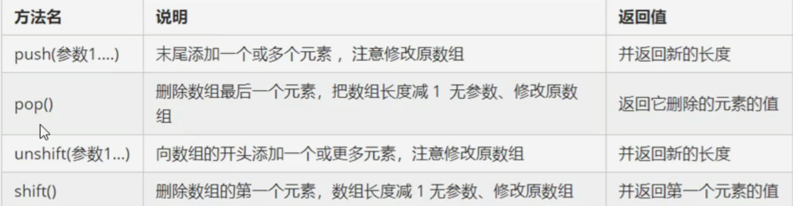

```js
 <!DOCTYPE html>
<html lang="en">
<head>
    <meta charset="UTF-8">
    <meta http-equiv="X-UA-Compatible" content="IE=edge">
    <!--[if lt IE 9]>
      <script src="https://cdn.jsdelivr.net/npm/html5shiv@3.7.3/dist/html5shiv.min.js"></script>
      <script src="https://cdn.jsdelivr.net/npm/respond.js@1.4.2/dest/respond.min.js"></script>
    <![endif]-->
    <link href="bootstrap/css/bootstrap.min.css" rel="stylesheet">
    <title>Title</title>
    <script>
        // 添加删除数组元素
        // push 在数组的末尾添加一个或者多个数组元素
        var arr = [1,2];
        arr.push(3);
        arr.push(3,4);

        // unshift 在数组的开头添加一个或者多个数组元素
        arr.unshift('hah');
        console.log(arr);

        // 删除数组元素
        // arr.pop() 可以删除数组元素的最后一个元素
        arr.pop();
        // arr.shift() 他可以删除数组的第一个元素
        arr.shift()
        console.log(arr)
    </script>
</head>
<body>

</body>
</html>
```

```js
 <!DOCTYPE html>
<html lang="en">
<head>
    <meta charset="UTF-8">
    <meta http-equiv="X-UA-Compatible" content="IE=edge">
    <!--[if lt IE 9]>
      <script src="https://cdn.jsdelivr.net/npm/html5shiv@3.7.3/dist/html5shiv.min.js"></script>
      <script src="https://cdn.jsdelivr.net/npm/respond.js@1.4.2/dest/respond.min.js"></script>
    <![endif]-->
    <link href="bootstrap/css/bootstrap.min.css" rel="stylesheet">
    <title>Title</title>
    <script>
        // 添加删除数组元素
        // push 在数组的末尾添加一个或者多个数组元素
        var arr = [1,2];
        arr.push(3);
        arr.push(3,4);

        // unshift 在数组的开头添加一个或者多个数组元素
        arr.unshift('hah');
        console.log(arr);

        // 删除数组元素
        // arr.pop() 可以删除数组元素的最后一个元素
        arr.pop();
        // arr.shift() 他可以删除数组的第一个元素
        arr.shift();
        console.log(arr);

        // 数组排序
        // 反转
        console.log(arr.reverse());
        console.log(arr.sort());

        // 数组的索引方法
        var test = ['red','green','blue','black','pink','blue'];
        // 查找元素所在列表的索引 不管有几个相同的元素 它只返回第一个元素所在的索引 如果没有该元素则返回-1 从正面开始查找
        console.log(test.indexOf('blue'));
        // 从列表的后边反向查找元素
        console.log(test.lastIndexOf('blue'));

        // 数组去重
        var oldlist = ['c','a','z','a','x','a','x','c','b'];
        var newlist = [];
        for (var i=0;i<oldlist.length;i++){
            // console.log(oldlist[i])
            if (newlist.indexOf(oldlist[i]) === -1){
                newlist.push(oldlist[i])
            }
        };
        console.log(newlist);

        //数组转换为字符串
        // toString()将数组转换为字符串
        var arr1 = [1,2,3];
        console.log(arr1.toString());
        // join
        var arr2 = ['green','blue','red'];
        console.log(arr2.join('_'))


    </script>
</head>
<body>

</body>
</html>
```

#### 字符串对象

```js
 <!DOCTYPE html>
<html lang="en">
<head>
    <meta charset="UTF-8">
    <meta http-equiv="X-UA-Compatible" content="IE=edge">
    <!--[if lt IE 9]>
      <script src="https://cdn.jsdelivr.net/npm/html5shiv@3.7.3/dist/html5shiv.min.js"></script>
      <script src="https://cdn.jsdelivr.net/npm/respond.js@1.4.2/dest/respond.min.js"></script>
    <![endif]-->
    <link href="bootstrap/css/bootstrap.min.css" rel="stylesheet">
    <title>Title</title>
    <script>
        // 根据字符返回字符所在位置
        var str = "andy";
        console.log(str.length);
        console.log(str.indexOf('n',[2])); //从索引2的位置开始往后查找

        // 根据位置返回字符
        console.log(str.charAt(3));
        // 返回字符的acsll码 可以判断用户按下的是哪个键
        console.log(str.charCodeAt(3));
        //str[index] h5新增
        console.log(str[3]);

        var o = {
            age: 18
        };
        // 通过对象[属性名] 判断该对象内是否存在这个属性
        if (o['age']){
            console.log('存在该属性')
        }else{
            console.log('不存在该属性')
        };

        //字符串操作方法
        // concat 拼接字符串
        console.log(str.concat(' red'));
        //substr 截取的起始位置 截取几个字符
        var str1 = '改革春风吹满地';
        console.log(str1.substr(2,2));

        // 替换字符串
        // replace
        var str2 = 'haha';
        console.log(str2.replace('h','c'));
        


    </script>
</head>
<body>

</body>
</html>
```


