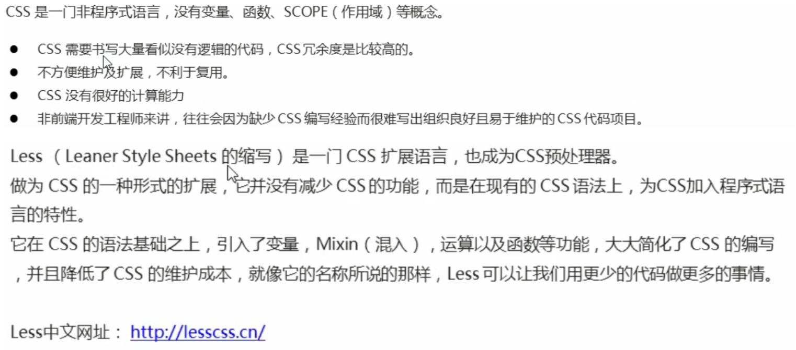

### rem布局


- rem的优点就是可以通过修改里边的文字大小来改变页面中文字的大小可以整体控制

```
<!doctype html>
<html lang="en">
<head>
    <meta charset="UTF-8">
    <meta name="viewport"
          content="width=device-width, user-scalable=no, initial-scale=1.0, maximum-scale=1.0, minimum-scale=1.0">
    <meta http-equiv="X-UA-Compatible" content="ie=edge">
    <title>Document</title>
    <style>
        html{
            font-size: 14px;
        }
        div{
            /*em是相对于肤元素的字体大小来说的*/
            font-size: 12px;
        }
        p{
            /*rem 相对于html元素字体大小来说的*/
            width: 10rem;
            height: 10rem;
            background-color: pink;
        }
    </style>
</head>
<body>
    <div>
        <p></p>
    </div>
</body>
</html>
```

##### 根据页面宽度改变背景颜色

```
<!doctype html>
<html lang="en">
<head>
    <meta charset="UTF-8">
    <meta name="viewport"
          content="width=device-width, user-scalable=no, initial-scale=1.0, maximum-scale=1.0, minimum-scale=1.0">
    <meta http-equiv="X-UA-Compatible" content="ie=edge">
    <title>Document</title>
    <style>
        /*小于540px 页面的 背景颜色变为蓝色*/
        @media screen and (max-width: 539px) {
            body{
                background-color: blue;
            }
        }
        /*540~970px之间我们的背景颜色就调整为绿色*/
        @media screen and (min-width: 540px) and (max-width: 969px) {
            body{
                background-color: green;
            }
        }
        /*大于等于970px 就将背景颜色调整为灰黑色*/
        @media screen and (min-width: 970px) {
            body{
                background-color: #383f49;
            }
        }
    </style>
</head>
<body>
    <div>
        <p></p>
    </div>
</body>
</html>
```

##### 媒体查询 + rem实现元素动态大小变化


```css
<!doctype html>
<html lang="en">
<head>
    <meta charset="UTF-8">
    <meta name="viewport"
          content="width=device-width, user-scalable=no, initial-scale=1.0, maximum-scale=1.0, minimum-scale=1.0">
    <meta http-equiv="X-UA-Compatible" content="ie=edge">
    <title>Document</title>
    <style>
        /*html{*/
        /*    这样写就写死了*/
        /*    font-size: ;*/
        /*}*/
        @media screen and (min-width: 320px) {
            html{
                font-size: 50px;
            }
        }
        @media screen and (min-width: 640px){
            html{
                font-size: 100px;
            }
        }
        .top{
            height: 1rem;
            font-size: 0.5rem;
            background-color: green;
            color: #383f49;
        }
        /*小于540px 页面的 背景颜色变为蓝色*/
        @media screen and (max-width: 539px) {
            body{
                background-color: blue;
            }
        }
        /*540~970px之间我们的背景颜色就调整为绿色*/
        @media screen and (min-width: 540px) and (max-width: 969px) {
            body{
                background-color: green;
            }
        }
        /*大于等于970px 就将背景颜色调整为灰黑色*/
        @media screen and (min-width: 970px) {
            body{
                background-color: #383f49;
            }
        }
    </style>
</head>
<body>
    <div class="top">
        购物车
    </div>
</body>
</html>
```

##### 引入资源


### less基础



#### less使用

##### less变量


##### less编译

```css
//定义一个颜色变量
@color: pink;
@color2: blue;
body {
    background-color: @color;
}
div{
    background-color: @color2;
}
```

- 如果html文件想引用这个文件 那么需要对这个less文件进行编译 ctrl s 一保存就自动编译了 手动编译需要到 这个less文件所在目录下 执行 lessc my.less my.css 他就会给你生成css文件 这个时候 html文件就可以引入css了

```css
<!doctype html>
<html lang="en">
<head>
    <meta charset="UTF-8">
    <meta name="viewport"
          content="width=device-width, user-scalable=no, initial-scale=1.0, maximum-scale=1.0, minimum-scale=1.0">
    <meta http-equiv="X-UA-Compatible" content="ie=edge">
    <link rel="stylesheet" href="my.css">
    <title>Document</title>
    <style>

    </style>
</head>
<body>
    <div class="top">

    </div>
</body>
</html>
```


##### less嵌套

```css
.header{
  width: 200px;
  height: 200px;
  a {
    color: red;
    //如果有伪类选择器 我们内存选择器的前面需要加&
    &:hover{
      color: #92B0DD;
    }
  }
}
```

编译成css文件后

```css
.header {
  width: 200px;
  height: 200px;
}
.header a {
  color: red;
}
.header a:hover {
  color: #92B0DD;
}
/*# sourceMappingURL=next.css.map */
```


##### less运算


```css
@border: 5px +　5;

div{
  width: 200px - 50;
  //height: 200px * 50;
  height: 200px / 4;
  border: @border solid red;
}
```


