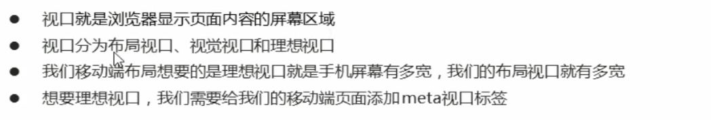
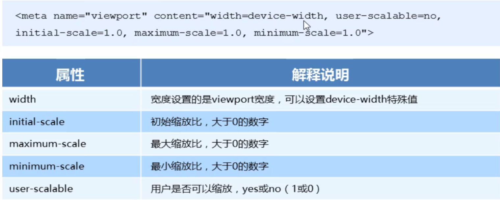
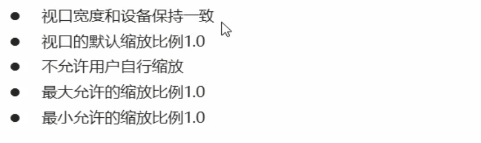
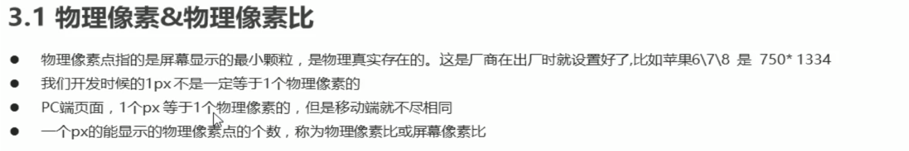
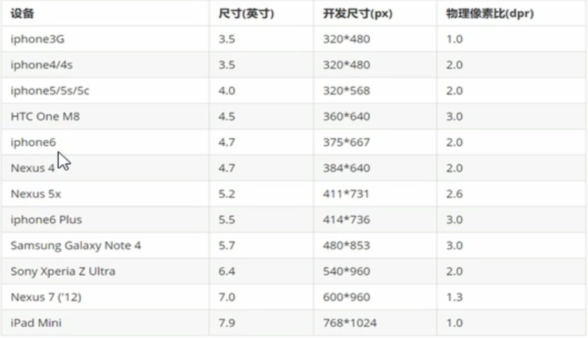
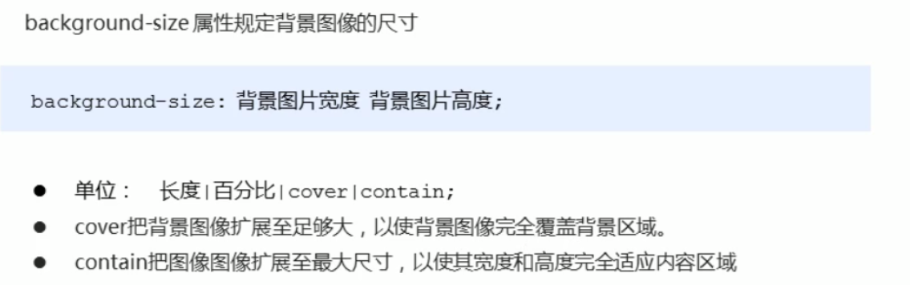
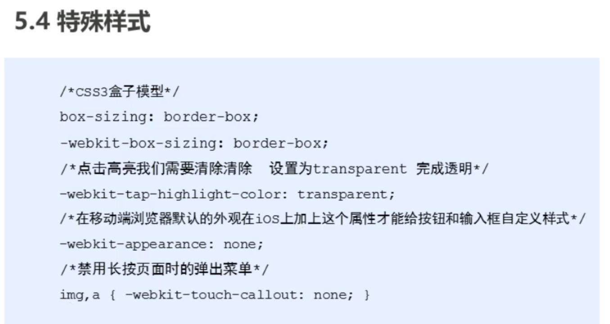
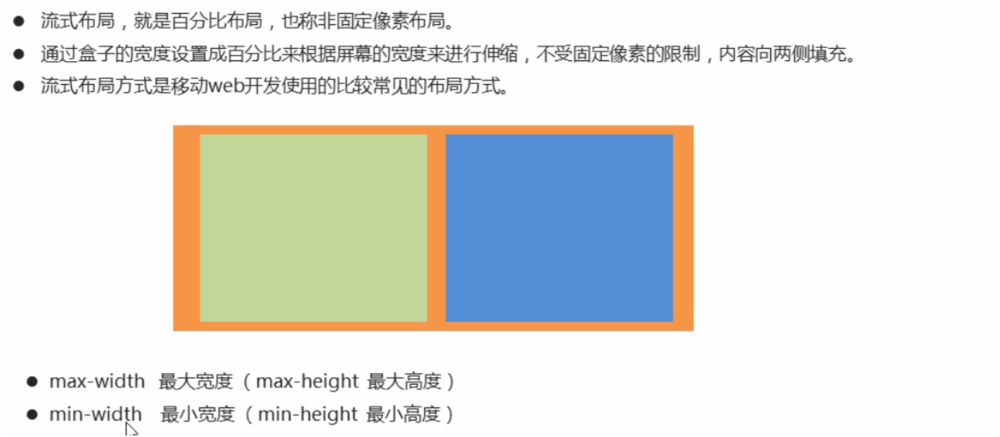

## 移动端基础



### 视口

#### meta视口标签





```css
<!doctype html>
<html lang=zh-CN>
<head>
    <meta charset="UTF-8">
	/*手机页面展示*/
    <meta name="viewport"
          content="width=device-width, user-scalable=no, initial-scale=1.0, maximum-scale=1.0, minimum-scale=1.0">
    <meta http-equiv="X-UA-Compatible" content="ie=edge">
    <title>Document</title>


</head>
<body>
    这是测试页
</body>
</html>
```

#### 二倍图





#### 像素比

```css
<!doctype html>
<html lang=zh-CN>
<head>
    <meta charset="UTF-8">
    <meta name="viewport"
          content="width=device-width, user-scalable=no, initial-scale=1.0, maximum-scale=1.0, minimum-scale=1.0">
    <meta http-equiv="X-UA-Compatible" content="ie=edge">
    <title>Document</title>
    <style>
        /*我们需要一个50*50css像素的图片 直接放到我们的手机端 里边会放大两倍 就是100*100 这就会造成图片模糊*/
        /*我们采取的是 放一个100*100 图片 然后手动把这个图片缩小为50*50css像素*/
        img:last-child{
            /*将100px的图像缩小后到手机自动放大两倍 那么图片就不会模糊了*/
            width: 50px;
            height: 50px;
        }
    </style>

</head>
<body>
    
    
</body>
</html>
```

#### 背景缩放



```css
<!doctype html>
<html lang=zh-CN>
<head>
    <meta charset="UTF-8">
    <meta name="viewport"
          content="width=device-width, user-scalable=no, initial-scale=1.0, maximum-scale=1.0, minimum-scale=1.0">
    <meta http-equiv="X-UA-Compatible" content="ie=edge">
    <title>Document</title>
    <style>
        .father{
            width: 500px;
            height: 500px;
            border: 1px solid red;
            background: url("100px.jpg") no-repeat;
            /*background-size: 500px 500px;*/
            /*只写一个参数 肯定是宽度 高度省略了 会等比例缩放*/
            /*background-size: 500px;*/
            /*按照百分比来写*/
            /*background-size: 80%;*/
            /*cover要完全覆盖div盒子 可能有部分背景图片显示不全*/
            /*background-size: cover;*/
            /*contain 高度宽度 等比例拉伸 当宽度或者高度铺满div盒子 就不再进行拉伸了 可能有部分空白*/
            background-size: contain;
        }
    </style>

</head>
<body>
    <div class="father">

    </div>
</body>
</html>
```



#### 流式布局(百分比布局)



```css
<!doctype html>
<html lang=zh-CN>
<head>
    <meta charset="UTF-8">
    <meta name="viewport"
          content="width=device-width, user-scalable=no, initial-scale=1.0, maximum-scale=1.0, minimum-scale=1.0">
    <meta http-equiv="X-UA-Compatible" content="ie=edge">
    <title>Document</title>
    <style>
        body{
            margin: 0;
        }
        section{
            width: 100%;
            max-width: 100%;
            min-width: 800px;
        }
        section div{
            width: 50%;
            height: 300px;
            float: left;

        }
        section div:nth-child(1){
            background-color: #2b323c;
        }
        section div:nth-child(2){
            background-color: red;
        }
    </style>

</head>
<body>
    <section>
        <div >

        </div>
        <div></div>
    </section>
</body>
</html>
```

